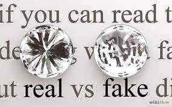

He walked into the packed ball room, looking as suave as ever, doing every bit of justice to his sharply cut immaculate black tuxedo that emanated a subtle glint of luxury, as did the sharp whiff of his musky masculine scent.

_"Yes! Looks like today is my day...he's finally going to ask me..."_ thought the sneering Emma twirling a golden strand that had escaped her carefully coiffured hairdo, as she vainly admired the reflection of her perfect makeup in the glittering swirl of the red wine in the gleaming goblet she sipped it from.

 Although she dressed and appeared rather simple compared to Emma's overpowering glamour, Anna still exuded a faint glimmer of natural elegance as she silently observed her beautiful sister's rising excitement when he strode in with a sense of purpose in the roomful of people, and so, she consciously looked away to avert her eyes from meeting his, lest he would gauge the flow of emotions on her face.

Both the sisters were blinded by a sudden flash of radiance as he walked past one of them, swiftly fished it out of his pocket and knelt down in front of her to profess his love for her in front of the world. A droplet of tear which was as priceless as a diamond, but shone as bright as a diamanté, trickled down the blushing Anna's imperfect features as he slipped on her least expecting ring finger, a rock sized solitaire that sparkled a tad too brilliantly so as to rudely sting Emma's disbelieving eyes.

 

_Image Source: Google Images_

This post was written for [Five Sentence Fiction – Dazzles](http://lilliemcferrin.com/five-sentence-fiction-dazzles/) at [Lillie McFerrin Writes](http://lilliemcferrin.com/).
