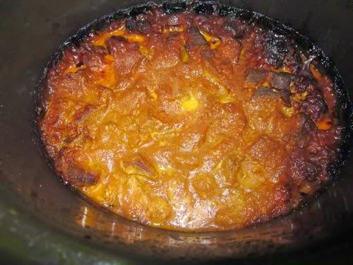
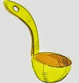

The sound of waves lapping gently, soothed her senses. As did the soft whistling breeze that teased her shiny hair playfully while her expensive sheer crepe sarong fluttered around her perfect curves. The canary yellow Versace bikini on her hourglass figure contrasted beautifully against the silver sheen of the ocean that lay sheathed ahead of her.  An expanse of white sands glimmered gloriously under her. She dreamily hummed her favorite tune as she tilted her straw hat. The drifting clouds flirted lazily with the twinkling sun causing her to pull down her large Prada sunglasses perched atop her head. Lying on the beach recliner under the gaily striped umbrella, sipping her Pina Colada languorously from the stemmed glass rimmed with a wedge of pineapple and a tiny umbrella that twirled merrily in the breeze. Not a worry in the world...she sighed in relief. An exotic holiday abroad after decades. Mmm...life was good! She took in a deep breath sucking in her flat tummy.

But wait a minute - what was the smell? She sniffed curiously. No - it wasn't the salty-fishy smell of the sea. Smelt like something was burning...

_"Mummyji!"_ she heard a familiar voice calling out in a distance. Before she could comprehend where it came from, she was felt someone shake her jiggly rotund body, as though the earth was quaking under her humongous feet, as frizzy oiled hair sprang out awkwardly from her messily tied bun. She quickly tried to make sense of what was happening, instinctively checking on the favorite Versace yellow bikini that she was clad in. But instead she was met with the sight of a gaudy shocking pink sari which had faded several shades lighter, soaked in sweat, sticking to her flabby paunch.

Where was the yellow?? She did find some bright yellow angrily glaring back at her from the wok, spitting oil and spices along with clouds of nauseating smoke._"You burnt the curry Mummyji!"_ yelled her pesky little brat, _Munna,_ reacting to the smoke with furious coughs while tugging at her sari. Her reverie was broken rudely, as she gave one confused look at her son and back to her hand which was supposed to be holding her Prada shades. It all came back to her instantly in a flash when she saw the steel ladle in her hand, standing in the middle of the kitchen of her cluttered shanty. Mrs. Ram Pyari swung into action to rescue it, only to find her burnt curry's blackened charred edges against the not-so-gay yellow.

<table class="tr-caption-container" style="margin-left: auto; margin-right: auto; text-align: center;" cellspacing="0" cellpadding="0" align="center"><tbody><tr><td style="text-align: center;"></td></tr><tr><td class="tr-caption" style="text-align: center;"><b>This is what you get when you daydream in the middle of work!</b></td></tr></tbody></table>

_So...did you enjoy lounging by the sea...? Heavenly...wasn't it?_

**NOW GET BACK TO WORK!**

Image source: Google Images

Linking this post to Day 1 of  [UBC July 2014](http://ultimateblogchallenge.com/) and [NaBloPoMo July 2014](http://www.blogher.com/nablopomo-july-2014-blogroll)

