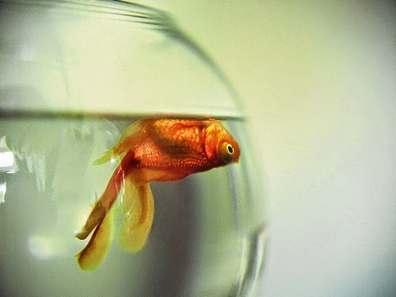
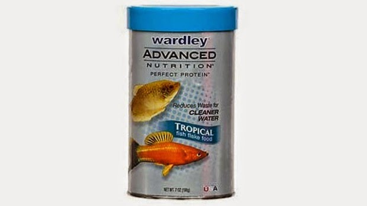

There was a soft click of the key turning into the key hole. Lillie, the pleasantly pudgy housekeeper, bustled into the dead silence of the deserted apartment. Deserted temporarily coz my family was out on a vacation. I was left home as usual for reasons best known to them.

She put on a flowered apron and started her daily activities.Vacuuming carpets.Wiping the shelves clean with a colorful fluffy duster. Cleaning the wash rooms. And generally pottering around. On particularly happy days she would whistle merrily as she went about her chores. On some days one could hear her hum softly under her breath. And you would know all was not right when she wouldn't do either of the two - which was today.

 

The last meal I had was two days back, just before my folks left. It seemed like decades ago. I was ravenous. To top it, Lillie was happily munching on the freshly baked cookies that she had just got in! I looked at her expectantly as she came closer to me. She frowned and started cleaning the area around me not giving me a second glance. God! Hadn't she been instructed to feed me? I agree, I'm not a baby anymore but I still depend on people for my grub. My heart sank when I saw her leave. I wished I could scream out to her or at least say what I wanted to. But I could do none.

The next day she was back. By now my tummy was growling fiercely. Today she was whistling. Yay! Food at last, I assumed. I waited patiently to finish her tasks on the other side of the house and come to me. Finally when she came to my side, she was pleasantly lost in her thoughts. I tried to grab her attention. Put up my best pout for her. Paced around for a wee bit. Drew circles around me. Finally glared at her in rage. And when none of it worked I started throwing flying kisses at her. Ah that worked! She came closer, smiled at me. At least, that is what I thought. But I was wrong. I desperately pressed my nose flat against the glass that separated us, but all she did was smoothed her hair looking at her reflection in the glass. Grrr...women, I tell you...they are the heights of vanity! No...don't go! Not yet...gimme me my food lady! The words remained trapped in my mouth and sometimes came out as bubbles.

The next morning when Lillie walked into the house, the sight she was met with was a late reminder to the task she was asked to prioritize by the house owners. The can of fish food stood untouched next to the bowl for days together. Jughead the goldfish was floating on his tummy - dead in his fish bowl.

**Unfed and forgotten.**

_Pics Source: Google Images_

 

Linking this to Day 2 of the [UBC July 2014](http://ultimateblogchallenge.com/) and [NaBloPoMo July 2014](http://www.blogher.com/nablopomo-july-2014-blogroll)

