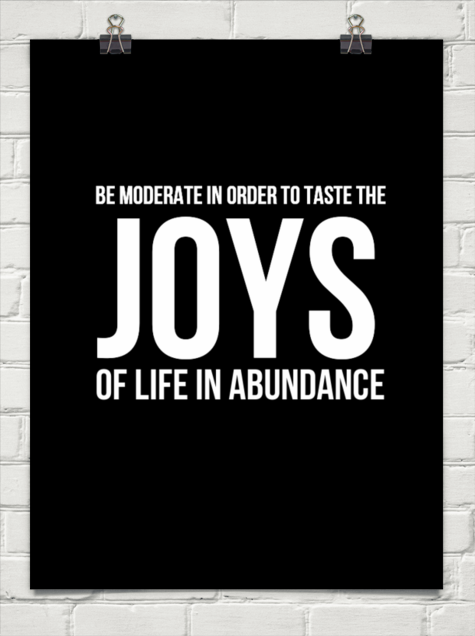

_Sweet memories are always cherished to be devoured in future, slowly...swaying along the rhythm of a rocking chair, lost in moments of warm nostalgia. The way we first met is still close to my heart. The white expanse of undulations within the circular space was confining, yet never-ending. Our first flush of love got encapsulated in cubes of transparent sweetness. We met every single day after that. Our love story peaked on the earthy mounds of the jagged yellow mountains surrounded by a space that was only ours._

_A few months of blissful courtship later we got wedded with the blessings of our kith and kin. And what a grand wedding it was?! People still rave about the lavish banquet we had hosted because of the heavenly venue we chose. On the banks of nectar... a golden picturesque fairy tale wedding..._ _I wanted to honeymoon at a destination which no one had ever thought of before. But apparently the place was a bit remote and reaching there was a herculean task. But he wouldn't give up that easily. He was determined to do everything he could to please me. So, he came up with a unique plan that was unheard of in the history of romance. He chartered an unusual flight. A convertible flight opening into the sky which took us soaring through the fluffy clouds to those lush green countryside fields. The fresh prolific untouched fields, where I had desired to spend some saccharine soaked passionate moments with him after our wedding... and well, do I need to elaborate on how it went?! Sigh..._ _It did not stop at that. Our life opened us up to grains of myriad candied flavors after we settled in marital bliss. The first icy flush of strawberry pink romance blossomed into deep ruby redness of cherries that adorned the icing of our first wedding anniversary cake._  _But alas, fairy tales don't last forever!_ _He seemed to have had an overdose of sweetness._ _He was diagnosed with diabetes. Our life changed drastically thereafter. Suddenly, it comprised of a lot many restrictions. Controlled diet, exercises, medications and what not. I lovingly nagged him into adapting the required lifestyle changes to combat the disease. I myself gave up on a lot, to help him stay strong in his will to fight it. But that sweet tooth of his never got satiated. So, he began to lie and cheat on me. And then began the tiffs...whenever I would catch him red handed, at unacceptable places, biting fervently in all those things that were strictly taboo for him. Surprisingly and much to my sorrow, I caught him at places that we had visited in the past as per the chronological order of our romance._

The first place I caught him was, in **the sugar tin** where we first met and fell in love. The first time we had seen each other, he pretended to nibble at a sugar granule while stealing soulful glances at me. And I blushed in embarrassment and crept behind the angled safety of a giant sugar cube. Imagine, that's where I caught him gobbling on chunks of sugar now, in spite of his diabetic condition.

The next place he was caught red handed, was our favorite hangout while we dated - **the yellow** **mounds of jaggery** mountains. It was okay to indulge in such sweetness back then. But gorging on that stuff now was criminal. And I caught him doing just that!

I'm sure you know the order of his visit to these places now.

Thereafter, he sneaked to our heavenly wedding venue, the shelf on which stood **the honey jar.** My eyes glazed over the grand memories of our golden wedding. He couldn't have afforded this luxury now. That's where I found him again, with his hands stuck in the sweet sticky poison.

And the heights was when he reached our honeymoon destination. How did he ever manage to convince that friend yet again to take him to that remote place again? His helping friend, the **Pigeon,** who had carried him on his back to fly to **the sugarcane fields,** just the way we had flown there, after our wedding, sitting cozily on the Pigeon back - remember my dream destination for our honey moon? Back then I assumed this favor was done by the Pigeon just as a gesture of goodwill because we were newlywed and it was our honeymoon. So, I was shocked beyond words when I saw him perched on the pigeon yet again after all these months, obviously returning from the sugarcane fields. My heart sank when I noticed a droplet of sugarcane juice dribbling down the side of his mouth.

A few days later his sugar-level shot up big-time. Apparently, sneaking behind my back, he was heavily indulging himself in **blobs of** **strawberry ice cream, cake crumbs topped with sugared cherries, desserts, candies,** **chocolate cookies,** **and more of such venomous sweet treats,** that he chanced upon in the lane between the refrigerator and pantry, where we had settled after our marriage.

It did not end well. **My husband died of excessive sweetness in his life.** And me - **Mrs. Ant****,** widow of late **Mr. Ant****,** have moved out of the hazardous city called the **'Kitchen,'** which took my dear husband's life. I have put my past behind me and now live in a small town called the **'Veranda.'** Life is slow here but minus a lot of sweet distractions.

_Image source: Google Images_

Linking this to Day 6 of [UBC July 2014](http://ultimateblogchallenge.com/) and [NaBloPoMo July 2014](http://www.blogher.com/nablopomo-july-2014-blogroll)

