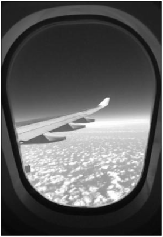

The flight was scheduled to take off in the next few minutes. I settled in the aisle seat grumpily. I hate aisle seats, but well, you're not always lucky to get a window seat. Like the gentleman sitting next to me, looking out of the window. He gave me weird lop-sided smile when I climbed into my seat. As if mocking me for not getting the seat of my choice. Gosh! Was my displeasure so evident? I wondered, as the flight started to take off.

_"Traveling to Hyderabad for the first time?"_ he inquired. _"No, not my first. Work often takes me there."_ I replied back with a little uncertainty on carrying on with the small talk. I observed him from the corner of my eyes. Not bad. He looked young, wasn't good-looking in the conventional sense, but there was something mysteriously charming about him. Looked pretty harmless to me. Let me take a chance, I thought to myself. Who knows, he could be the one? I had crossed my ideal age for tying the knot long back. Folks back home were not really very supportive of my single and professionally successful status. I had not met the right one so far. But I did keep an eye out for chance coincidences which could probably bring my Mr.Right to me. Coincidences like this, for example.

I turned to him and asked _"So...are you visiting Hyderabad or do you live there?"_ Before he could answer, an air-hostess suddenly interrupted our conversation. _"Ma'am why don't you take the window seat?"_ she suggested in the most artificially possible cordial tone. _"I'm okay"_ I replied disinterestedly, wondering how she had  guessed that I preferred the window seat. She did not seem to be convinced with my reply and gave me a strange puzzled look through her thickly mascaraed eyelashes. But, I was least interested in her reaction at the moment.

I turned to the object of my interest at the window and gave him an encouraging look to continue our conversation from where we left it. _" I don't live there. I have some business to settle there"_ he answered with his gaze fixed faraway on the wafting clouds seen through the window. There was a certain melancholy about him. _"So what do you do?"_ I prodded further. _" I used to be a writer."_ he said. _"A writer...wow! And what have you written? So, you don't write anymore?"_ I was all questions. He shook his head _"I had been working on my novel. But people don't seem to get what I write. I've tried it all."_ He sighed dejectedly.

Our conversation was interrupted yet again when refreshments arrived. I chose to take a vegetarian meal. Surprisingly, he was not offered a meal by the attendant and he did not seem to be interested in having one either. I assumed that he had already had a word on it with the attendants while boarding the plane, so I shrugged it off.

I continued my conversation while biting into my meal. I was always fascinated by the struggling arty kind of people. And this man had me curious, so I quizzed him yet again,_" So...what do you do now?"_ He paused for a second before replying, _"I travel to various places trying to understand where I'm going wrong...in understanding the human mind."_ Ah...now that sounds interesting! That's how creative people typically are. Maybe he was too good at his work. He did sound so. His writing probably was not the stereotypical kinds which made sense to the general masses. Perhaps he was cut to enthrall that well-read section of society who indulged in a certain eclectic kind of literature which only a select few acquired out of sheer ingenuity of thoughts. Breaking my chain of thoughts I remarked suddenly, _"Maybe I could help you. I have a friend who heads a renowned publishing house in Hyderabad. I could probably put in a word for you."_ He looked pleased, with hope surging instantly in his eyes. _"Really? That would be great!"_ he exclaimed, in a voice that suddenly throbbed with life.

I had to use the washroom. So I gently excused myself from the conversation and made my way to the loo. No matter how much I hate relieving myself in the cold sanitized toilets on a flight, sometimes there was no way you could control not answering to the call of nature. The window seat was empty when I got back. I assumed he had taken a loo break too. The pilot's voice announcing the landing boomed through the aircraft. I looked around for my new-found friend. But he was nowhere to be seen. I hoped to catch up with him in the queue while getting down. I was disappointed when I still did not see him while walking down the aisle towards the gate.

On an impulse, I asked the air-hostess who stood near the cockpit to wish us goodbye, _"Excuse me, did you happen to see the gentleman who was sitting next to me?"_ She looked confused as she exchanged a look with her frowning colleague, who asked me _"Which gentleman, ma'am?" "The one sitting next to me"_ I replied. _"But ma'am, the seat next to you was vacant throughout the journey. I even asked you to take the seat but you didn't."_ she said. I was confused. I gave one last look at the seat to attempt and make sense of things before I walked towards the exit. Just as I was about to step down the flight, I heard the hostesses whispering to each other.

_"Not again. This has been happening to every single person who sat on that seat. They all seem to see him."_ said one. _"Are you sure it is the same guy they see? That writer who committed suicide by consuming poison while flying on this aircraft a few months back?"_ asked the other.

I walked away as fast as my feet could lead me into the depth of the dark night without once turning back.

_Image Source: Google Images_

Linking this to Day 8 of [UBC July 2014](http://ultimateblogchallenge.com/) and [NaBloPoMo July 2014](http://www.blogher.com/nablopomo-july-2014-blogroll)

 

