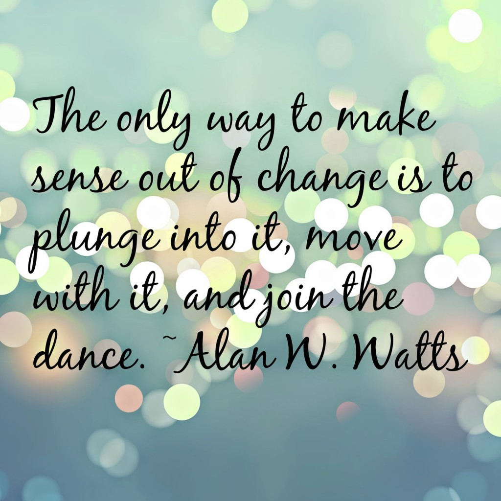

It feels warm and cozy where I am. They take good care of me here. Although, I did take time settling in when I first landed here and turned out to be a big pain in the beginning. I gave them a tough time - really. But yet, they shower me with so much love that sometimes I get overwhelmed with all the affection. I love to relax in the fuzzy confines of this hearth. I've been here for a while now. Have lost track of time. This is where I found my identity and grew stronger as a person.I'm fed well on time every day. The best part is that they just let me be. At times they keep me entertained with their amusing talks. When I get bored or feel neglected I kick the wall which makes them jump to attention.  And then they start murmuring to me. I love to swim and I get to do that a lot. At times I pretend to be sleeping. That's when I get to hear all the juicy talks that go on between them. They say I might be in here for some more time. Why...oh why...JUST some more time? I love this place and can't dream of going elsewhere. I feel protected here. I don't think it’s as good out there as it is here.

So now, I heard that it's time. You know, I can be real stubborn when I want to be. I'm not going to make this easy for them - watch out! I curl up real tight so that they just leave me alone. I dodged a lot many times when they tried to reach me. But heck, they won't give up easily it seems! I hear shrieks of pain as I stick my ear close to the wall - maybe now they might leave me in peace. Suddenly, I feel something cold and hard gripping my feet. I'm forced into some weird kind of journey now. I reckon I'm sliding down a deep dark tunnel. Sooo scary man! And suddenly, there's so much light blinding my eyes. I hear a lot of commotion. Damn, it's freakin' cold out here! Suddenly I feel something snap. Good grief...they've cut me off from my only connection back there! No...no...oh please no...let me be in there! I’m blood red, wailing my guts out! But what do they care?!

Why do I see everything upside down? God! This strange looking creature is now holding me by my ankles. I hang helplessly in the air, as he smacks me hard on my bum...ouch! I cry out three notches louder! How humiliating?! I can’t fathom why but people are happily cheering, as he wickedly announces:

**"IT'S A BOY!"**

_Images Source: Google Images_

Linking this to Day 9 of [UBC July 2014](http://ultimateblogchallenge.com/) and [NaBloPoMo July2014](http://www.blogher.com/nablopomo-july-2014-blogroll)

 

