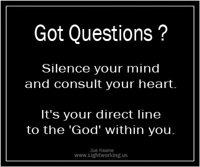

_"Oh my god!"_ There goes. Yet again, someone decided to shake me off my precious moments of peace. Why? Why the hell can't they handle their own problems? Haven't I equipped them well enough to manage every good and bad situation that they would ever come across?  Yet, they choose to leave everything to me. Why this dependency on me? I fail to understand. If something good happens, it is because they did something good. But heaven forbid, if something bad happens, automatically I am questioned. _"God, why did you do this?"_  To which I ask _"My dear child...when good things happened, did you ask me that?"_ And I am told _"But I worked hard to earn the good things."_ So I ask again _"Then why don't you work hard to avoid or deal with the bad things?"_ Strange. You know the answers to your questions, but yet you're not ready to apply them to your life. How can even I help you if you choose to remain ignorant in spite of being aware deep down, that help for every single thing comes from within? All I can give you is the strength to use your inner reservoir of resilience. You have an exam coming up, you tell me,_“God please help me score 100% marks this time."_ I say_" I will, if you put in your 100% effort. If you don't, tell me how can I help you?"_  You're ill, you tell me, _"God please cure me at the soonest."_ I say _"I will, but only if you comply in taking care of your health. If you don't, tell me how can I help you?"_  You want money /fame /power; you tell me_”God please make me prosperous, famous and powerful."_ I say_" I will, but only if you work hard for it. If you don't, tell me how can I help you?"_  You want peace on earth; you tell me _"God please help us have peace on earth."_ **I say _"I will. But first let me have some peace - will you?"_** You enjoy your weekends and vacations without being disturbed, don't you?  But what about me? Do you spare me even on a Sunday? Not to mention the odd hours you call out for me. Do you even look at what time of the day or night it is before you start sending in your requests to me? Don't I require a sound night's sleep or at least a tiny nap to recharge myself to manage the mess you're creating with the natural resources I've bequeathed you with? There are times when you give up way too easily, fold your hands in prayer and roll your eyes looking upwards, pleading to me. To which I glare back at you in response with a look that says, _"WHAT?!"_ But I doubt if you notice me glaring back at you, since you're so self-obsessed with your own self. I am sick and tired of all this spoon feeding. I do not use my magic wand anymore, except in genuinely needy cases which do require my intervention. I do not intend to use it for people who incessantly dump all their worries onto me without putting in any effort from their side while they deprive me once again of required some moments of peace.

Even I need a vacation at times folks! For people who still claim that they do not know this fact, let me reinforce the fact, _**"There is god within each one of you."**_  Please use him to tackle your problems on your own. The god within you is the one who gives you hope, faith, patience, optimism, compassion, determination, resilience and the strong will to fight your own battles with the strength that only you can draw from within yourself. These are the qualities that can fix any situation if applied well. Stop relying on some external force that will be available at your beck and call 24/7, because the external force will only comply if the god within you is put to work.

_**Miracles happen only when you've turned on the god within you**_

 _**to channelize the internal force that all of us carry within us.**_ So for a change - turn on the god within you and please let the god up there go on a vacation. For god's sake! He badly needs it._Thanking you_ _Yours Truly_

 

_Image Source: Google Images_

Linking this to Day 13 of [UBC July 2014](http://ultimateblogchallenge.com/) and [NaBloPoMo July 2014](http://www.blogher.com/nablopomo-july-2014-blogroll)

 

