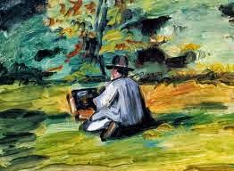

When he painted...the colors spoke to him, in a language that only he could decipher.

_**The rough sloshes of paint sometimes oozed spurts of warm love**_ 

_**Joy emerged rapturously once in a while peeping through vibrant tones**_ **_Shades of self-doubt sprang up unceremoniously now and then_** _**Bringing with them haunted feelings of dripping melancholia**_

_**At times cold hatred crept through his strokes on every grain of the background**_ _**But the ones that hit him real hard were those streaks of failure**_

_**Bringing with them dabs of stabbing deep disappointment**_

_**Shredding the canvas with blood curdling hues of revenge and anger.**_

Yet another day had passed over years, that they wouldn't give into his demands. He had no choice but to make do with the natural background of the earth for a canvas, brushes made out of twigs and colors that he managed from leaves, bricks and pebbles. Every single day he begged to be given paints, brushes and canvas but the mental asylum authorities never obliged him.

<table class="tr-caption-container" style="margin-left: auto; margin-right: auto; text-align: center;" cellspacing="0" cellpadding="0" align="center"><tbody><tr><td style="text-align: center;"></td></tr><tr><td class="tr-caption" style="text-align: center;">'Painter at work' by Paul Cezanne (1839-1906)</td></tr></tbody></table>

_Image Source: Google Images (The painting and the name of the painter as seen above has been used for mere graphic representation and has no relevance whatsoever with this piece of fiction)._

Linking this to Day 14 of [UBC July 2014](http://ultimateblogchallenge.com/) and [NaBloPoMo July 2014](http://www.blogher.com/nablopomo-july-2014-blogroll)

 

