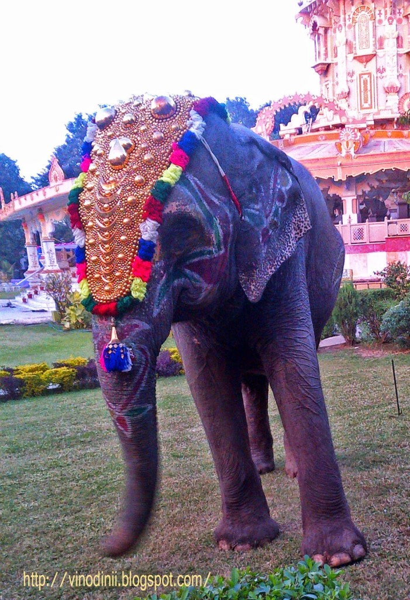

The jingle of the temple bells stirred _Gulab-Kali_ (rose bud) from her beauty sleep. It was time for the morning _[Aarti](http://en.wikipedia.org/wiki/Aarti)._ The divine fragrance of sandalwood and incense floated out of the temple premises. She loved to watch the lord being offered the brightest fresh sweet-smelling flowers like roses, marigolds, _kanakambaram_ and jasmine. The priests were chanting mantras in a unified harmony as the pitch of the cymbals rose. She felt blessed to live in such a pious environment. It was time for her to get ready and serve the lord. In no time, she would bathe in the lake nearby, which would leave her skin tingling fresh. Her skin despite being dark and wrinkled was her pride. And then, she would be rendered with beautiful motifs on her forehead which made her look like a radiant bride. She stood under the giant _Neem_ tree ready to welcome the early rush of devotees.

No matter what the age of the people who came in was, they did stop once near her to seek her blessings. She would give them the customary pat before she ushered them into the holy premises. On certain auspicious occasions, she would accompany the temple priests and devotees in the grand religious procession that went around the town to shower the lord’s blessings on the masses. She would be decked up with the grandest of accessories, the finest of silks, the brightest of brocade finery and the richest of jewels. They would move to the pulsating rhythm of drums, cymbals and the mighty [nadaswaram](http://en.wikipedia.org/wiki/Nadaswaram) instruments that were played as they moved royally, heading the holy procession.  She had a natural oomph in her swaying gait which left people swooning over her. And that would further add to the gaiety of the festive procession.

She was a people’s person and she absolutely loved it when people made an attempt to interact with her. Children especially gave her immense joy. Some people got her delicious fruits to eat, while a few threw coins at her from a distance. They would want to click pictures with her. But the temple authorities were strict in this matter. They made sure that the temple visitors interacted with her only from a distance. They had learnt from previous experiences, that no matter how adorable she was, some people acted very insensitive. They would tease her, throw pebbles at her, poke her with sharp objects and at times try to manhandle her if they got the opportunity to do so. The fact that she was sturdy to withstand all this without getting hurt was not a justified reason to be treated in this manner. There was one occasion when someone had stubbed a lit cigarette on her body.

Is that how one treats someone like her - she/he who is a reminder of one of the most adorable lords from Indian mythology? [Lord Ganesha](http://en.wikipedia.org/wiki/Lord_Ganesha) surely must be so unhappy with the kind of treatment meted out on his representatives on earth. If an elephant like _Gulab-Kali_, who lives in the secure environment of a holy temple has to go through this kind of harassment from thoughtless visitors, I shudder to imagine the plight of the other members of her species who live unprotected in the wild across the world.

<table class="tr-caption-container" style="margin-left: auto; margin-right: auto; text-align: center;" cellspacing="0" cellpadding="0" align="center"><tbody><tr><td style="text-align: center;"></td></tr><tr><td class="tr-caption" style="text-align: center;"></td></tr></tbody></table>

_Note to my readers: This is a piece of pure fiction. The picture of the elephant at the temple seen above, is used here as mere graphic representation and so is the fictitious name 'Gulab-kali.' Both the picture and the n__ame are not in reference to any animal, person, event, temple or place in particular._ 

_**\*This is a small tribute from my end to my Lord Ganesha/ Ganapathi/ Vinayaka\***_

<table class="tr-caption-container" style="margin-left: auto; margin-right: auto; text-align: center;" cellspacing="0" cellpadding="0" align="center"><tbody><tr><td style="text-align: center;"></td></tr><tr><td class="tr-caption" style="text-align: center;"><b><i>~"Ganapathi Bappa Morya!"~</i></b></td></tr></tbody></table>

Linking this to Day 17 of [UBC July 2014](http://ultimateblogchallenge.com/) and [NaBloPoMo July 2014](http://www.blogher.com/nablopomo-july-2014-blogroll)

 

