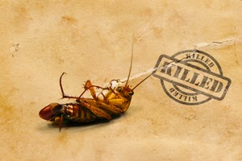

They had out-lived their stay in her house. Enough was enough. She could not let them feed on her peace of mind anymore. For days they had been eating up on her space. At times she would want to scream out loud but the scream remained trapped in her throat.She tried ignoring them, working around them, but they would invariably appear from nowhere and get onto her nerves. She had meant to get rid of them over the weekend, but she still couldn't find where she had misplaced it.

Finally she found it standing in the cabinet under the sink in her washroom. Just at that point she found one of them crawl by her feet. And the vengeance of last few days unleashed itself in one 'whoosh' of a spray to nail the roach. An evil smile played on her lips. One down. This was just the beginning.

**_Rest in Peace. And give me some Peace!_**

_Image Source: Google Images_

Linking this to Day 21 of [UBC July 2014](http://ultimateblogchallenge.com/) and [NaBloPoMo July 2014](http://www.blogher.com/nablopomo-july-2014-blogroll).

