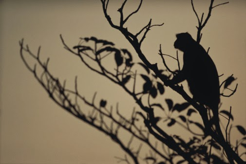

The soft breeze whistled by his ears, at such dizzy heights, all he could see was miles and miles of intoxicating clouds, grey and unappealing. In fact, he found everything unappealing these days. Drab and lack luster.He wasn't like this a few days ago. He was a happy-go-lucky mischievous character when he was around his mates. Together, they went haywire painting the town red. Till recently, when he chanced to stop by the balcony of a house. A deliciously tantalizing aroma hit his nostrils from the room that the balcony was connected to.  He took a quick peek in there to quench his curiosity. To his delight, he was met with the sight of a pyramid of freshly made _laddus_ sitting in a plate on the dining table there. So tempted was he by them, that he jumped over the balcony parapet and landed inside the room. Just as he started feasting on the heavenly sweet, he noticed her. He had never before laid his eyes on someone as pretty as her. The epitome of feminine beauty and grace. She stood in front of a mirror in the next room, brushing her knee length lustrous hair in gentle sweeps, smiling softly as she adjusted the red _bindi_ on her forehead in her reflection, oblivious of his presence. He moved forward to have a better look at her, his face smothered messily with the traces of the _laddus_ he had devoured.

And then, she saw him in the mirror. Her reflexes astonished him. He was least prepared for her bewildered expression, which replaced the pleasant one earlier. Her eyes popped two sizes larger and her jaw dropped open to let out the most hideous resounding scream of horror! He was as taken aback as her by the turn of events. So, the best he could do was turn around and run out of the house for his life.

When he got back home, he was swimming in a sea of mixed emotions. The initial surge of strong attraction he felt for her, got submerged in the panic he felt when she yelled at the sight of him, followed by sorrow for the turn of events and eventually anger that coursed madly through his veins. Was he really that scary and repulsive to look at? He pondered over it a bit and came to a conclusion that it was his messy face after gorging on those stolen _laddus,_ that had put her off. He decided to give it another try. So, off he went the next day, properly groomed, brushing his hair in place as he reached her house. This time he walked through the door like a gentleman, instead of hopping in from the balcony.

He entered the house and found no one around. He walked softly into her room looking for her. Just to make sure that he looked his best he approached the mirror to check out what he actually looked like. The shock of the previous day's event was nothing compared to what met his eyes now in the mirror. Was this really him? A hideous charcoal black leathery face with a pair of orange tinted eyes glared at him rudely. For a second he got scared by his own reflection. And, just as he was trying to come in terms with this knowledge he felt a sharp pain. Someone had hit him hard with a stick. It took him a moment to register who it was. His object of love had got her father to get rid of the beast who had meandered into her room. Just as the father raised the stick once again to hit him, he lurched and ran out to save himself from the painful situation.

The humiliation of the entire event coupled with the realization of his grotesque looks had thrown him into deep throes of melancholia. He wasn't the right match for her kind of beauty. So what if the Hindus worshiped him and called him an avatar of the brave monkey lord? Ironically, they called him _'[Sankat Mochan Hanuman](http://en.wikipedia.org/wiki/Hanuman)'_ _(Lord Hanuman, the reliever of troubles),_ but were still terrified by his presence and his repelling looks. Today he perched himself on the highest branch of the tallest tree in the vicinity, with his tail hanging on a loose end - just like his life. As the gale blew viciously, he contemplated on jumping down to end his life.

Suddenly, he heard a wild cheering from below. It was his bunch of mates jumping from one branch to another. Gosh, that looked tempting! He took a quick decision and hopped his way down to join them in their naughty play without a second thought. Time to monkey around!

 **_After all...there's so much more to life than just one person!_**

_Image Source: Google Images_

Linking this to Day 29 of [UBC July 2014](http://ultimateblogchallenge.com/) and [NaBloPoMo July 2014](http://www.blogher.com/nablopomo-july-2014-blogroll).

 

