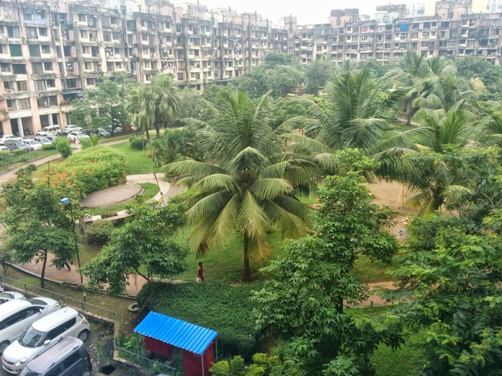
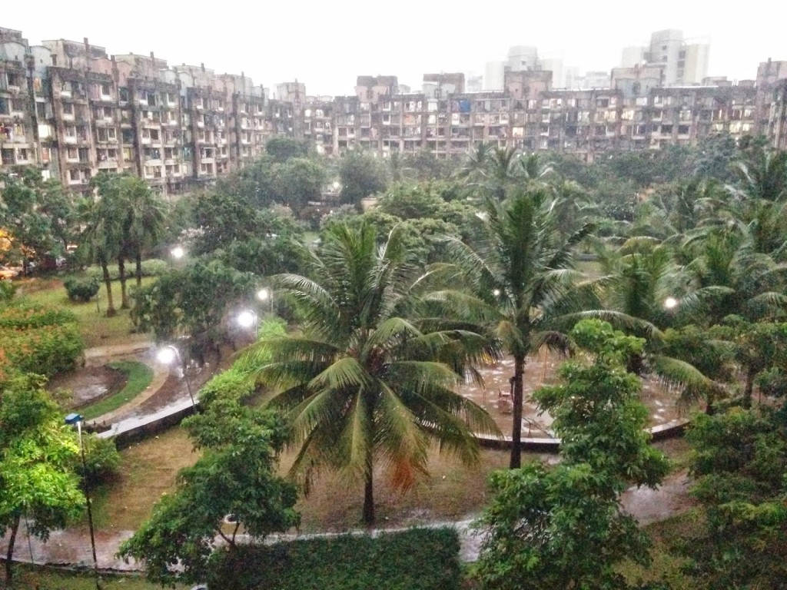

<table class="tr-caption-container" style="margin-left: auto; margin-right: auto; text-align: center;" cellspacing="0" cellpadding="0" align="center"><tbody><tr><td style="text-align: center;"></td></tr><tr><td class="tr-caption" style="text-align: center;">Yay...finally!</td></tr></tbody></table>

The journey so far on this blog has finally got me to my 100th post here. Yes, this is my 100th post on this blog that has been receiving my fond quality attention only since April this year, when I participated in the Ultimate Blog Challenge and the A to Z Challenge. Prior to that, it was kind of lonely here. I would write occasionally, maybe once in six months and share it with a few close friends. But since April, this place has suddenly been buzzing with visitors. Most of whom I'm friends with now, thanks to social media. It gives me immense pleasure to read their feedback and also hop on to their blogs when they post something new.I would especially like to thank [Shailaja](http://shailajav.wordpress.com/), [Beloo](http://letbeautybeyourconstantideal.blogspot.in/), [Krithika](http://dialmformarketing.co/) and [Elly](http://xpressyouressence.blogspot.in/) for providing their constant support and encouragement for me to go that extra mile. I would also like to mention: [Stephanie](http://stephanierosebirdstudio.blogspot.in/), [Donna](http://thebrightersideblog.blogspot.com/), [Aathira](http://awanderingmindofabookaholic.blogspot.in/), [Reema](http://reemadsouza.blogspot.in/), [Vinay](http://inspire99.com/), [Vishal](http://vishalbheeroo.wordpress.com/), [Shilpa](http://nblo.gs/ZobBE), [Lisa](http://www.getskinnywithskinnyliz.com/), [Preethi](http://tulipsandme.blogspot.in/), [Afshan](http://afshan-shaik.blogspot.in/), [Renu](http://www.renuvyas.com/), [Maniparna](http://maniparna5002.wordpress.com/), [Jyotsna](http://jyotsnabhatia.blogspot.in/), [Sabeeha](http://midnightscribbless.blogspot.in/) and [Sahiti](http://sahitibloggin.blogspot.in/) for visiting me time and again, leaving me a dose of encouragement every single time. Please click on their names to visit their amazing blogs. Each one of them are awesome bloggers who have created a special niche for themselves by the virtue of their sheer passion for writing. There are many more names that I would have loved to add here. I might have missed out a few important ones too. You know who you are if you don't see your name here but I do mean to thank each one of you who were present with me through this enriching journey.

Surprisingly the 100th post has been a milestone of sorts for me. Life  has proven once again that there is no end to the 'ifs' 'buts' 'ands' 'etcs' (forgive me for the twisted grammar, I prefer writing 'ands' for added effect!) in this worldly journey. After a sabbatical of two years just when I was content weaving stories on this blog, I landed up with a new job. So, back I am on yet another corporate assignment with a retail giant after two whole years. A new job in a fairly new environment. It is Mumbai again, but another part of Mumbai that I hadn't explored previously and I’m happy doing so these days.

Exploring new places, meeting new people, discovering new ways of doing things for a fresh new lifestyle and starting all over again from the scratch keep charging me up from time to time! Not to mention the host of struggles and challenges they bring with them. You only realize later that the struggle you had so painfully put up with, was actually for quite a simple task. Something as basic as finding your way back home from work also becomes a challenge at such times. The route isn't as complex as I initially thought it was. Today I explored my way through the by lanes of my vicinity scouting for a _Lord Ganesha_ idol for _Ganesh Chathurthi_. I know it's too early to get _Ganeshji_ home but weekend is the only time when I can devote time for such matters. A kind auto-rickshaw driver helped me figure out the closest shop to buy one, from where I emerged beaming with the best looking _[Dagadusheth Halwai](http://en.wikipedia.org/wiki/Dagadusheth_Halwai_Ganapati_Temple)_, Elephant Lord in my hands.

It will soon be a month since I joined this job. The roller-coaster ride of settling in a new place is still on. But past experiences of these kinds have helped me take it efficiently in my stride. A beautiful apartment and an even more beauteously planned work campus leave me in awe of my new surroundings. There's so much greenery and natural beauty around me to absorb. I wake up to an orchestra of chirping birds each morning, perched on the coconut palms that my apartment windows open to.

<table class="tr-caption-container" style="margin-left: auto; margin-right: auto; text-align: center;" cellspacing="0" cellpadding="0" align="center"><tbody><tr><td style="text-align: center;"></td></tr><tr><td class="tr-caption" style="text-align: center;">View from my apartment window.</td></tr></tbody></table>

And even as I sit by the window sill typing the final draft of this post, it starts pouring. So here's another picture of the heavenly Mumbai rains showering upon my sweet new abode!

<table class="tr-caption-container" style="margin-left: auto; margin-right: auto; text-align: center;" cellspacing="0" cellpadding="0"><tbody><tr><td style="text-align: center;"></td></tr><tr><td class="tr-caption" style="text-align: center;">Enjoying Mumbai Rains!</td></tr></tbody></table>

I must add that I would have been happier just writing and building more on it, but at the moment I cannot afford that luxury. Someday maybe... But not today. I have my apprehensions of being able to see through the responsibilities of my new role after spending blissful days recently just writing to my heart's content, but well I'm taking it one day at a time. I do miss writing regularly off late but I have been trying to write a little bit every weekend. I should be back on track with regular posts soon. And, yes I miss home big-time but before it gets too much to bear I take the first train going to Baroda and spend a blissful weekend there. So, that's the advantage of working six hours away from your hometown!

Since long I had been putting off creating my Facebook page for this blog. But I guess now is the best time. Since you already have obliged me with a visit, it would be great if you could visit this blog's newly created Facebook page by clicking [here](https://www.facebook.com/ifsbutsandsetcs) and hit the 'Like' button if you have been enjoying my posts so far. That would probably be akin to giving fuel to bring out the recently dormant blogger sitting silently under the layers of a renewed corporate employee's identity. I promise, you wouldn't be disappointed with my next 100 posts!

<table class="tr-caption-container" style="margin-left: auto; margin-right: auto; text-align: center;" cellspacing="0" cellpadding="0" align="center"><tbody><tr><td style="text-align: center;"></td></tr><tr><td class="tr-caption" style="text-align: center;">That's going to be me celebrating my 100th blog post on my 100th blog! Do keep dropping by!</td></tr></tbody></table>
