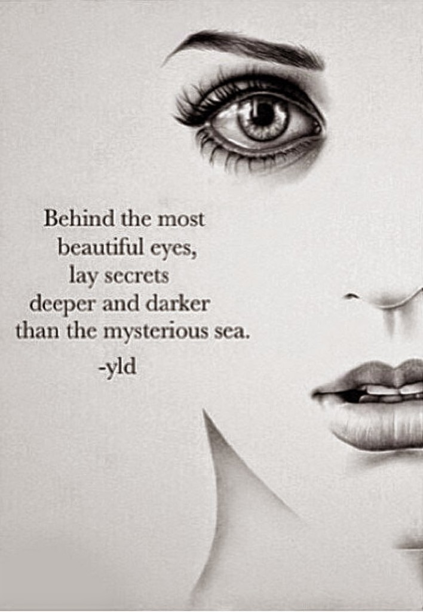

 

 Her dreaded weapon had dropped dead many

Deep, deft powerful strokes, that yielded the sharpness of a knife's edge

Not once did she flinch as she went around creating drama, every single time she cast a spell of enigma

The mesmerizing liquid pools shone arrogantly as the veil of her eyelashes revealed the kohl streaked dangerously along the rims of her eyes

Black, alluring and sinister.

This post was written for [Five Sentence Fiction – Darkness](http://lilliemcferrin.com/five-sentence-fiction-darkness/) at [Lillie McFerrin Writes](http://lilliemcferrin.com/). Also linking this to the [Ultra Blog Challenge](http://ultrablogchallenge.com/).
