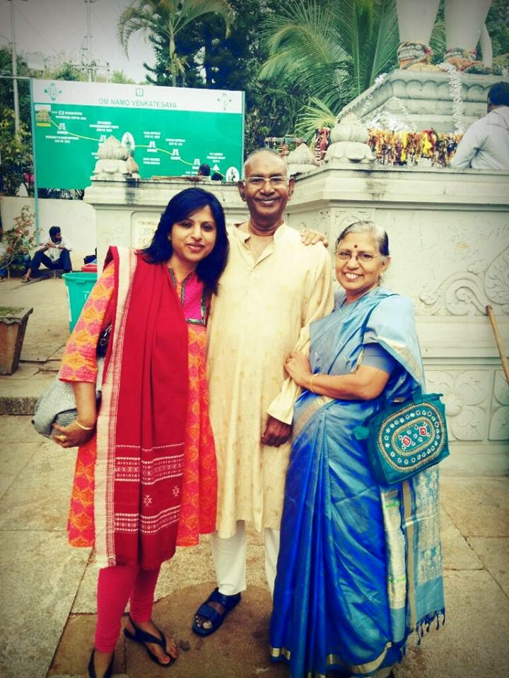

**Dear Vinni,**

_**The world is not always bad,**_

_**At times it is exceedingly good.**_

_**Turn adversity into advantage-**_

_**And feel younger than your age!!**_

**Good luck and bye for now.**  **Daddy (-:**

Two days back, I received these pearls of wisdom in my mailbox from my dad. This is his way of keeping my morale high and always making me look ahead in life with renewed optimism. I often get tiny doses of such surprises penned by my dear dad himself! A man of few words, sometimes he stumps us with the sheer ingenuity of the limited words he uses.

There are times when you assume that he’s lost in his thoughts or burrowed deep into the newspaper. But those are the very moments he is quietly observing, listening and absorbing information from our  behaviors’ and conversations while we're oblivious of his presence, processing and filing them away in his mental shelves to be used on some other day when we least expect it.

He has a method to every madness and yes there is a deep rooted logic in every grain of the adorable eccentricities he displays. Only, we are often left juggling with our own mental capacities to gauge his reasons.  He doesn't see the trivial need to explain those, you see.  After all, why the hell should he be expected to give you a reason for pacing the constricted length and breadth of our tiny patch of terrace, instead of going for his daily dose of exercise at the nearest public park for a refreshing walk? Apparently, he doesn't like getting his feet dirty! Sweet, no?! There are many such instances to quote, but I really shouldn't be rubbing him the wrong way, lest he gets offended and strikes off my wishlist, some of those things that I've been dreaming fantasizing waiting impatiently for, that they are supposed to get me from Sydney!

My parents are away on a longish trip out of the country, visiting my brother who resides in Australia. With due regards to their insatiable craving for spending quality time with their son and grandsons...although, they are physically miles apart from me, mentally they are still deeply connected to their 'out-of-this-world' adorable daughter back home. This awareness keeps me strong, secure, and grounded, no matter which situation I am in. Be it on WhatsApp, emails, phone calls or Skype, not a day passes without them asking me how my day was going, despite the struggle of catching up with the time zones.  They do end up invariably turning into my sounding boards but gladly absorb all the verbal ventilation I throw at them.

It is said, that you’re never given a chance to choose your parents.  But, I guess I got plain lucky when God was assigning parents!  Today is _**World Gratitude Day**_.  Just another reason for me to feel grateful for being blessed with world’s best parents, who fill my life with the most vibrant colors - especially a dad who takes the time to pen exclusively for his daughter.

Thank you Daddy! Love you. Come back soon.

<table class="tr-caption-container" style="margin-left: auto; margin-right: auto; text-align: center;" cellspacing="0" cellpadding="0" align="center"><tbody><tr><td style="text-align: center;"></td></tr><tr><td class="tr-caption" style="text-align: center;">*Copy rights reserved for both, the picture and the parents.</td></tr></tbody></table>
