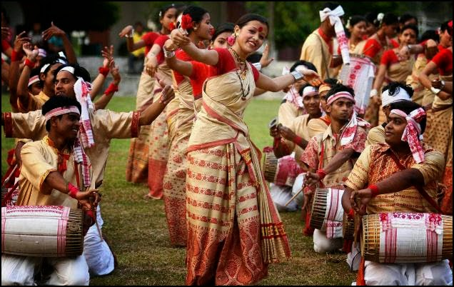

Elly and I have known each other for about two months now. While she enjoys reading my stories with twisted endings, I’m in awe of the tremendously informative blog posts she writes with careful research to back her write-ups with. Since we had decided to do a guest post on each other’s blog, after she obliged me with a wonderful story on my blog on August 1, 2014 (read it [here](http://vinodinii.blogspot.ca/2014_08_01_archive.html)), it is time for me to invade Elly’s blog space. I chose to talk about India in this post for Elly’s apparent interest in the topic.

  

~\*~\*~\*~

  

**No, I do NOT speak Indian!**

  
While India boasts of a rich and vibrant culture, there are a few misconceptions the world has about India. This observation has been made on certain generalized assumptions one comes across while interacting with people outside India.  
  

<table align="center" cellpadding="0" cellspacing="0" class="tr-caption-container" style="margin-left: auto; margin-right: auto; text-align: center;"><tbody><tr><td style="text-align: center;"></td></tr><tr><td class="tr-caption" style="text-align: center;"><a href="http://ifsbutsandsetcs.com/2014/09/27/no-i-do-not-speak-indian/">Source</a> &nbsp;<b>Who says we aren't rich?</b></td></tr></tbody></table>

India has also been ridiculously and falsely perceived as a poverty-stricken nation. Ridiculous assumption, specifically because the world is well aware of the royal heritage and background that this country originates from. Our historical monuments, rich cultural resources, and lifestyle are a testimony to the wealth of culture and riches this nation boasts of. So, the documentaries and photographs depicting the dreary poverty in India that you might have chanced upon are only one side of the story. This is the land of the aristocratic Tatas, Birlas, and Ambanis. Go on, Google them if you haven’t heard about them..._Go on, read more of this on my guest post at Elly's blog [here](http://ifsbutsandsetcs.com/2014/09/27/no-i-do-not-speak-indian/)._
