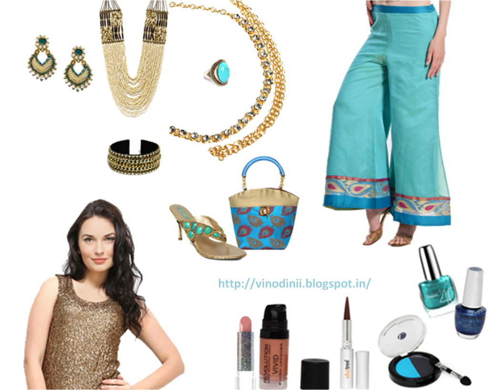

So, the festive season has swept in with full gusto. Mechanically my mental checklist starts buzzing in my head...sweets and savories - check, light and lamps - check, doing up the house - check, sprucing up my wardrobe for the festival...oops...haven't managed to get there yet!

  

 Being a working woman with commitments, at both work and home, leaves me hardly any time to indulge in scouring around fashion boutiques, malls and supermarkets . Thank god for online shopping! I pretty much manage to pull it off well when it comes updating my looks with latest must-haves at the best possible deals. So, when [http://www.myntra.com/](http://www.myntra.com/?src=tn) sent me an invite to put a look together for myself for this festive season from their versatile collection, I simply grabbed the opportunity. It served my purpose well, I got to shop without stepping out, got a glimpse of what was the latest up for grabs and the best of all, I also was supposed to blog about it! I was pleasantly surprised on the wide array of products across categories to choose from at rates that were super competitive. Working in the fashion and retail industry over a long span of years, I can vouch on the authenticity of these facts!

  

I actually managed to come up with two looks that I would love to sport this festive season. The first look inspired by my love for the _'Aqua'_ color, is what I plan to wear for a semi-formal luncheon with friends. And the second look is more on the traditional lines inspired by the _'Vermilion'_ color. I'm hoping to add some sparkle to a soiree with lit terracotta _diyas_ around me to add to the effect! Over the past few years, I am done to death with wearing the regular _Anarkalis,_ _cholis_ and traditional saris. Not that I don't like those, in fact, I'm a sucker for all things traditionally original. But I have had my share of wearing them on umpteenth occasions in the past. So, this year my mood really was to experiment with fusion and co-ordinates as opposed to the well matched attires with the perfectly matched set of accessories. Both these looks are not thoroughly conventional and have some quirky touches of fusion to them.

  

~\*~\*~

  

<table align="center" cellpadding="0" cellspacing="0" class="tr-caption-container" style="margin-left: auto; margin-right: auto; text-align: center;"><tbody><tr><td style="text-align: center;"></td></tr><tr><td class="tr-caption" style="text-align: center;"><b>Amazing Aqua!</b></td></tr></tbody></table>

Although October is closing in, there is no sign of winter and the days are still warm in India. One look at these aqua blue patterned _palazzo_ trousers from _Lavennder_  and I was bought out! The sheer material with the simple border with just the right amount of gold in it made it just perfect for a day wear for one of those numerous lunch invites with friends and family. I chose to balance the simplicity of the pants by pairing it with this shimmering knitted golden top adding the required amount of bling to the look. It has a round neck, is sleeveless with sequin work in the front and has a contrasting black color at the back. 

  

A heavy cream-colored antique gold-toned necklace with multiple beaded strands would take center stage over this expanse of glimmering gold. I would pair it with pair of gold-toned white drop earrings embellished with blue stones and pearl-like beads. To spice up this otherwise elegant look, I have chosen a gold plated, intricately designed kamarbandh with circular detailing, studded with faceted, white stones, which can be secured with an adjustable s-hook closure to be belted around the waist to further accentuate the look.  A pair of traditional earrings, a gold-toned cuff bracelet that has intricate beads, stones and metallic interlinked chain detailing throughout the wrist and a turquoise blue intricately designed ring in gold tone to adorn my finger accessorize me to the T to complete the look.

  

I simply love this blue and beige handbag with golden accents for the impact it would create, no matter what I'm wearing while carrying it around. And for this look...it is a complete go-getter! The chunky pair of open toed, gold toned sandals footwear beautifully adds yet another shade of aqua to my collection. I fell for them for their quiet elegance.

  

<table align="center" cellpadding="0" cellspacing="0" class="tr-caption-container" style="margin-left: auto; margin-right: auto; text-align: center;"><tbody><tr><td style="text-align: center;"></td></tr><tr><td class="tr-caption" style="text-align: center;"><i>One of my favorites</i></td></tr></tbody></table>

<table align="center" cellpadding="0" cellspacing="0" class="tr-caption-container" style="margin-left: auto; margin-right: auto; text-align: center;"><tbody><tr><td style="text-align: center;"></td></tr><tr><td class="tr-caption" style="text-align: center;">Want to give this a try</td></tr></tbody></table>

The blue eye-shadow can quite be a show-stopper if handled with expertise and caution. An over dose of caked up blue could be a disaster though! I can trust myself to go easy and deftly with it, thus I picked it to add the much needed pizzazz to this look. Go subtle by day and dramatic by night with this wet and dry eye shadow by _Lakme Absolute_. Its incredibly smooth oil and powder formulation delivers high-fashion drama in two tones. I couldn't quite decide between these two color of nail paints, so I decided to use the deep blue for my toes and the aqua shade for my finger nails, or who knows I might just get creative with some nail art using both these colors on my nails!  A streak of smoky kohl that contains handmade carbon black collected from vegetable oil lamps, organic _ghee_ (clarified butter), natural mineral colors and organic sweet almond oil. Since the eyes are going to be a bit dramatic I'll go easy with the other parts of the face. A light hint of lip color that is enriched with aloe vera and vitamin E that gives a moisture rich look and stays up to 12 hours with a gloss based sheen, a sweep of ultra intensive liquid blush for an intense pop of color that is easy to blend for a natural, soft and matte finished skin tone.... and I'd be good to go have some fun!

  

_**Check out each product on the links provided below to get a clear product description:**_

  

[Lavennder Women Blue Palazzo Trousers](http://www.myntra.com/trousers/lavennder/lavennder-women-blue-palazzo-trousers/375661/buy?src=search&uq=&q=women-trousers&p=81) - Rs. 1,679 

[FabAlley Women Golden Top](http://www.myntra.com/tops/faballey/faballey-women-golden-top/314109/buy?src=search&uq=&q=women-tops-tees&p=49) - Rs. 950

[Adrika Antique Cream-Coloured & Gold-Toned Poth Beaded Necklace](http://www.myntra.com/necklace/adrika/adrika-antique-cream-coloured--gold-toned-poth-beaded-necklace/464331/buy?src=search&uq=&q=women-jewellery&p=43) - Rs. 296

[Bindhani Gold Plated Kamarbandh](http://www.myntra.com/saree-accessories/bindhani/bindhani-gold-plated-kamarbandh/287868/buy?src=search&uq=&q=women-jewellery&p=59) - Rs. 319

[Anouk Gold-Toned & White Drop Earrings](http://www.myntra.com/earrings/anouk/anouk-gold-toned--white-drop-earrings/357877/buy?src=search&uq=&q=women-jewellery&p=34) - Rs. 449

[Accessorize Turquoise Blue & Gold Toned Ring](http://www.myntra.com/ring/accessorize/accessorize-turquoise-blue--gold-toned-ring/350044/buy?src=search&uq=&q=women-new-jewellery&p=38) - Rs. 945

[Blueberry Gold-Toned Cuff Bracelet](http://www.myntra.com/bracelet/blueberry/blueberry-gold-toned-cuff-bracelet/400651/buy?src=search&uq=&q=women-jewellery&p=55) - Rs. 509

 [Anouk Blue Handbag](http://www.myntra.com/handbags/anouk/anouk-blue-handbag/472031/buy?src=search&uq=&q=women-bags-wallets&p=87) - Rs. 799

[Catwalk Women Gold Toned Heels](http://www.myntra.com/heels/catwalk/catwalk-women-gold-toned-heels/177076/buy?src=pp&prt=myntrarecos&psid=272604&prs=177076%2C211821%2C239529%2C177068%2C17686%2C248785%2C145276%2C259938%2C248787%2C227270%2C227180%2C200814%2C248790%2C227173&rc=similar&rd=sd) - Rs. 999

[De Rene Moodpearl Vivacious Orange Lipstick](http://www.myntra.com/lipstick/de-rene/de-rene-moodpearl-vivacious-orange-lipstick-mp-org/398693/buy?src=search&uq=true&q=lipstick&p=5) - Rs. 501

[Makeup Revolution London Bloom Vivid Liquid Blush](http://www.myntra.com/blusher/makeup-revolution-london/makeup-revolution-london-bloom-vivid-liquid-blush/387114/buy?src=search&uq=true&q=blusher&p=21) - Rs. 750

[Soultree Pure Black Colour Kohl 011](http://www.myntra.com/kajal/soultree/soultree-pure-black-colour-kohl-011/417693/buy?src=search&uq=true&q=kajal&p=8) - Rs. 295

[Lakme Absolute Drama Stylist Blue Shadow Duos](http://www.myntra.com/Eye-Shadow/Lakme/Lakme-Absolute-Drama-Stylist-Blue-Shadow-Duos/204203/buy) - Rs. 585

[Colorbar USA Pro Wedding Affair Fluid Sand Nail Lacquer 005](http://www.myntra.com/Nail-Polish/Colorbar/Colorbar-USA-Pro-Wedding-Affair-Fluid-Sand-Nail-Lacquer-005/376816/buy) - Rs. 499

[Maybelline Turquoise Blue Nail Polish](http://www.myntra.com/nail-polish/maybelline/maybelline-turquoise-blue-nail-polish/62314/buy?src=search&uq=true&q=nail-polish&p=31) - Rs. 210

  

This complete look costed me just Rs. 9785, including the accessories, make-up and the works. Considering how people end up buying only one single designer outfit or a pair of branded footwear at that price, this is not a bad deal at all! Just the clothes would cost me something as low as Rs.2629.

  

~\*~\*~

  

<table align="center" cellpadding="0" cellspacing="0" class="tr-caption-container" style="margin-left: auto; margin-right: auto; text-align: center;"><tbody><tr><td style="text-align: center;"></td></tr><tr><td class="tr-caption" style="text-align: center;"><b>Vermilion Verve</b></td></tr></tbody></table>

Every Diwali, I wait for the time I light the terracotta _diyas_ to dress my home with their twinkling sparkles. The colorful _rangoli_ I design at my doorstep normally compliments the colors I wear that evening. The first time I laid my eyes on this riotous red printed maxi skirt with tassels on the left side, I lost my heart to it. The contradiction of its quiet simplicity of design as opposed to its popping bright outrageous color swirled me right into festive mode! The best part is that I could club it with the same gold top that I plan to sport during the day. That's how versatile this top is! One could get away with the most chic western wear as also the charming traditional looks, that the festivities call for. I chose to throw in this vibrant multicolored woven printed stole with striped and tassel detail on either sides along the hems, just to satisfy the quirky part of me. I wouldn't drape it the way it is seen in the picture though...rather I would throw it casually on one side of my shoulder to compliment the formal look. Agreed, this stole is ideally meant for a casual look, and a heavy _dupatta_ would have been perfect to go with this look! But who wants to be perfect this season?! Not me at least! Aren't the markets already flooded with a lot of perfectly coordinated outfits? I'd rather stand out with my experimental coordinates, put together to dazzle, rather than mingle in a crowd of people dressed in duplicated commercial looks.

  

The red potli bag with antique gold-toned accents that has overlay and stitched details adds to the playfulness to this look. The footwear adds to the need for vibrant colors here. I love the _khadau_ look on heels. Classy and traditional.

  

<table align="center" cellpadding="0" cellspacing="0" class="tr-caption-container" style="margin-left: auto; margin-right: auto; text-align: center;"><tbody><tr><td style="text-align: center;"></td></tr><tr><td class="tr-caption" style="text-align: center;"><i>An all time classic</i></td></tr></tbody></table>

<table align="center" cellpadding="0" cellspacing="0" class="tr-caption-container" style="margin-left: auto; margin-right: auto; text-align: center;"><tbody><tr><td style="text-align: center;"></td></tr><tr><td class="tr-caption" style="text-align: center;">On my wishlist!</td></tr></tbody></table>

The accessories are chosen to satiate the traditional heart in me that completely adores the fine craftsmanship and delicate designs that jewelers in our country boast of. A ruby red neck-piece to compliment the color riot of the skirt_,_ a pair of _jhumkas_ carved with my all-time favorite paisley motifs, a gold toned peacock shaped ring with white stones and black, green and red accents, an armlet with teardrop-shaped and flower-shaped details encrusted with maroon, green and white stones, and an over-sized nose ring that is simply 'oh-so-Indian'...just the things required to add the requisite drama!

  

For the evening look I go bright on the lip color that has a soft and creamy texture which leaves the lips feeling moisturized, smooth with a stunning finish, pairing it with a rich wine colored jeweled nail color. A gold eyeliner is something I haven't tried so far and intend to experiment with. An eye-shadow crayon, that is long lasting, soft, waterproof, and remarkably smooth with an intense color pay-off that can give the right amount of definition to this look. A hint of glitter with loose shimmer powder to get that festive glow and peachy blush to accentuate my cheeks, and I guess I would probably give the sparkling _diyas_ a competition!

  

_**Check out each product on the links provided below to get a clear product description:**_

  

[9rasa Red Printed Maxi Skirt](http://www.myntra.com/skirts/9rasa/9rasa-red-printed-maxi-skirt/431634/buy?src=pp&prt=myntrarecos&psid=431633&prs=431634%2C407973%2C407976%2C392059%2C431628%2C392068%2C431627%2C392060%2C431629%2C431632%2C329497&rc=similar&rd=sd) - Rs. 1,599

[FabAlley Women Golden Top](http://www.myntra.com/tops/faballey/faballey-women-golden-top/314109/buy?src=search&uq=&q=women-tops-tees&p=49) - Rs. 950

[Anouk Red Potli Bag](http://www.myntra.com/clutches/anouk/anouk-red-potli-bag/472167/buy?src=search&uq=&q=women-bags-wallets&p=57) - Rs. 799

[Catwalk Women Gold Toned Heels](http://www.myntra.com/heels/catwalk/catwalk-women-gold-toned-heels/272604/buy?src=search&uq=&q=women-sandals-heels&p=1) - Rs. 999

[Tassels Women Multicoloured Printed Stole](http://www.myntra.com/stoles/tassels/tassels-women-multicoloured-printed-stole/380586/buy?src=search&uq=true&q=stole&p=15) - Rs. 899

[Pretty Women Gold-Toned & Red Necklace](http://www.myntra.com/Necklace/Pretty-Women/Pretty-Women-Gold-Toned--Red-Necklace/411753/buy) - Rs. 1,104

[Siyora Gold-Toned & White Drop Earrings](http://www.myntra.com/Earrings/Siyora/Siyora-Gold-Toned--White-Drop-Earrings/432661/buy) - Rs. 1,020

[Bindhani Gold toned Finger Ring](http://www.myntra.com/ring/bindhani/bindhani-gold-toned-finger-ring/150092/buy?src=search&uq=&q=women-jewellery&p=64) - Rs. 419

[Siyora Gold-Toned Oversized Chain Nose Ring](http://www.myntra.com/nosepin/siyora/siyora-gold-toned-oversized-chain-nose-ring/432810/buy?src=search&uq=true&q=nose-ring&p=2) - Rs. 280

[Siyora Gold-Toned Armlet](http://www.myntra.com/bracelet/siyora/siyora-gold-toned-armlet/432594/buy?src=search&uq=true&q=armlet&p=6) - Rs. 1,120

[Loreal Color Riche Deep Raspberry Lipstick 375](http://www.myntra.com/lipstick/loreal/loreal-color-riche-deep-raspberry-lipstick-375/135305/buy?src=search&uq=&q=personal-care&p=60) - Rs. 825

[Loreal Color Riche Hypnotic Red Nail Polish 409](http://www.myntra.com/nail-polish/loreal/loreal-color-riche-hypnotic-red-nail-polish-409/96329/buy?src=search&uq=true&q=nail-polish&p=81) - Rs. 211

[Lakme Absolute Drama Stylist Pink Eye Shadow Crayon](http://www.myntra.com/eye-shadow/lakme/lakme-absolute-drama-stylist-pink-eye-shadow-crayon/204198/buy?src=search&uq=true&q=eye-shadow&p=8) - Rs. 675

[LOreal Paris Glamour Gold Super Liner Gelmatic Eyeliner](http://www.myntra.com/eyeliner/loreal/loreal-paris-glamour-gold-super-liner-gelmatic-eyeliner/296834/buy?src=search&uq=true&q=loreal-eyes&p=3) - Rs. 425

[Maybelline Dream Touch Blusher 07](http://www.myntra.com/blusher/maybelline/maybelline-dream-touch-blusher-07/62504/buy?src=search&uq=true&q=blusher&p=11) - Rs. 375

[Colorbar Miss Reflective Body Shimmer 001](http://www.myntra.com/55834) - Rs. 425

  

This entire look will cost me just Rs.12125 (actually Rs. 11175 if you minus the cost of the top which is repeated in this look)....yes it's 'just' that much, since it includes every little detail to make you sparkle bright this Diwali! If you're looking at the cost of the attire clothes would cost you only Rs.3448, isn't that reasonable enough?

  

~\*~\*~

  

Wow, I can't believe that I actually figured out both these looks at such a neat amount! I'm sure, had I bought these products off the shelves in the local markets, it would have costed me a bomb. Besides the humongous variety of products at the best prices, Myntra sure offers a fuss-free, shopping experience. Their prompt customer service is impeccable. Thank you so much, _'Myntra,'_ for giving me such a wide array of choices at prices so affordable....guess I can now take off for that luxurious spa session with the monies I saved up after buying all these fabulous products!

  

~\*~\*~

  

_**Happy Diwali and a Prosperous New year**_

_**Keep Shining!**_

_\*Disclaimer: The review and recommendations offered here are my own. I suggest that you use the products at your own discretion. This post has been written for 'Blog it. Bag it’ activity hosted by [http://www.myntra.com/](http://www.myntra.com/?src=tn)._

