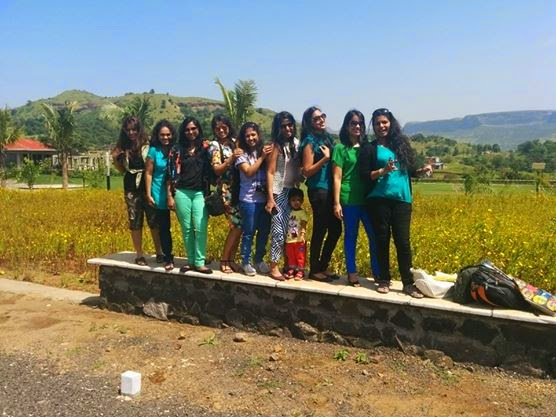
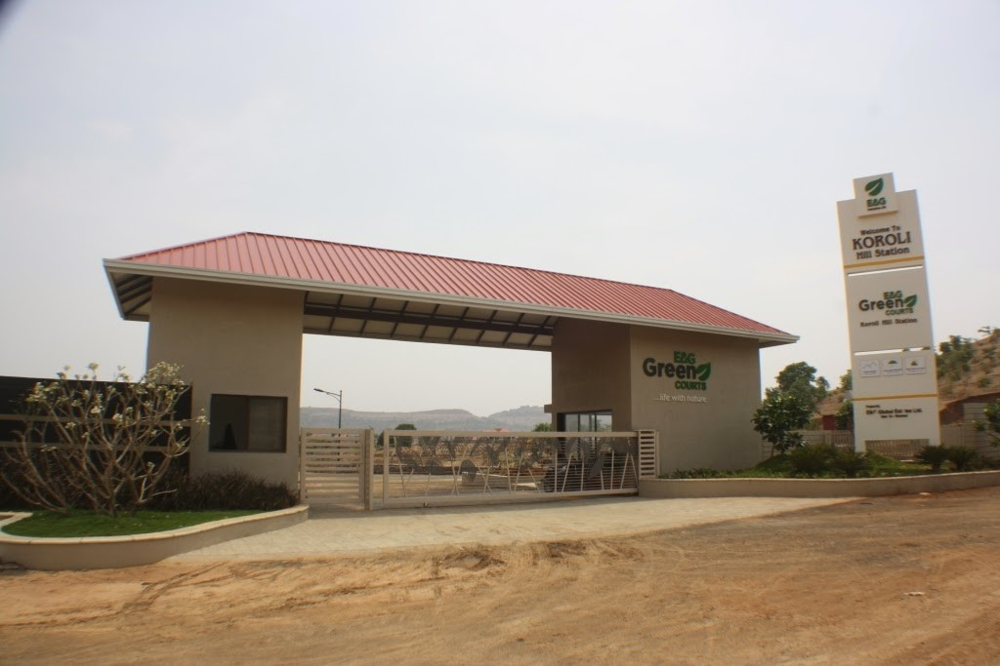
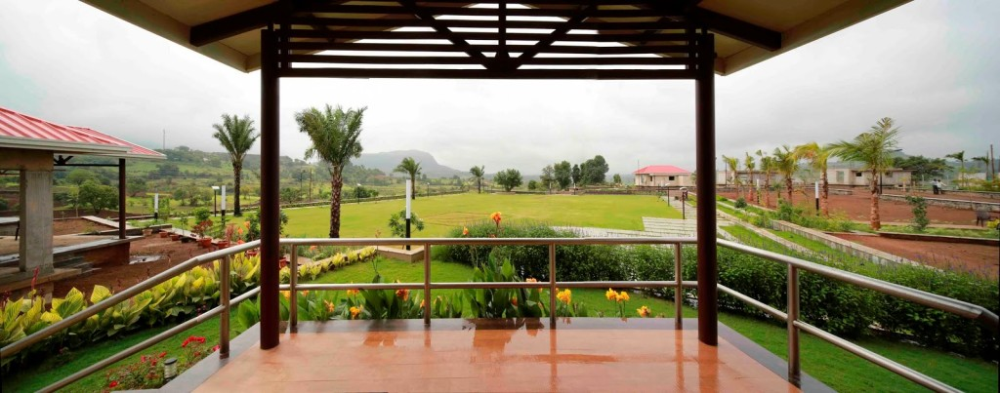
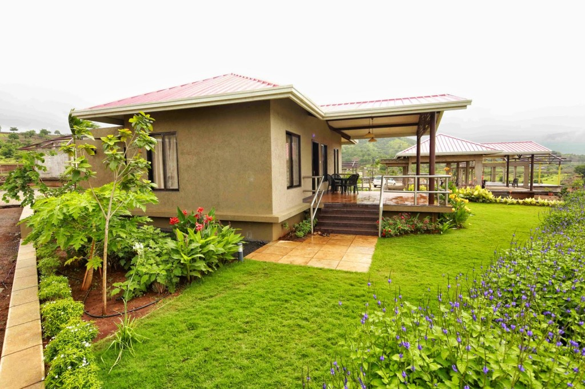

A few weeks back I got a mail in my inbox asking for my interest in joining in for a bloggers meet. The venue was at a hill station two hours away from Mumbai. It sounded like an interesting weekend getaway, especially with select bloggers for company. What I got to know later was that, it was hosted by a company that was involved in developing vacation villas/homes. And the catch to the weekend getaway was to blog about the property we were visiting as a part of the #DiscoverGreen activity hosted by E&G in association with [So-Saree](http://www.sosaree.in/).  
  
_**A brief background about the developers of the property we were visiting:**_  
_E&G are pioneers in building nature villas at unexplored scenic locations with state of art infrastructure and resort facilities. They also provide a source to generate passive income through a convenient leaseback model. They really seem to be passionate about their green endeavors._  
  
To be honest, although I was keen on meeting these bloggers whom I barely knew, the thought of blogging about a real estate property did not appear to be too appealing to me. After all, all I had on my mind was to unwind and enjoy the nature at it's best. And really, there were so many of these vacation home concepts coming up off late...that I really wondered, what was it that was so great about this particular project that would inspire me to write about it. Weren't they all at beautiful untouched destinations, far off yet reachable from city limits? Didn't they all boast of the amazing state of art technology and services they were providing to their customers? I did have a chance to see some of the pictures posted by the developers on the site which momentarily impressed me but then yet again, my doubts still persisted. Nevertheless I decided to go with the flow and set off with the effervescent bloggers...a bunch of giggly, selfie obsessed women!  
  

<table align="center" cellpadding="0" cellspacing="0" class="tr-caption-container" style="margin-left: auto; margin-right: auto; text-align: center;"><tbody><tr><td style="text-align: center;"></td></tr><tr><td class="tr-caption" style="text-align: center;">The bunch of vivacious bloggers!</td></tr></tbody></table>

<table align="center" cellpadding="0" cellspacing="0" class="tr-caption-container" style="margin-left: auto; margin-right: auto; text-align: center;"><tbody><tr><td style="text-align: center;"></td></tr><tr><td class="tr-caption" style="text-align: center;">The verdant greenery by the Vaitarna lake</td></tr></tbody></table>

Two hours away from Mumbai, nestled close to Nashik and Igatpuri, Koroli is an untouched stretch of green expanse for as long as your eyes could strain to see, with the scenic interspersing of the Vaitarna lake's backwaters, close to the Vaitarna dam. Also worth noting is the fact that Maharashtra government's contribution to develop Nashik's infrastructure has been quite commendable which shows distinctly on the way to our destination. As we approached Green Courts, that's the name of the ongoing project of villas that we were visiting, we were greeted by a huge driveway that wound through an unending stretch of manicured lawns, flowerbeds and dreamy butterflies fluttering around. It reminded me of the fairy tale descriptions of the royal gardens around a king's castle!  
  

  

<table align="center" cellpadding="0" cellspacing="0" class="tr-caption-container" style="margin-left: auto; margin-right: auto; text-align: center;"><tbody><tr><td style="text-align: center;"></td></tr><tr><td class="tr-caption" style="text-align: center;">The perfectly manicured driveway</td></tr></tbody></table>

Along with the fully furnished villas come personalized swimming pools, private gardens and more. A hill view coffee shop, fully stocked library, horse riding, fun boating, a sports and recreational area, a spiritual condominium, a spa, an amphitheater are surefire temptations that are being developed on the property. The security is well taken care of with a 24x7 patrolling security and 6ft, 1ft barbed wire fencing for overall project for outer boundary. But what about proximity to necessary places one needs to reach out in case of emergency? There is a super specialty hospital located 15 minutes away. Orchid international school, an ISO certified boarding school that is ranked as the 4th most respected boarding school in the western region by the education world, is located 6 kms from Koroli.  
  

<table align="center" cellpadding="0" cellspacing="0" class="tr-caption-container" style="margin-left: auto; margin-right: auto; text-align: center;"><tbody><tr><td style="text-align: center;"></td></tr><tr><td class="tr-caption" style="text-align: center;">Need I say more?</td></tr></tbody></table>

 Nashik is 30 minutes drive from Koroli. Trimbakeshwar is one of the holiest Hindu temples in India, 28kms from the city of Nashik, 30 mins away from Koroli. This temple is dedicated to Lord Shiva and is one of the twelve Jyotirlingas. About 35 Km from Igatpuri is the highest peak of the Sahyadri ranges. It is a great peak for trekkers offering uninterrupted view of surrounding. Shirdi is 90kms from Koroli.  
  
All my doubts regarding the uniqueness of the project vanished the moment we stepped onto the porch of the _**Silver Springs**_ 2BHK villa. A tastefully laid out cane table with garden chairs with beautiful ceramic ware greeted us on the porch.  
  

<table align="center" cellpadding="0" cellspacing="0" class="tr-caption-container" style="margin-left: auto; margin-right: auto; text-align: center;"><tbody><tr><td style="text-align: center;"></td></tr><tr><td class="tr-caption" style="text-align: center;">The inviting porch</td></tr></tbody></table>

<table align="center" cellpadding="0" cellspacing="0" class="tr-caption-container" style="margin-left: auto; margin-right: auto; text-align: center;"><tbody><tr><td style="text-align: center;"></td></tr><tr><td class="tr-caption" style="text-align: center;">I could while away hours curled up reading these on the lawns</td></tr></tbody></table>

<table align="center" cellpadding="0" cellspacing="0" class="tr-caption-container" style="margin-left: auto; margin-right: auto; text-align: center;"><tbody><tr><td style="text-align: center;"></td></tr><tr><td class="tr-caption" style="text-align: center;">Understated elegance at it's best</td></tr></tbody></table>

 The interiors were earthy, rustic and opulent at the same time. Considering that FAB India was responsible for giving these villas a character that made them stand apart, it shouldn't really have been such a surprise. Tiny details like the antique looking ceiling fan, the rare artifacts strategically placed across the house, the subdued colors were a delight to discover. Even the ceiling had a distinct identity of its own.  
  

<table align="center" cellpadding="0" cellspacing="0" class="tr-caption-container" style="margin-left: auto; margin-right: auto; text-align: center;"><tbody><tr><td style="text-align: center;"></td></tr><tr><td class="tr-caption" style="text-align: center;">Silver Springs 2 BHK Villa</td></tr></tbody></table>

_**Specs:**_  
_2BHK VILLA_  
_An elegant abode, a stand-alone 2BHK villa is open to a view of green hills from both the sides._  
_Lawn Area: 450 Sq.ft_  
_Parking: 200 Sq.ft_  

_**The Kingsmead**_, 4BHK villa left us speechless, the interiors were as interesting as the 2BHK villa. But it was the attached personal swimming pool in the villa lawn which took the cake. One could just laze around lying in the pool, dreamily watching the hills around in the distance. It was an experience dreams are made of!

  

<table align="center" cellpadding="0" cellspacing="0" class="tr-caption-container" style="margin-left: auto; margin-right: auto; text-align: center;"><tbody><tr><td style="text-align: center;"></td></tr><tr><td class="tr-caption" style="text-align: center;">Kingsmead 4 BHK villa with personal swimming pool</td></tr></tbody></table>

<table align="center" cellpadding="0" cellspacing="0" class="tr-caption-container" style="margin-left: auto; margin-right: auto; text-align: center;"><tbody><tr><td style="text-align: center;"></td></tr><tr><td class="tr-caption" style="text-align: center;">Imagine owning a pool in the midst of hills!</td></tr></tbody></table>

<table align="center" cellpadding="0" cellspacing="0" class="tr-caption-container" style="margin-left: auto; margin-right: auto; text-align: center;"><tbody><tr><td style="text-align: center;"></td></tr><tr><td class="tr-caption" style="text-align: center;">The villas come with muted yet classy interiors by Fab India.</td></tr></tbody></table>

<table align="center" cellpadding="0" cellspacing="0" class="tr-caption-container" style="margin-left: auto; margin-right: auto; text-align: center;"><tbody><tr><td style="text-align: center;"></td></tr><tr><td class="tr-caption" style="text-align: center;">Even the ceiling had a character of its own. &nbsp;Loved these antique&nbsp;looking fans!</td></tr></tbody></table>

<table align="center" cellpadding="0" cellspacing="0" class="tr-caption-container" style="margin-left: auto; margin-right: auto; text-align: center;"><tbody><tr><td style="text-align: center;"></td></tr><tr><td class="tr-caption" style="text-align: center;">The bath that opened up to the sky!</td></tr></tbody></table>

One thing inside the villa that caught my fancy was, the open- to-sky shower room with a glass ceiling to watch the clouds above while you showered. That was quite some imagination!

  

<table align="center" cellpadding="0" cellspacing="0" class="tr-caption-container" style="margin-left: auto; margin-right: auto; text-align: center;"><tbody><tr><td style="text-align: center;"></td></tr><tr><td class="tr-caption" style="text-align: center;">The porch of the 4 BHK villa. That swing overlooking the hills was a perfect lounging partner!</td></tr></tbody></table>

  

_**Specs:**_  
_4 BHK luxury villa, one facing the other, opens to a cluster of green environs and an uninterrupted view of bosom shaped mountains._  
_Lawn Area: 700 Sq.ft_  
_Parking: 350 Sq.ft_  
_Swimming pool area with 800 sq.ft deck_  
What made this property stand apart from all the other vacation homes that I have come across, is the simplicity of it's aesthetics, which doesn't just scream of money but makes it a tasteful acquisition for enjoying the little pleasures of life that we have long forgotten. Thank you E&G and So-Saree for giving us this wonderful opportunity to visit a place as lush and classy as this! It was a complete delight to visit and review this project! I must admit that I am tempted to invest in this project considering the fact that the property I buy can actually be leased back to E&G. Someday for sure....  
  
  

Check out the virtual walk through to get the live experience of the beauty of this project:

  

<iframe allowfullscreen frameborder="0" height="270" src="https://www.youtube.com/embed/nNI5HfLHreY" width="480"></iframe>

  

For more information about this check out [www.koroli.in](http://www.koroli.in/).
