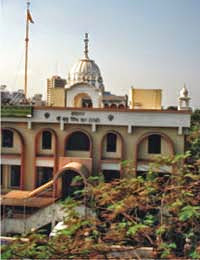

Life has been crazy off-late ever since I've joined this new job. Work hours stretch beyond imagination and one thing adds to another out of nowhere. What else can you expect when you're working for retail format that has over 800 stores spread across the length and breadth of the country, that you're expected to spruce up? Endless chaos, mindless arguments, popping confusions, last minute projects, flying tempers and attempts to soothe yourself by guzzling down gallons of caffeine, coupled with several laughs over funny moments to lighten up the madness of it all.One such busy day last week, my colleague and friend at work, came decked up in her best Punjabi finery. It wasn't unusual for us to see her decked up, for she does enjoy the dressing up bit. So, none of us really got thinking about it. The day stretched on at the usual pace with work flowing in. By the time we could call it a day, it was already 11.30 pm, another half an hour for the day to end. Since we work in an area that is pretty isolated from civilization, on a secluded highway, most nights that we're working late, girls who live around each other's pads make it a point to huddle together in a cab and ensure that each of us reaches our homes safely.

Just as the three of us got into a cab, I noticed that this normally talkative chirpy colleague of mine was quiet and lost in her thoughts. On probing her a bit, we realized that it was [_'Guru Nanak Jayanti'_](http://en.wikipedia.org/wiki/Guru_Nanak_Gurpurab) also known as _Gurpurab,_ which is a special day for the Sikh community since it signifies the birth of the first Sikh Guru, _Guru Nanak._ No wonder she was dressed for the occasion since morning, a Sikh that she was. Staying away from home has its up and downs. The downside is that you end up missing certain rituals that you wouldn't ignore back home. Apparently, her other Sikh friends and relatives had been texting her and updating her on their celebrations and their visits to the _gurdwārās_ and _langars,_ which she had not been able to manage due to our tight work schedules. Just as we were discussing this, she casually asked the cab driver on the spur of the moment if he knew of any _gurdwārā_ in the vicinity. All three of us are not very familiar with this part of the city since we have started living and working there only recently. When the driver confirmed that he did know the existence of a _gurdwārā_ closeby, without a second thought we headed towards the religious destination. After all, it seemed like the Guru himself had sent us his summons. Why else would a bunch of drained women who looked like they were something the cat just dragged in, after a whole day's slogging, even think of going elsewhere but head home and crash into their respective beds?!

<table class="tr-caption-container" style="margin-left: auto; margin-right: auto; text-align: center;" cellspacing="0" cellpadding="0" align="center"><tbody><tr><td style="text-align: center;"></td></tr><tr><td class="tr-caption" style="text-align: center;"><i>Gurdwara Sri Guru Singh Sabha</i>, Vashi Source: Google Images</td></tr></tbody></table>

Soon, we were at the steps of the _gurdwārā_. It was my first visit to a _gurdwārā,_ with the exception of my visit to the Golden temple at Amritsar, a few years back. While both my companions had a scarf and a _dupatta_ each to cover their heads with, which is mandatory when you walk into a _gurdwārā_, I had to make do with a scrap of a cloth being distributed there for people like me who did not have the necessary garb to cover their heads with. I quickly attempted to cover my head in a bandanna of sorts. After a moment of reverence as we offered our prayers to _Guru Granth Sahib,_ we walked out, having the yummy _Karah Parshad_ (sweet flour and ghee-based food offering) being distributed there, surprisingly a lot fresher and not feeling as tired as we were when we had walked in. My Sikh friend was back in her bubbly elements and we also managed to click a few pictures!

Just as we climbed into the cab to head back home, we realized that it was 12 am. We had managed to pay our homage to the lord just in time before the pious day ended. It was a tiny reminder to us that, even when you do not have time for god, he makes sure that you find time for him...but only if you have the will to do so!
