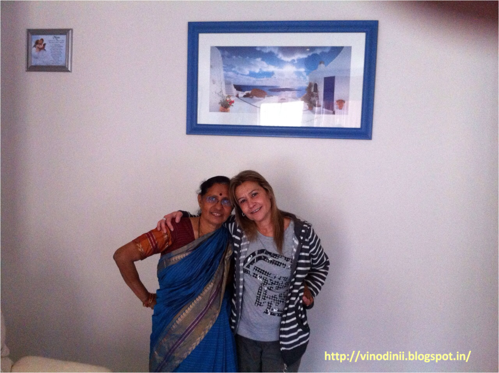
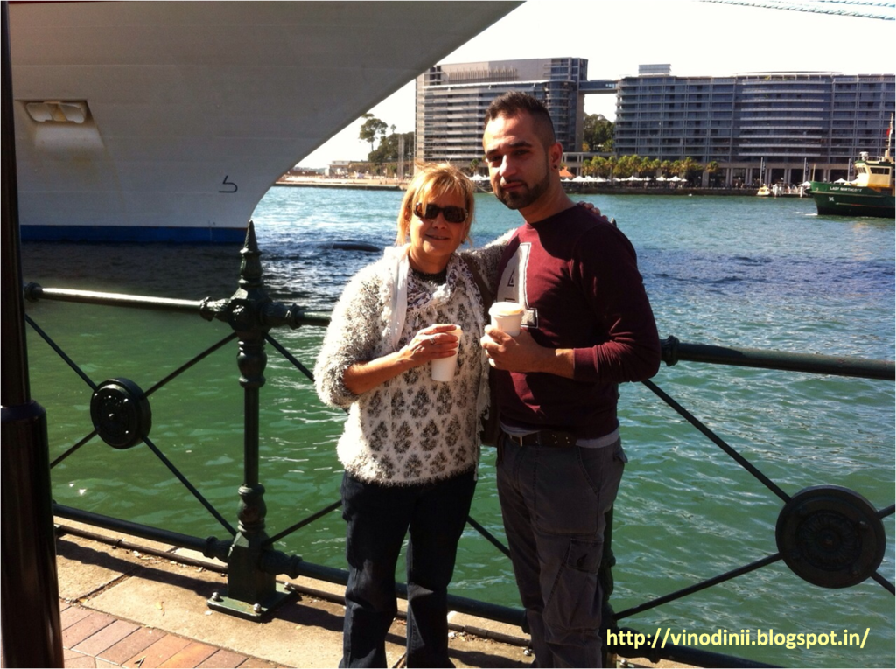
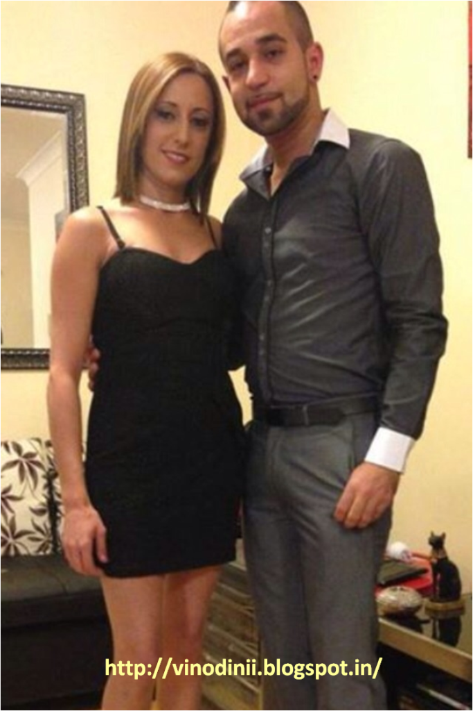

Today's post is about souls who connect over long distances. I use the word soul for the depth of a certain casual connection that translates into a meaningful association in a surprisingly personal and endearing manner. One such soul I have encountered, connected and bonded with, over a period of last few years now, is a bright, warm, affectionate and young-at-heart woman called Nahla Hazzoury, who happens to be a close friend of my mother, to the extent that their bond is almost as good as that of real sisters, despite the differences in their ethnicity and cultures.Interestingly, I have never met Nahla in person. But today she rightfully is my foster mother, as she puts it. Long ago, Nahla and her husband Michael used to be my brother's neighbors in Sydney, Australia. On my parents' first visit to Sydney, they came across this charming couple who lived right across my brother's house. Over long chit-chats, on lazy afternoons, my mum and Nahla got familiar with each others lives, their families, their common interests, personal challenges and a lot of mundane yet important details one shares with only someone you are close to. And that's when they happened to discuss me.

<table class="tr-caption-container" style="margin-left: auto; margin-right: auto; text-align: center;" cellspacing="0" cellpadding="0" align="center"><tbody><tr><td style="text-align: center;"></td></tr><tr><td class="tr-caption" style="text-align: center;"><b>My mum with my foster mum...yes, that's Nahla on the right hand side!</b></td></tr></tbody></table>

Now, one thing striking about Nahla is her gift of intuition. My brother and sister-in-law on various occasions had mentioned to us about her predictions based on her intuitions. Initially, we did not really take these predictions seriously, coz we never understood the basis of her predictions. Although, she did make sense on a lot of things she predicted. She would often describe people around me at work and my friends, and I would wonder how she could come up with such accurate details about my connections, those that even my mum would not be aware of.

For a long time, she conveyed these messages to me through my mum, that did help me decide my future course of actions to a large extent, till a few months ago, when I connected with her directly over Whatsapp and email. This was around the time I had been shortlisted for a new job and I was waiting to hear from my prospective employers. They were taking forever to revert with the offer and I had almost given up on receiving the same, assuming that they probably had changed their minds. Mum was in Australia at the time and Nahla would often inquire about me. Mum would update her on the developments in my life. That's when I first received a mail from her stating that I was almost hired for the new job and that my papers were ready. It was only taking time coz the firm was going through a restructuring and that it was a new profile that was being created exclusively for me. She further advised me to call the recruiters and check with them. Something stirred within me when I read these words and on the spur of the moment I called the concerned human resource at the company. And, what I heard next, made me almost stumble off my seat! Exactly the same words that Nahla had written in her mail, were repeated over the line through my recruiter's voice! After this incident I do take her very seriously and seek her guidance on and off. All my interactions with her turn out to be very uplifting coz she paints such beautiful pictures of my future...well, but do I have a choice but to believe her?!

I finally declared to my mum with all my conviction that Nahla had mystical qualities  in her (an assumption that I was mocked for, by Nahla when my mum told her about it!). Since she never resorted to tarot cards, calculations or the crystal ball, I often wondered the basis of her predictions. Unable to contain my curiosity, I ventured to ask her about the same and learnt from her that she receives these messages via the music that she listens to. Interesting, isn't it?!

She tells me that, she and my mother have some kind of an invisible connection, I guess a karmic connection. And that's how she finds herself receiving messages for me. Nahla has a daughter Joanne, and a son Anthony, who are quite like me and my brother in terms of their personalities. Jo apparently is as outspoken as me and Nahla tells me she has the spirited spark in her eyes, just as I do. While Anthony is as reserved and quiet a person as my brother is. I often send her links of my blog posts that I think would interest her and she has been quite encouraging regarding my writings. She sees a future script writer in me!

<table class="tr-caption-container" style="margin-left: auto; margin-right: auto; text-align: center;" cellspacing="0" cellpadding="0" align="center"><tbody><tr><td style="text-align: center;"></td></tr><tr><td class="tr-caption" style="text-align: center;"><b>Nahla and her son Anthony</b></td></tr></tbody></table>

<table class="tr-caption-container" style="margin-left: auto; margin-right: auto; text-align: center;" cellspacing="0" cellpadding="0" align="center"><tbody><tr><td style="text-align: center;"></td></tr><tr><td class="tr-caption" style="text-align: center;"><b>Nahla's kids: Joanne and Anthony</b></td></tr></tbody></table>

Nahla desires that I write a book on her life some day. Sure Nahla, let me get the crux of your biography and someday I am sure to share the story of someone I admire as person with the best possible justice that I can offer. Today, on 30th November, this amazing foster mum of mine, celebrates her birthday. I haven't started writing the book on her yet, but I thought why not write a blog post to start with, of as much as I know of her?  So here it is...my birthday dedication to Nahla!

**_Happy Birthday Dear Nahla!_**

God bless you with the happiness multiplied in manifold ways, that you go about spreading among people around you....so effortlessly. I hope to see you in person, sometime soon! Love you...xoxo
