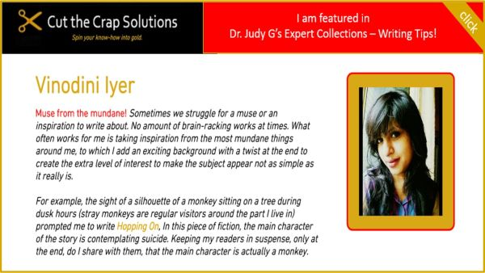
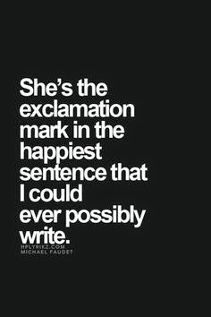

As the world celebrates International Women's Day today, I really wasn't in the mood for acknowledging this day, with the recent spate of mud-slinging on the 80% of 'bad girls,' as pointed out by the accused rapists and the lawyers defending them in the brutal Delhi rape case. These are the same people who have self-appointed themselves as the moral policemen of Indian society. I'm proud to claim that I fall in the category of the 'bad girls.' A woman who is unapologetic in everything she does to please herself and does not live in the shadow of fear of confirming to the so-called politically correct image of a 'good girl,' as defined by a certain creed of hypocrites plaguing the society.Well, what changed my mind and put me in a better perspective to write today was this email that I received yesterday from someone. Judy Yaron, is a dear blogger friend, whom I connected through one of the blogging challenges I had undertaken a few months back. Her blog posts are intriguing, informative and at the same time entertaining with her trademark sense of humor peeping through her words on and off. Judy's interest is in writing content for learning and information products and services. She recently came up with this brilliant idea wherein she invited a host of bloggers, writers and entrepreneurs to share their writing tips which in turn would be featured on her page: [http://www.cutthecrapsolutions.com](http://www.cutthecrapsolutions.com/#!my-story/c1bwh). The purpose for doing this was with the intent of providing benefit to both seasoned and amateur writers/bloggers alike to help them write better content.

Last evening she sent me the link of the beautifully turned out page that she had compiled and developed, featuring the writing tips that she had received from individual writers and bloggers, which included me. What struck me instantly as I scrolled down these undoubtedly helpful tips that came from people from varied backgrounds was that they were all majorly from women, with only one thing in common - that was their love for writing! What beautiful coincidence that we could see a fruition to this venture on 'Women's day!' After all, it was a coming together of like-minded women (with the exception of one man, I could see only one there!), to share and help grow in whatever they were best at, and that too on behest of a woman who is admired by all of us for her pro-activeness...who else but our dear friend 'Judy!' Thank you so much Judy, for this thoughtful initiative.

Here's the writing tip I shared that works for me the most and which got featured on her site:

To read more of it [click here](http://bit.ly/1wcXFoC)

I also recommend that you read the entire set of writing tips compiled on her page.

These are simple yet useful measures that one could adapt and learn from to improve

 and develop great content.

To read them all [click here](http://bit.ly/18pxEan)

Do feel free to browse around her site when you're there!

Before you go...here's one for all you fabulous women out there.

**HAPPY WOMEN'S DAY!**

**So... lets continue leaving those** 

**exclamation marks everywhere we go :)**

**Keep shining!**

Also linking this to #MakeItHappen at [B-A-R](https://blogarhythmblog.wordpress.com/2015/03/07/international-womens-day-link-up-2015/)
