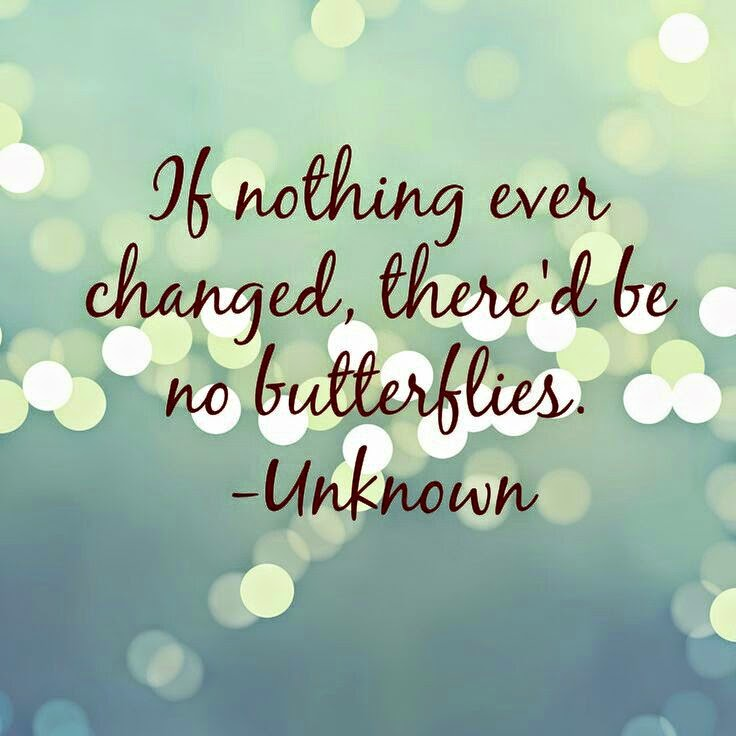

My blog's got a makeover!Change, is what it takes for you to go from where you are to where you want to be, that is, if you make a conscious effort to go with the flow. So well, that's the reason you see the _'Change'_ on my blog, and I hope it is big enough a change for it to not go unnoticed!

<table class="tr-caption-container" style="margin-left: auto; margin-right: auto; text-align: center;" cellspacing="0" cellpadding="0" align="center"><tbody><tr><td style="text-align: center;"></td></tr><tr><td class="tr-caption" style="text-align: center;">Source: Google Images</td></tr></tbody></table>

It is soon going to be an year now, since I had turned to my neglected blog for that extra something that was missing from my life. April 2014, saw me taking up not one, but two blogging challenges, 'The Ultimate Blog Challenge' and 'The A to Z Blog Challenge.' What happened in the due course of this journey called blogging, changed me forever in a lot many ways. Innumerable new connections, within and across borders - some like-minded and some exactly opposite thinkers, but nevertheless each of them added value to my thoughts and writing, enriching me through their posts, comments and words of encouragement. You all know who you are. Thanks for being what you are. A point worth noting here is that, the sense of community that I am surrounded with amidst these amazing bloggers is something that one rarely comes across in real life relationships. Complex yet sorted, not many mind games, balanced egos, with a passion to express, these beautiful souls are the best cheerleaders that you could ever come across, no matter what they are cheering you for - be it your writing or your other challenges in life.

So, in preparation for the April 2015, 'A to Z Blog Challenge,' (yes, I finally decided to participate despite my tight schedule!) I dressed up my blog differently, a few frills and fancies, some serious grooming plus sprucing and yes, a bit of make up too! And lo,  its ready to meet more new people and to celebrate the warm bonhomie with my special lot of readers! She's still work in progress but do let me know how you find my newly decked up bloggie bride :)
