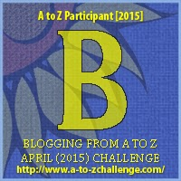

My theme for this year's

 Blogging from A to Z Challenge is called the

**[_"THE POWER OF TWO."_](http://ifsbutsandsetcs.com/2015/03/22/the-power-of-two/)** 

**Click [here](https://www.blogger.com/) to read more about it.**

\*\*\*

Today's words are

**'BRACE UP'**

The word 'Brace' is synonymous with support,

but when 'up' is added after it,

the implication of those two words is 'strength.'

<table class="tr-caption-container" style="margin-left: auto; margin-right: auto; text-align: center;" cellspacing="0" cellpadding="0" align="center"><tbody><tr><td style="text-align: center;"></td></tr><tr><td class="tr-caption" style="text-align: center;">Source:&nbsp;<a style="font-size: 12.8000001907349px;" href="http://pixabay.com/">http://pixabay.com/</a></td></tr></tbody></table>

**_Brace up!_**

**_Yesterday is gone_**

**_But today_**

**_is yours_**.

So she goofed up. Her throat croaked out some strange noises when she was asked to sing a line from her favorite song in front of the judges. Damn that tub of ice cream that she had dug into the night before the auditions!

She turned red with embarrassment when all three men from the jury exchanged jeering looks, with eyebrows raised. Her palm felt moist at the thought of being ticked off as no good. But as luck would have it, just as she was about to give up, the kind looking woman from the panel of judges who was watching it all silently, asked her to come back again the next day for the auditions.

So today, after the numerous salt gargles and cough tonics to soothe her throat, all she did was **brace up** to go grab the last chance to make her dreams come true. Yesterday was gone. But today was hers...

Linking this to the [Blogging from A to Z (April 2015)](http://www.a-to-zchallenge.com/) for the letter B.

