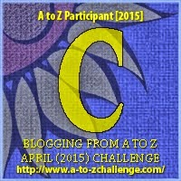

My theme for this year's

Blogging from A to Z Challenge is called the

**[_"THE POWER OF TWO."_](http://ifsbutsandsetcs.com/2015/03/22/the-power-of-two/)**

**Click [here](https://www.blogger.com/) to read more about it.**

**\*\*\***

Today's words are

**'Cling to'**

which means holding on to something.

<table class="tr-caption-container" style="margin-left: auto; margin-right: auto; text-align: center;" cellspacing="0" cellpadding="0" align="center"><tbody><tr><td style="text-align: center;"></td></tr><tr><td class="tr-caption" style="text-align: center;">Source:&nbsp;<a style="font-size: 12.8px;" href="http://pixabay.com/">http://pixabay.com/</a></td></tr></tbody></table>

She thought he would come looking for her with a glass shoe that would fit her perfect. He did just that and whisked her off to his castle. Only for her to discover a castle that stood embarrassingly in crumbling shambles.

Today she polishes his shoes till they shine, every morning before she'd get busy with the endless chores that domesticity had piled onto her. Her glass shoes were stowed away deep into the attic along with those rose-tinted glasses that dropped off her nose, the day she realized that there was no prince charming.

**_We cling to our_** **_fairy tales_**

**_until the price for_**

**_believing them becomes._**

Linking this to the [Blogging from A to Z (April 2015)](http://www.a-to-zchallenge.com/) for the letter C.

