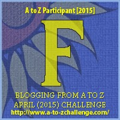

My theme for this year's

Blogging from A to Z Challenge is called the

**[_"THE POWER OF TWO."_](http://ifsbutsandsetcs.com/2015/03/22/the-power-of-two/)**

**Click [here](https://www.blogger.com/) to read more about it.**

**\*\*\***

Today's words are

**'Fall apart'**

  which mean

to break up or disintegrate.

<table class="tr-caption-container" style="margin-left: auto; margin-right: auto; text-align: center;" cellspacing="0" cellpadding="0" align="center"><tbody><tr><td style="text-align: center;"></td></tr><tr><td class="tr-caption" style="text-align: center;">Source:&nbsp;<a style="font-size: 12.8px;" href="http://pixabay.com/">http://pixabay.com/</a>

&nbsp;
She looked over her shoulder as the fire brigade tried to bring down the gnarling flames that were leaping furiously behind her. It was her home, her safety cocoon, ever since she remembered. Everything was over. She saw her world&nbsp;<b>fall apart</b>. She had nowhere to go to. So, she thought. But within hours she was surrounded by her own blood relatives, the people she was born from.

The couple who had lost their only child in the crazy crowds of a pilgrimage place years ago had recognized their daughter instantly even after the long duration of time that they were seeing her. It was their blessed destiny that they happened to see the news coverage of the devastation caused by an accidental gas leak at the orphanage on the television. Just as the camera zoomed on the rescued victims, they saw their little one with that unique birthmark that ran past her jaw. It had to be her, without doubt. No other human could have that kind of birthmark. She had grown into a beautiful young girl from the toddler that they had lost back then. &nbsp;The sinking hopes of having lost their baby forever, after years of running from pillar to post looking for her without yielding results, rose suddenly in the ecstatic parents as they rushed to reunite with their child.

Her innocent heart took a while to let it all sink in as she stepped into her house, her own house with her own parents. She wasn't an orphan after all. The gas leak, the fire, the loss had all happened for a reason...probably it happened so that the life that was rightfully hers could get a chance to&nbsp;fall together.

</td></tr></tbody></table>

_**Sometimes good things fall apart**_

_**so better things can fall together.**_

_**~Marilyn Monroe~**_

Linking this to the [Blogging from A to Z (April 2015)](http://www.a-to-zchallenge.com/) for the letter F.

