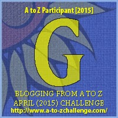

My theme for this year's

Blogging from A to Z Challenge is called the

**[_"THE POWER OF TWO."_](http://ifsbutsandsetcs.com/2015/03/22/the-power-of-two/)**

**Click [here](https://www.blogger.com/) to read more about it.**

**\*\*\***

Today's words are

**'Give up'** and **'Give in'**

  which means to cease making an effort or to admit defeat.

<table class="tr-caption-container" style="margin-left: auto; margin-right: auto; text-align: center;" cellspacing="0" cellpadding="0" align="center"><tbody><tr><td style="text-align: center;"></td></tr><tr><td class="tr-caption" style="text-align: center;">Source:&nbsp;<a style="font-size: 12.8px;" href="http://pixabay.com/">http://pixabay.com/</a></td></tr></tbody></table>

From birth to death

From naivety to maturity

From girlhood to womanhood

From what you wear to what you shed

From where you go to where you don't

From what you say and what you don't

From soul mates to soul suckers

From choices to decisions

From likes to dislikes

From taste buds to hunger pangs

From alphabets to account numbers

From what you possess to what you don't

 Conditioned as we are,

the only way to be

 a 'Good' giving woman

All you do is

**_Give up_**

**_Give in_**

**_or_**

**_Give it your all._**

Linking this to the [Blogging from A to Z (April 2015)](http://www.a-to-zchallenge.com/) for the letter G.

