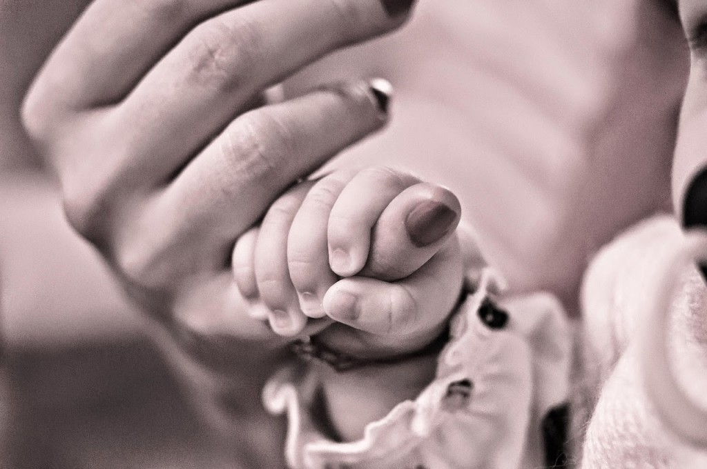
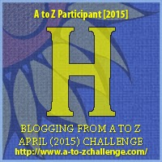

My theme for this year's

Blogging from A to Z Challenge is called the

**[_"THE POWER OF TWO."_](http://ifsbutsandsetcs.com/2015/03/22/the-power-of-two/)**

**Click [here](https://www.blogger.com/) to read more about it.**

**\*\*\***

Today's words are

**'Hold on'**

  which means

to endure in difficult circumstances.

<table class="tr-caption-container" style="margin-left: auto; margin-right: auto; text-align: center;" cellspacing="0" cellpadding="0" align="center"><tbody><tr><td style="text-align: center;"></td></tr><tr><td class="tr-caption" style="text-align: center;">Source:&nbsp;<a style="font-size: 12.8000001907349px;" href="http://pixabay.com/">http://pixabay.com/</a>

&nbsp;</td></tr></tbody></table>

Her eyes squinted by a sudden glint. What was the glint? A ray of hope streamed in a shaft across onto the water that stood flooded around her surroundings. She had hung on wearily slacked on the stooping branch of the neem tree in their courtyard to save herself from drowning. The rage of the stormy rains had seen the onslaught of the pregnant river that flooded in fury across the banks and into their farms and homes of their modest village. Her husband had passed off, fainting out of sheer exhaustion of balancing on the other branch of the neem tree. His frame hung loosely on to the branch, ready to fall anytime into the murky waters below. But she had decided to **hold on** for as long as she could. The neem tree was their only hope for life ahead. Else they would drown to death just like their cattle that floated around soaking lifelessness in the deadly waters.

The glint was the beginning of the brilliance that the so-far missing sun decided to come back with. Yes, the sun was shining bright up there. The water seemed to be ebbing slowly. Seconds to minutes and minutes to hours later the water seemed to have receded completely. The warmth of the sun stirred her husband back to senses and he slowly climbed down as both of them together started inspecting the level of damage the floods had caused them. The crops were a sight of rotting mayhem. But they had sacks of dry stock of seeds that they could sow again, stowed away safe in their attic. Thankfully, their house was intact with the roof in place. The cattle were dead but the little calves that they delivered a few weeks ago had scampered to the safety of a high mound of rocks. The couple rescued the shaken babies and got them back to their safe haven. It would take time to rebuild all that was lost. But the seeds of faith would help them **hold on** to the hope that all was not lost.

_**Be brave enough**_ 

_**to hold on**_

_**to the hope that**_

_**life will be**_ 

_**beautiful again.**_

 

Linking this to the [Blogging from A to Z (April 2015)](http://www.a-to-zchallenge.com/) for the letter H.

