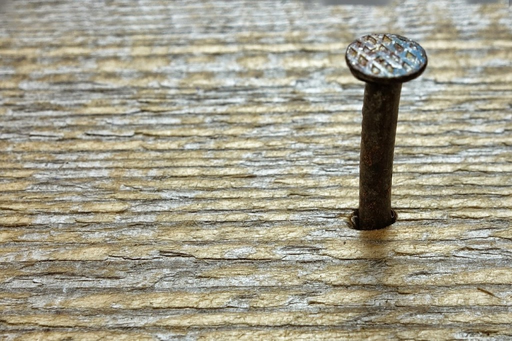

My theme for this year's

Blogging from A to Z Challenge is called the

**[_"THE POWER OF TWO."_](http://ifsbutsandsetcs.com/2015/03/22/the-power-of-two/)**

**Click [here](https://www.blogger.com/) to read more about it.**

**\*\*\***

Today's words are

**'Nail down****'**

  which means to specify, fix something, or to win something decisively.

<table class="tr-caption-container" style="margin-left: auto; margin-right: auto; text-align: center;" cellspacing="0" cellpadding="0" align="center"><tbody><tr><td style="text-align: center;"></td></tr><tr><td class="tr-caption" style="text-align: center;">
Source:<a href="http://pixabay.com/">http://pixabay.com/</a>
</td></tr></tbody></table>

_"So...what do you want Santa to get you this year for Christmas, sweety?"_ 

I tried once again, in vain, to get an insight on what to expect in that tiny note that Tim would scribble on as a ritual and slip down the stocking hung by the chimney. Well, it was increasingly getting to be a herculean task every year to **nail down** what it was on his little mind, that would go on to his wishlist to Santa. He wasn't like the other kids, who would openly ramble about what exactly they wanted from Santa so that he left it for them in the stocking they hung up expectantly on the night of Christmas eve. So, it really was simple to go pick those gifts that these kids talked about since days well in advance and plant them in time to make it appear like Santa Claus had actually left them for them.

An introvert that he was, Tim wasn't a boy of many words. He would never ever spell out what was on his mind, leave alone share his secret wishlist to Santa with me or any one else for that matter. I felt that this quality of his really shouldn't be a reason for a child to lose out on his little joys. As a child I actually thought it was Santa Claus who read my note from the stocking and left me the gift of my choice. And it delighted me no end for having miraculously found that very gift as a surprise in the stocking. Now, I wished that my own kids also enjoyed this tradition till the time they were old enough to understand where the gifts came from.

As a mother I would go by my instincts and keen observation every year to make sure that I would be able to deliver somewhat the same kinda gift he might actually end up writing into the note. For example, last year, I could make out that he had his eyes on the toy train that ran around on the tiny tracks in the toy shop we happened to stop by. He did not utter a word, but his curious eyes spoke volumes of his desire and it seems like he had filed away this piece of desire for future reference. But sharp as I was, I picked it from there. So, no surprises for guessing what he had requested Father Christmas for that year! Phew...job done!

But this year, I couldn't find a clue to latch onto. My hawk eyes followed him everywhere as Christmas peeped closer. Lets see, he just got the series of comic books he enjoyed reading when he visited his grandpa, he pretty much had all the toys most boys of his age owned...video games...no he was done with them...what else?  I racked my brains. Lost in my confusion, my gaze drifted towards little Tim playing in the courtyard. The carpenter was busy fixing our creaky bar stools out there. And Tim was closely watching the carpenter in awe as he skillfully swung the hammer up in the air aiming onto the nail that he held against the stool. After a few seconds, Tim brought out his compass box. He took out a pencil that was to act like a nail and you may wonder what he used as a hammer. Well, it had to be the poor compass box which landed with some serious bruises and dents for all the thudding that Tim did with it, imagining it to be his hammer. My eyes lit up and I smiled knowingly. As Santa tip-toed into the kitchen from the bedroom  climbed down the chimney this Christmas eve, while the kids slept, he knew what to expect in the note from Tim. Yes, it was a toy tool box with a set of fake nails and a hammer. And there it was, gift wrapped and all, waiting for Tim.

Linking this to the [Blogging from A to Z (April 2015)](http://www.a-to-zchallenge.com/) for the letter N.

