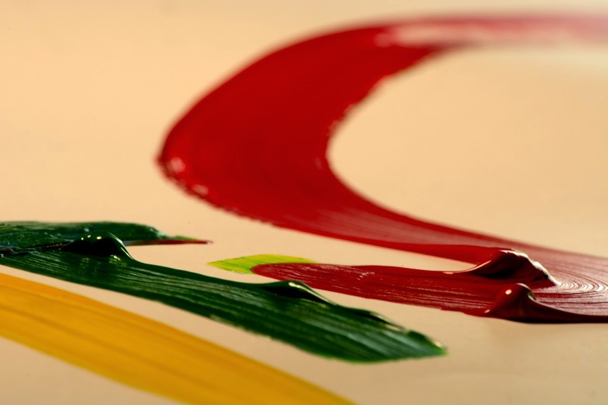

My theme for this year's

Blogging from A to Z Challenge is called the

**[_"THE POWER OF TWO."_](http://ifsbutsandsetcs.com/2015/03/22/the-power-of-two/)**

**Click [here](https://www.blogger.com/) to read more about it.**

**\*\*\***

Today's words are

**'Use up****'**

which means to to consume entirely.

<table class="tr-caption-container" style="margin-left: auto; margin-right: auto; text-align: center;" cellspacing="0" cellpadding="0" align="center"><tbody><tr><td style="text-align: center;"></td></tr><tr><td class="tr-caption" style="text-align: center;">Source:&nbsp;<a style="font-size: 12.8000001907349px;" href="http://pixabay.com/">http://pixabay.com/</a></td></tr></tbody></table>

She gazed at the half done canvas blankly. A roughly sketched composition of two men reclining in the same hammock with their heads on either side stared back at her mocking at her for her state of disorientation. It had been years ago when she had started to paint this canvas, but had to to give it up midway when the responsibilities of life glared at her forefront and the creative side of her just had to make way for those priorities to push their way right in.

The canvas hung half done on the wall in her room at her mother's place with the hope that someday when the creative side of her emerges yet again, she would oblige it with fresh coats of paint and finally complete the painting. Well, over a period of years, she did attempt on and off to complete it, but couldn’t go beyond staring at it clueless on how to go forward. She sighed and wondered if she had used up whatever amount of creativity she had.

Then suddenly one fine day, it occurred to her what it was that was holding her back. She realized that in all these years she hadn’t used her creative reserves as much as one needs to, to keep it free flowing. She had to get back to using it again with same regularity and gusto as she used to in the past. And soon the brush got busy mixing colors on the palette and off it was flowing smooth strokes bringing life to the comatose canvas. The colors mingled effortlessly seeping thirstily, some sloshed onto the grains of the canvas, and some percolated right into her effusive soul.

_**You can't use up creativity**_

_**The more you use,**_

_**The more you have.**_

_**~Maya Angelou**_

_P.S. This is a true life story. The woman in the story is me. Although, the ending here is a wishful one that hasn’t culminated in reality so far. The half done canvas still hangs in my room at my mother's place and those two men still stare back at me from their reclining state in their hammock, questioning me every time I cross them on when I'm going to paint some life into them! "Someday, for sure, buddies," I assure them wistfully._

Linking this to the [Blogging from A to Z (April 2015)](http://www.a-to-zchallenge.com/) for the letter U.

