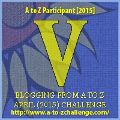

My theme for this year's

Blogging from A to Z Challenge is called the

**[_"THE POWER OF TWO."_](http://ifsbutsandsetcs.com/2015/03/22/the-power-of-two/)**

**Click [here](https://www.blogger.com/) to read more about it.**

**\*\*\***

Today's words are

**'Venture forth****'**

which means to set out; to go forward; to go out cautiously.

<table class="tr-caption-container" style="margin-left: auto; margin-right: auto; text-align: center;" cellspacing="0" cellpadding="0" align="center"><tbody><tr><td></td></tr><tr><td class="tr-caption" style="font-size: 12.8000001907349px;">Source:&nbsp;<a style="font-size: 12.8000001907349px;" href="http://pixabay.com/">http://pixabay.com/</a></td></tr></tbody></table>

They thought she was crazy. But she didn’t care. If she did not do this now, she would never do it ever. As a child, when she told her friends that her dream was to go around the world on her skateboard, they thought she had lost it. Her own parents asked her to think rationally. Concerned that they were about her well-being.

It took her years to build up on her energy levels, save up financially and chuck her secure job. But what the heck, what use was the security if it fed your body but did not feed your soul, she told herself. You got to **venture forth** and take the plunge to ignite your passions and reach out for what you set your heart on. No matter what they say, you just got to do it.

And here she was today, with her backpack slung onto her shoulder and her skateboard all prepped up for the long journey ahead. Blowing out kisses to her loved ones, she took a deep breath and off she was, wheeling on her fantasy board, zipping through the world just the way she wanted to see it.

Linking this to the [Blogging from A to Z (April 2015)](http://www.a-to-zchallenge.com/) for the letter V.

