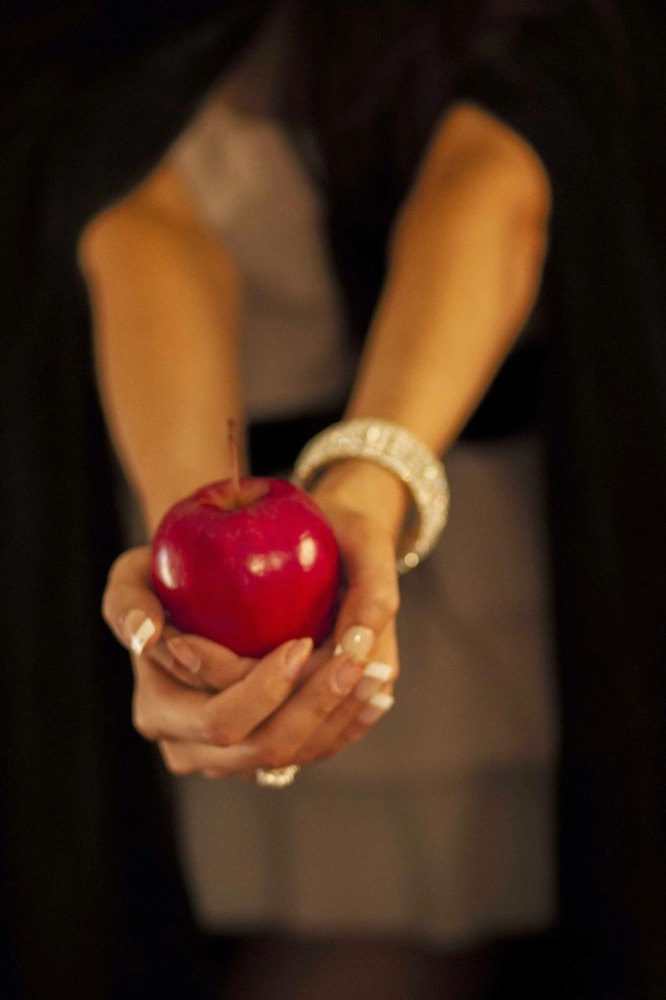

My theme for this year's

Blogging from A to Z Challenge is called the

**[_"THE POWER OF TWO."_](http://ifsbutsandsetcs.com/2015/03/22/the-power-of-two/)**

**Click [here](https://www.blogger.com/) to read more about it.**

**\*\*\***

Today's words are

**'Yield to****'**

which means to give way to some argument, persuasion, influence, or entreaty.

<table class="tr-caption-container" style="margin-left: auto; margin-right: auto; text-align: center;" cellspacing="0" cellpadding="0" align="center"><tbody><tr><td style="text-align: center;"></td></tr><tr><td class="tr-caption" style="text-align: center;">Source:&nbsp;<a style="font-size: 12.8000001907349px;" href="http://pixabay.com/">http://pixabay.com/</a></td></tr></tbody></table>

Eddie peered hard into the glass case that displayed the delectable lollies. Brightly colored, in alluring shapes and sizes, with such a huge variety of flavors that his mouth watered at the very sight of them. From the corner of his eyes he saw her frown at him. Jeez...she caught him! He had to cover it up quickly. He rolled his eyes and faked his disinterest as he shook his head, looking at her. There was no way she was going to allow him to have even one. _"You know what all that sweet does to you, right?"_ she asked raising one of her eye-brows to confirm his guess. _"Yes, of course, I wouldn’t imagine touching those, leave alone eat them. No way,"_ he assured her, looking away. _"So why were you staring at them?_ She demanded. _“I noticed a wrongly spelt word there on the shelf talker there. It says rapberry, instead of raspberry!"_ he explained, trying to fathom from her expressions if he had convinced her enough.

Thank god, for that spelling mistake, he thought to himself. He could not afford to be grounded. Not now, during the soccer season, when the boys would be out enjoying the game. He made a quick decision. _"You've got to pick up your night cream, remember?"_ he reminded her just at the right moment. _"Oh yes, I almost forgot that. Hang around here Eddie, till I go get it, will you? Stay here, don’t get naughty and wander off...okay?"_ she instructed over her shoulders as she walked towards the cosmetic counter at the far end of the lane.

Once home, he quietly finished his dinner without any fuss, though the meal was boring. It was the usual bland and tasteless stuff. He helped her clear the table and when she got busy with the dishes; he quietly slipped into his room and fished out the brown bag that he had shoved into the side of his sock on their way back. Edgar Wheeler, greedily unwrapped the largest and the most irresistibly juicy lolly he had laid his eyes on this evening, quickly set his dentures aside as he blissfully sucked and licked on his sin of the day, while his blissfully oblivious wife, Elizabeth Wheeler, waited for him to come down to join her on the sofa to watch their favorite show on television after he was done taking his medicines post-dinner as he always did.

_**The only way to get rid of a**_

_**temptation is to yield to it.**_

_**~Oscar Wilde**_

Linking this to the [Blogging from A to Z (April 2015)](http://www.a-to-zchallenge.com/) for the letter Y.

