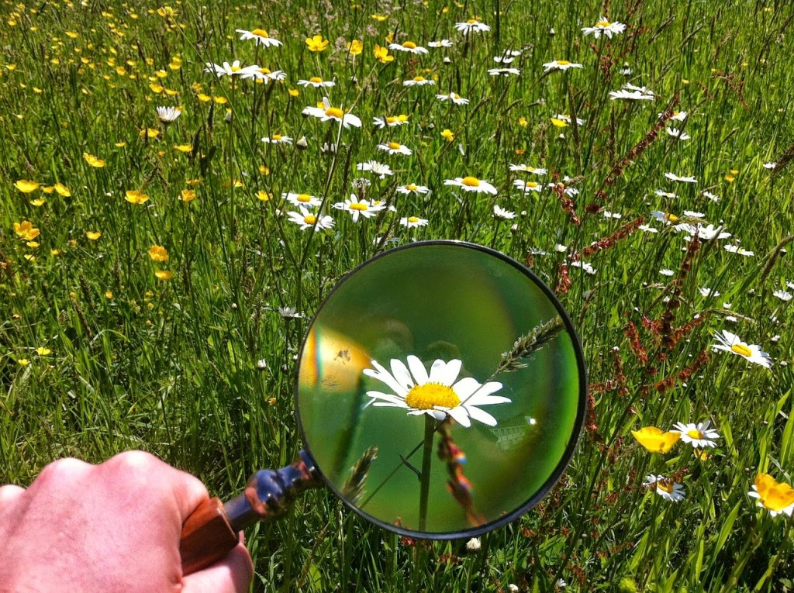
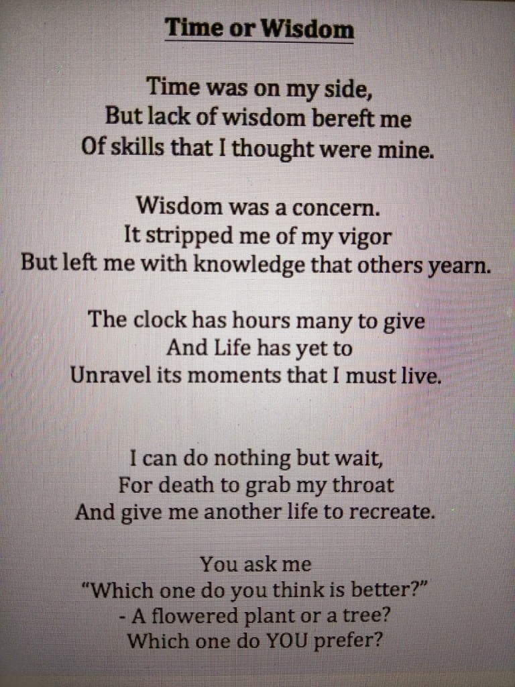
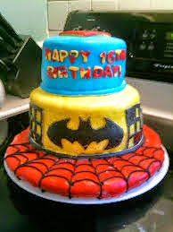
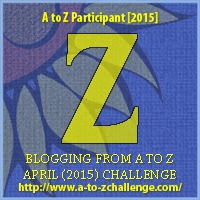

My theme for this year's

Blogging from A to Z Challenge is called the

**[_"THE POWER OF TWO."_](http://ifsbutsandsetcs.com/2015/03/22/the-power-of-two/)**

**Click [here](https://www.blogger.com/) to read more about it.**

**\*\*\***

Today's words are

**'Zoom in****'**

which means to concentrate on a matter.

<table class="tr-caption-container" style="margin-left: auto; margin-right: auto; text-align: center;" cellspacing="0" cellpadding="0" align="center"><tbody><tr><td style="text-align: center;"></td></tr><tr><td class="tr-caption" style="text-align: center;">Source:&nbsp;<a style="font-size: 12.8000001907349px;" href="http://pixabay.com/">http://pixabay.com/</a></td></tr></tbody></table>

_"Now, I am confused!"_ exclaimed my little young gentleman-in-making, unwrapping the glossy blue gift wrapper to find Batman looking straight in his eye. A Superhero figurine to go along with the Incredible Hulk that he had picked up a few days ago to add to his collection, much to my wonder. Well, I had no reason not to wonder, considering that I had assumed that he was done with his fetish for toys or figurines for that matter. I should have seen it coming though, what with his birthday treat to his friends involving him taking the whole bunch of them to watch 'The Age of Ultron,' the day it hit the movie theatres. It followed with me lecturing him about the right choices he should make at his age after we had got Mr. Hulk home. Although, I had a moment of ephipany after my sermon was over.

So, a little while after that, when I gave him gift choices that he could pick from for his upcoming birthday, he wasn’t surprised with my suggestion of getting him a suave black blazer. After all, he was in the process of getting into adulthood soon enough. And, a fine young man should possess a well-cut sophisticated blazer in his wardrobe to flaunt his best physique when the occasion demands. He took a while for all this _gyan_ to sink in and soon came around to the idea. A few clicks on his Mac book and soon he had narrowed down on a classy blazer of his choice. We ordered it to be delivered, which he soon received.

So, today on his 16th birthday when I gifted him this Mr. Batman, the size of half his arm length, he wondered what I wanted him to be at age 16 - a boy who still adored his Superhero figures or the man who dons his blazer with all the elegance it calls for. To which I say, be yourself my son. Love all the little things that make you happy, and be the Superhero of your life - forever! There’s absolutely no age to stop doing that, no matter what people say. **Zoom in** on the best things in life. Make the most of what you have today till it lasts and look forward to the best that is yet to come.

_**Days are like trains,**_  _**they will just zoom by.**_  _**You can be zapped seeing them pass**_  _**or you can jump on to one of them**_  _**and enjoy the journey.**_

With this, I proudly present a poem, that I happened to **zoom in** on my son's lappy, written by none other than my son himself. It came as beautiful surprise to me, ‘coz although he writes occasionally, (he blogs at [http://skeptechal.blogspot.in/](http://skeptechal.blogspot.in/)) the poet in him just introduced himself to me now!  He did not specifically write this with his birthday in mind but it couldn't have gotten as apt as this, just as he turns all of 16.

 

_**~Viven Iyer**_

**_Happy 16th Birthday_**

**_to my Superhero!_**

**_God bless. Love you._** 

Linking this to the [Blogging from A to Z (April 2015)](http://www.a-to-zchallenge.com/) for the letter Z.

