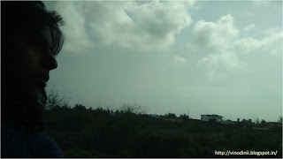

 

A fleck of me I left behind,

traces that held on to the emptiness

Around the shower cubicle

a strand of my hair twirled

halting for a second.

Faint shadows from yesterday

looming over the cold barrenness

 of the deserted floor.

Desolate sheets clung

 to the impressions on the bed

that now comforted none.

Finger prints wrapped themselves

around the favourite mug

I had sipped my thoughts from.

As the familiar notes

I often hummed to

 permeate from somewhere out there,

hugging the curtains

that ushered in the expectant breeze

for no one in particular,

yet despondent.

My familiar presence

the rays seek

as they filter their way through

But...I'm gone,

 leaving just an ounce of me to linger over,

memories,

Some sweet, some bitter and some sour.

As the noises of yesterday

die into a soft echo.

A soft footstep greets the door

and turns the key to let them in,

memories,

The making of some more.
