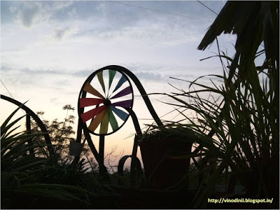

Was it the raindrops or was it a teardrop that strayed down her eye? Everything seemed moist and blurred merging into the green lushness. She tugged at the loose end of the lace curtain that framed the window that opened up to the dark threatening clouds pouring mayhem on to the helpless unsuspecting earth. Trees swayed wildly between the indecisiveness of the insane breeze blowing eeriness through the branches and the pelting slaps of harsh rain drops.The tiny sapling struggled, rooted right in the middle of the courtyard. It held on to its will to live with all its might. With every onslaught of the mighty diamonds splattering mercilessly on the only two tender leaves it boasted of, the resistance of the sapling was questionable. It quivered, shook and swayed in its trembling demeanor. Her eyes were fixed on the hapless sapling. Wasn’t their situation similar? She wondered. Her vulnerability, insecurities and her resistance were being tested just like the sapling there. The thunderstorms in her life had lashed shards of harsh situations on her vulnerable being  just the way those mighty merciless raindrops did on the tiny sapling.

Suddenly, the dark clouds started to drift. A slit of radiant light slashed through the overcast sky, and the raindrops reduced to a light dull drizzle vanishing into a haze.  Up rose the sun, the shade of the brightest of egg yolk yellow, beaming cheerfully...appearing out of nowhere. The sapling looked up to him and waved its tender leaves cheerily to confirm its survival, exhausted though it was from the rain raged saga. The water around ebbed away slowly as realization struck to her. _"The storms in life do not always rage forever. If you stay strong and put through the rough patches of chaos without succumbing to the harsh situations of life, in time the sun above does bestow its kindness on you and bless you with the gift of a bright and beautiful existence."_

She looked up at magnificence of the luminous sun and waved at him in acknowledgement, only to be greeted by a vibrant rainbow of unbelievable hues, arching right across the blue skies, smiling back at her._..Life!_

 

