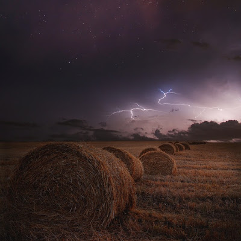

_"How soon?"_ she anxiously inquired._"As soon as I can,"_ he whispered, with a faraway look in his eyes.

_"You have to be back soon!"_ she pleaded in desperation.

_"I'll try my best, my love. But you have to hold on to faith,"_ he murmured, unsure if his words were convincing enough to give her strength.

The rain seemed to have thinned down a bit, but it didn't seem like it was going to stop anytime soon. It had been pouring crazy over the last few days non-stop. He turned his gaze upwards at the threatening dark clouds, bursting with fury. In spite of all his assuring words, he was unsure if he would be able to make his way back in this maddening weather. But he would have to do everything it took to get back. He sucked in a deep breath, looked back one last time at her, and plunged into the raging storm.

She waited by the sill till she could see the last of him fading into the mist of streaming rivulets. With a deep sigh of resolve she got back to them, her babies....her tiny vunerable newborn pigeons. The two frail souls trembled and shivered in the moist confines of their nest that was perched precariously in the balcony of a highrise building that stood surrounded by a concrete jungle. The nest had been half swept away when the rains lashed out hard. The twigs that held it together had escaped under the might of the downpour and exposed the family to mother nature's white wet rage.

She tried her best to keep them warm under her motherly wings, holding on to the hope that he would be back safe soon with the required twigs to keep their hearth strong and secure. There weren't many trees around, so the journey would be long, dangerous with the lightening striking out ever so often and tiresome. But he had to brave all of it for the sake of the well-being of their little ones. Hope was all that she had that she clung to, and waited with her babies cocooned under the umbrella of her warm protective embrace.

<table class="tr-caption-container" style="margin-left: auto; margin-right: auto; text-align: center;" cellspacing="0" cellpadding="0" align="center"><tbody><tr><td style="text-align: center;"></td></tr><tr><td class="tr-caption" style="text-align: center;">Source: https://pixabay.com/</td></tr></tbody></table>
