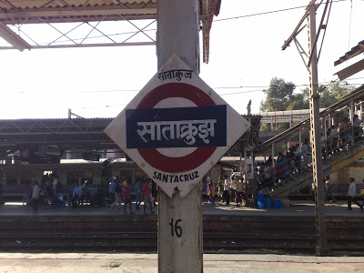

<table class="tr-caption-container" style="margin-left: auto; margin-right: auto; text-align: center;" cellspacing="0" cellpadding="0" align="center"><tbody><tr><td style="text-align: center;"></td></tr><tr><td class="tr-caption" style="text-align: center;">Source: Google Images</td></tr></tbody></table>

Sheena jostled through the crowd and got into the impatient local train. A couple of pushes and shoves later she had secured herself a window seat. Phew! Not bad, after all the struggle she had put up with to get it. She settled comfortably in the seat with the expression that resembled that of a cat who had got away with lapping up the cream. It would take her thirty minutes to reach her workplace. She pulled out a book from her bag and put on her reading glasses. Engrossed in her read, she barely noticed someone occupy a seat right across. It was only when he started a conversation with the guy seated next to him did she lift her head from the book and look up at the gentleman. He was old and greying. He pointed out to a photograph that he was holding in his hand and asked the man next to him if he had happened to see the woman in the photo. The guy shook his head disinterestedly. The old man asked a few more people around him. There were deep lines etched across his forehead. It seemed apparent that he had lost hope of finding the woman.

Wary of talking to random strangers, Sheena curbed the desire to ask him who the woman was. She  looked about as old as him in the picture and had a gentle expression on her face. He apparently had showed the picture to all the passengers before settling into the seat. She shifted her attention back to her book. Before she knew her destination had arrived and it was time to start yet another busy work day in the metro city. After a day full of client meetings and number crunching it was time to call it a day. She tidied her desk winding up for the day and headed towards the station just in time to catch up with the regular train that she took back home. It was crowded as usual, sweaty and smelly too with tired people getting in after a day of hard work but it was the fastest option available to reach home. A few seconds of the familiar jostles coupled with the much required tiffs to grab a decent seat and she had landed herself one, not a window seat this time, but comfortable enough for her to while her time away.

Seated next to her was an old woman looking out of the window. The breeze gently caressed her grey hair, causing her to look away from the window. There was something familiar about her wrinkled face, Sheena noticed. And suddenly, realization struck her. _"Hi, Aunty,"_ she said trying to strike a conversation with the old lady. She looked at Sheena and smiled.

_"You know, I saw this old man on the train this morning who had a picture of a woman who resembled you,"_ Sheena continued, _"He said he was looking for her."_

The lady frowned._"Really? Did the woman look like me?"_ she paused broodingly, _"Strange. I don't have any relatives in this city. Only a son who now lives in New York."_ she murmured almost to herself looking out of the window._"_

_"Oh, I must be mistaken then,"_ replied a confused Sheena. The lady got off at the next stop, disappearing into the crowd.

The next morning, on the same train Sheena chanced upon the gentleman with the same picture in his hand. She stepped closer and peered curiously into the picture. But of course, it was the same woman from the previous day! Sheena's expression said it all, while man's anxiety levels shot up, impatiently bursting with questions.

_"__Did you see her somewhere beta?_ _Do you know where she is?_ _Did she say something?_ _Is she safe?"_

Sheena nodded and shook her head all at once. _"I met this lady last evening on my way back from work in the train, and she looked exactly like her,"_ she went on, _"But when I mentioned to her about you, and that you were looking for someone who looked like her, she said she has no relatives in this city."_

The man shook his head wearily, _"Did she mention that she had a son living in New York?"_

Sheena was dumbstruck. _"Yes. And, how did you know?"_

He let out a sigh. _"She's my wife. And our son is no more. We lost him in a road accident a few years back after he moved to New York,"_ he said quietly.

_"But..."_ Sheena was rendered shocked, speechless and confused.

_"She developed Alzheimer's thereafter,"_ he said in a remorseful tone. _"Yesterday, once again she slipped out of our house, when I was asleep. The last time she went off like this, I found her at the airport trying to buy a ticket to New York,"_ he added.

_"Do you recollect the station where she got off at, yesterday?"_ he inquired, and instinctively they said it together,_"Santacruz!"_ That's where the city airport was located.

_**~We sometimes think we want to disappear,**_

_**But all we really want is to be found ~**_

_**Author Unknown**_
