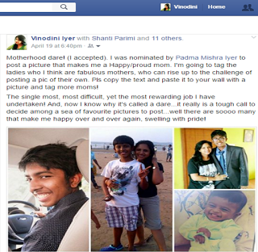

Idly scrolling through my Facebook news feed a few days back, I came across this post on the Motherhood Facebook dare, which led me to an outburst prompted by the sheer unfairness of the thought behind the post. What follows in my post here has turned out to be a series of questions and each of these questions really are answers in themselves if challenged within their context.The writer of the post has gone forth and called this dare a sexist activity. Sexist, really? How can anything related to something as pure and natural be termed as sexist? Sharing a few nuggets of happiness through smiling pictures of your children has been termed as a sexist activity. Have we really turned so cynical that we've started robbing each other off little pleasures of life? Yes, there have been pictures of cute kids in their growing phases, posted proudly, a lot more frequently than usual in the last few days. So, what’s the big deal about it? Aren't there a lot many different kinds of  pictures and posts being updated on Facebook regularly, that's what the purpose of that particular platform is, right? Sharing, connecting and networking. So what, if it is a bunch of happy, proud mothers cheering each other?

Her take is that this campaign was creating a lot of fuss which emphasised the emptiness it actually represented and how it segregated women into a superficial and selfish bracket of haves and have-nots - those whose womanhood was validated by marriage and motherhood, and those who have remained single, childless, or married women who live with the stigma of being barren. She further talks about empathy towards women who have had failed becoming mothers or who have been forced into becoming one.

Honestly, is that the only parameter we have towards judging women? How does posting a harmless picture of your child and tagging other mothers glorify you and bring down other women? Don't all of us humans, irrespective of our genders have our own share of blessings and misfortunes? Instead of counting our blessings, we have got into a habit of highlighting every misfortune that torments us. More so, when someone expresses their joy and fulfilment publicly. Why should a woman who's biggest joy of motherhood be questioned just for the sake of those who have been eluded of it? None of us are blessed with a perfect life so to speak of. There are numerous instances where one could draw comparisons and feel deprived or offended in our day to day lives. Listing some of them below:

\-Why haven't we raised a flag on Father's day and so many other "days" that can very well serve to be kill joys if at all that is the point we are driving home? Isn't that sexist again?

\-Irrespective of Valentine's Day or any regular day, lovey-dovey pictures of couples are trust into the faces of melancholic widow/ers, divorcees and singles. Poor single souls - have we ever reflected on how much lonelier it would have made them feel? So, should we stop posting those pictures that are precious memories of people in love, for the sake of those unfortunate singles?

\-I lost my pet dog last year and yet people have been torturing me with posts and pictures of cuddling cute cats and dogs every single day. I still have not got over my loss to replace it with another pet. Should those pet owners who post these pictures stop posting them to be sensitive to people who don't have pets and miss one in their lives?

\-One of my friends is jobless and in seeking a job since a long time. Does his/her peer's posting their own professional accolades indicate being heartless to that one friend who has been deprived of the same?

\-There are times you come upon some post that you related to and deemed it fit to be shared with your besties whom you tag on the post. Does the tagging of those specific people indicate that the other friends on your list are not worthy of sharing it with and do they need to feel dejected for being left out? Somehow tagging the mothers who you think are great mothers has been shamed at. Isn't it equivalent to choosing those besties while sharing that interesting post?

\-The #100saripact still runs viral on Facebook, with women flaunting the best of their finery. I wonder if it offends women who lack that number of saris in their wardrobe and draws their attention to their financial inability to own so many saris.

\-And then again, those travel posts. All good, we all love to see good sceneries and exotic locales. But are your happy faces against these backgrounds posted with an intention of bringing our inability to take such vacation to our notice?

Everybody has their share of misfortunes...but why do we have to associate somebody's joy with our own misfortune? Isn't that a sadist attitude in itself? Wouldn't we rather count our own blessings than raise fingers at someone's expression of joy that has not been yours? Agreed, there are some toxic personalities who might rub it the wrong way and pose unacceptable questions to women who have failed in conceiving, but those handful of negative people should not be used against the innocent majority of mothers who have actually earned that joy with the pains that they bore. Motherhood is a journey, with high and lows only a mother can understand. No mother needs to feel guilty for what she is proud of. Period.

In fact, although I was tagged on this dare quite a few days back and was unsure on participating in it, the rebel in me took it up only yesterday when I read this particularly offensive post. It is a perfect example of how we have started associating every simple joy giving activity with some kind of pain/trauma/unfairness on the other. As I draft this post, I notice that two of the friends I had tagged on the dare had silently untagged themselves from my post. Was it their disagreement to the whole concept or was it their concern that people would judge them on basis their association with the dare? All their choice. After all everyone has choices. You choose to either agree or disagree. Both of which can be done silently, moving on without offending others. Remember, you weren't hatched by a hen. So calm down. Shaming motherhood is akin to raising a finger at your own mother. Think about it.
