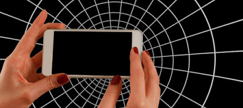

There, he was at it again."When do you ever leave that phone alone?"  I questioned my son who was at an age where I could reprimand him for not behaving old enough for his age, at the same time treat him like a baby as per the nature of the situation.

He replied without looking up, “When I go to school. That's when my dear phone gets it breathing space," he quipped smugly, quite pleased with the smart answer he could come up with.

I shook my head feeling hopeless. "No son, you gotta have a life besides this," I remarked, “Go out, play cricket with your friends, go cycling...look at your bicycle gathering dust!"

"Sure, but first tell me when do you leave your phone alone?" he demanded.

I looked at him straight in his eyes,  "I only check it when it beeps. It could be work-related, you see." I replied, trying to sound as matter-of-factly as I could.

“So what make you think I am not doing work on phone? I could be discussing my project with my teacher over WhatsApp," he shrugged. “Don’t give me that, child; catching Pokémon doesn't count as a project!" I retorted.

He walked away giving up on me, banging the door to his room after him.

I sighed. Kids these days...their childhood is just not the same as ours used to be. They are prisoners to their virtual life. Gone were the innocent and fancy free days of playing in the open,  the heady rush of sweating it out on a healthy outdoor game with friends and wondrously catching butterflies in the backyard.

The catching butterflies reminded me of something. Trying to push my thoughts aside I reached out for my phone. "Freak…that's Squirtle!" My eyes glinted with excitement as I spotted this virtual blue turtle character from the Pokémon series perched right there on my sofa, in augmented reality.  I promptly aimed a Pokéball to catch him. He dodged the ball, teasing me into action.

So busy was I in the act that I barely realised that my son was standing behind me studying me with a mocking expression. "Yeah, right!" he smirked sarcastically, with a raised eyebrow. So well, I was caught red-handed. This was worse than being confronted by my mum when she caught me stealing chocolates from the refrigerator in the middle of the night back in my childhood. Embarrassed to the core, I have to sheepishly admit that he had rested my case.

<table class="tr-caption-container" style="margin-left: auto; margin-right: auto; text-align: center;" cellspacing="0" cellpadding="0" align="center"><tbody><tr><td style="text-align: center;"></td></tr><tr><td class="tr-caption" style="text-align: center;">Source:&nbsp;<a href="https://pixabay.com/">https://pixabay.com/</a></td></tr></tbody></table>

This post was written for [BAR-A-THON.](https://blogarhythmblog.wordpress.com/) 

Day #4, Prompt - Caught red-handed.

 

 

**I am with Team #CrimsonRush for the #BarAThon Challenge from 1st to 7th August 2016.**
