This post comes almost four months later than schedule. Last May saw me heading towards Mauritius for my much deserved annual vacay with the family. Thanks to the pictures clicked on the trip, I had a whole bunch of memories and details to write about. I favor beach destinations. There's something about the tranquility found near the waters that soothes my nerves and puts me into relax mode instantly. Also, the climate in Mauritius was a pleasant 22 degrees of temperature with winter setting in around that time for us to decide on the destination. With the temperature touching 50 degrees in the western part of India where I live, the proposition of spending a few relaxing days away from sweltering heat was quite tempting.

[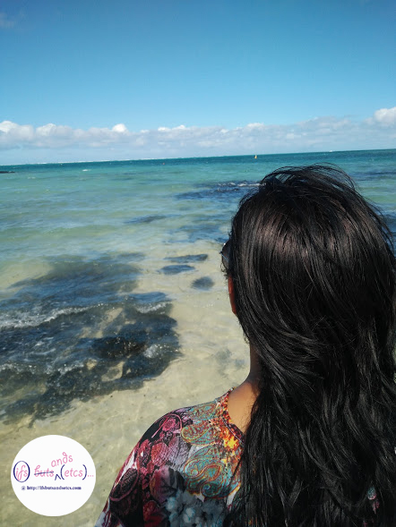](http://ifsbutsandsetcs.com/wp-content/uploads/2016/10/M21.jpg)

The images that come to mind when one thinks of Mauritius is stretches of never-ending pristine blues that one has seen in the backdrops of popular Hindi films. Generally, the assumption is that such places are apt for honeymoon destinations, but well, that really is a misconception at least when it comes to Mauritius. The experience of visiting the place was much beyond the seas and sands. The verdant greenery of the hills this island is propped beautifully amidst, is a dream come true. The Republic of Mauritius (French: _République de Maurice_) has a multi-ethnic society, therefore there's a lot of diversity in their culture. The population consists of a mix of Hindus, Creole, Chinese, Muslims and Europeans. It came as a pleasant surprise to see a fair majority of Indians (known as Indo-Mauritians) residing there, so much so that every other Mauritian there could get away with speaking basic Hindi, albeit, with faint traces of French/Creole accent. The first time I heard the radio jockey chirping away on the local radio station I assumed that it was probably in the local language but on listening carefully I realized that it was actually a heavily accented version of Hindi! Apparently, people from British India first arrived in Mauritius to work as indentured laborers, commonly referred to as coolies that were intended to work in sugarcane fields. These laborers were mostly brought from the state of Bihar, with a large number of Tamilians and Andhriates among them. A sizable portion of laborers were from Maharashtra. Thus, the food and culture has a lot of influence of Indian culture with tweaked adaptations seen across the little island in the general lifestyle of the locals.

It was raining when we landed in Mauritius. All my hopes of having a pleasant sunny holiday seemed to be getting washed away. We checked into The Le Palmiste Resort and Spa, a quaint little resort located on Coastal road near Trou Aux Biches. The room was comfortable and spacious, done up aesthetically with minimal fuss. To our relief it stopped raining by evening. So, the next day we were on our way to Ill Aux Cerfs, one of the best beaches for water sports and the Catamaran cruise. We skipped the Catamaran cruise. It was a day full of adventures and water sports with the highlight of the day being the undersea walking that we ventured to take. Undersea walking comprises of wearing an oxygen mask over your head while you are lowered into the depth of the ocean to explore the marine life underneath. I freaked a bit when I landed several feet down in the water taking time to adapt to the air pressure. But the volunteers put me to ease soon enough. In the course of the rest of the day the shades of blue had us in awe with our cameras clicking away as and when we would spot a scenic spot.

\[caption id="attachment\_1361" align="alignnone" width="960"\][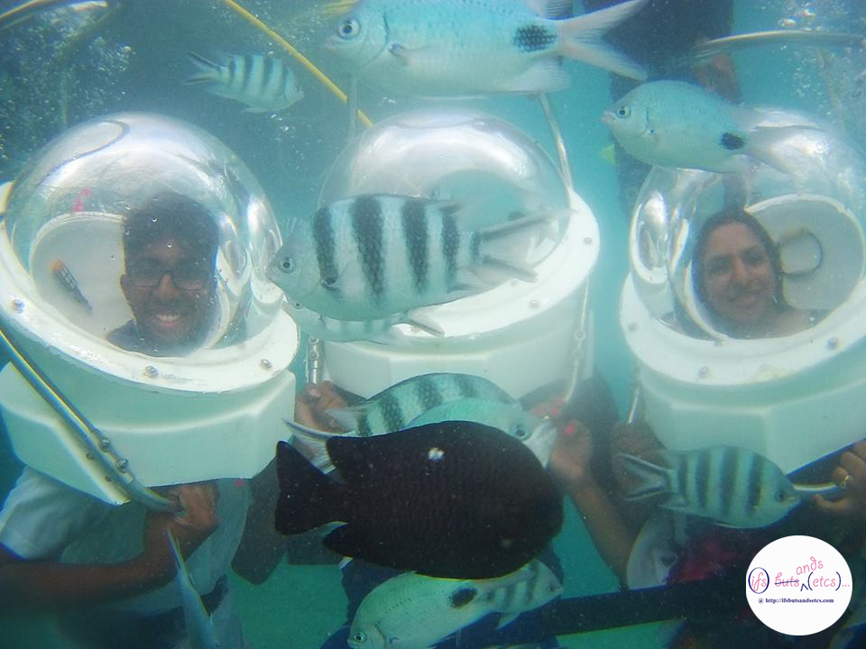](http://ifsbutsandsetcs.com/wp-content/uploads/2016/10/M24.jpg) Undersea walking\[/caption\]

The next few days saw us exploring some of the other highlights of the island. The Notre Dame Auxiliatrice is a beautiful little Catholic church in Cap Malheureux nestled along the stunning views of the island and the ocean.

\[caption id="attachment\_1348" align="aligncenter" width="785"\][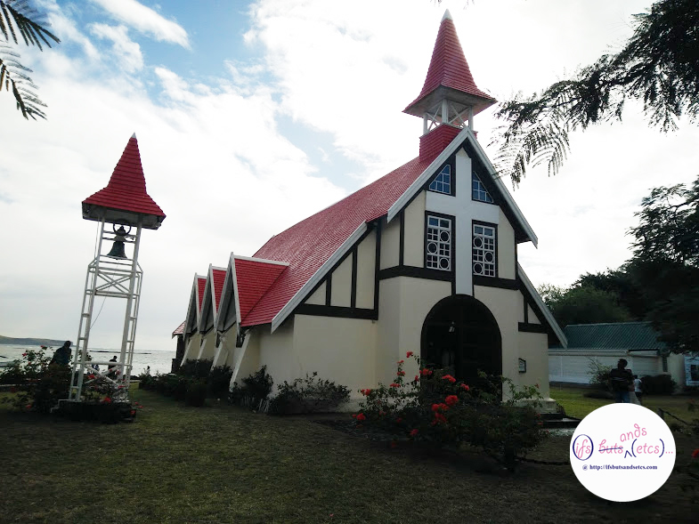](http://ifsbutsandsetcs.com/wp-content/uploads/2016/10/M10.jpg) The Notre Dame Auxiliatrice Church\[/caption\]

Trou aux Cerfs (also known as Murr's Volcano) is a dormant volcano with a well-defined cone and crater. It is 1,985 feet high and located in Curepipe, Mauritius. The crater has been alternately described as 300 and 350 meters in diameter, and is 80 meters deep. According to experts, the volcano is lying dormant but could become active at any time within the next thousand years. The thought of the volcano erupting any time was eerie! The crater is only accessible down a steep embankment which is considered dangerous. Water and silt have clogged the crater, making it even less accessible.

\[caption id="attachment\_1372" align="aligncenter" width="442"\][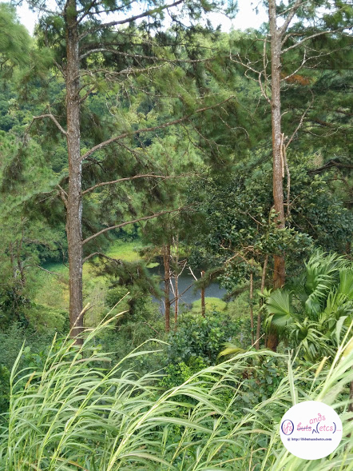](http://ifsbutsandsetcs.com/wp-content/uploads/2016/10/M15.jpg) The dormant volcano\[/caption\]

Ganga Talao (commonly known as Grand Bassin) is a crater lake situated in a secluded mountain area in the district of Savanne, deep in the heart of Mauritius. It is about 1800 feet above sea level. It is considered the most sacred Hindu place in Mauritius. There is a temple dedicated to Lord Shiva which is supposed to house the thirteenth Jyothirlinga of the world and other Gods including Lord Hanuman, Goddess Lakshmi, and Lord Ganesh along the Grand Bassin. An overpowering statue of Lord Shiva in all his grandiosity of 108 feet height greets us on our way to the temple. On my spa visit at the resort where we were put up, the therapist who was an Indo-Mauritian had mentioned during a casual chat that during Shivaratri she and her family along with many pilgrims walk bare feet from their homes to the lake.

\[caption id="attachment\_1349" align="aligncenter" width="442"\][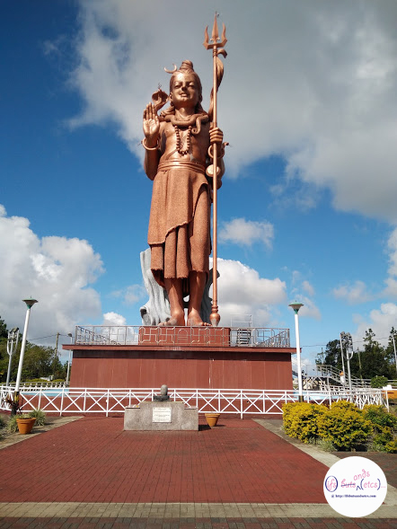](http://ifsbutsandsetcs.com/wp-content/uploads/2016/10/M12.jpg) The Shiva Statue - Ganga Talao\[/caption\]

\[caption id="attachment\_1350" align="aligncenter" width="442"\][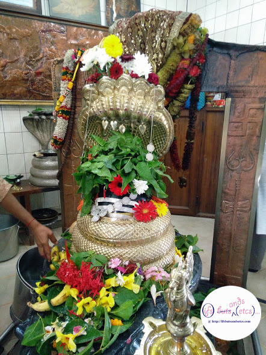](http://ifsbutsandsetcs.com/wp-content/uploads/2016/10/M14.jpg) The thirteenth Jyothirlinga of the world\[/caption\]

Perched on top of the hill Petite Montague, the Citadel Fort is located at a height of 100 meters. Also known as the Adelaide Fort (named after the wife of William II, when the British held land in Port Louis), the fort offers stunning views of the harbor and the entire city of Port Louis). We had to the chance to sip on the famous local coconut water which wasn't worth the Mauritian Rs.100 that we paid for each of them! Contrary to what I was told, the water wasn't as sweet. But, to compensate the raw deal came this ice-cream van which sold some amazing ice-cream and well, my day was made!

\[caption id="attachment\_1351" align="aligncenter" width="442"\] A truck-full of ice-cream!\[/caption\]

\[caption id="attachment\_1352" align="aligncenter" width="785"\][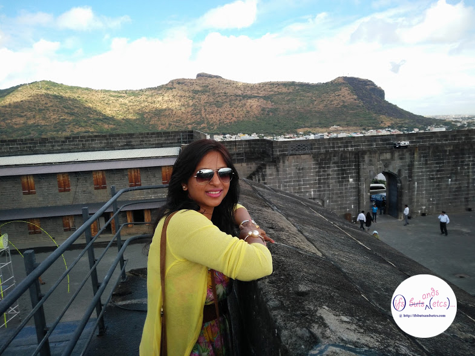](http://ifsbutsandsetcs.com/wp-content/uploads/2016/10/M9.jpg) View from the Citadel fort\[/caption\]

Seven-Colored Earths at Chamarel is about the composition of seven-colored earth which is a rare natural phenomenon that makes it worth a visit. Since this site is around a well-known adventure park known as La Vallée Des Merveilles, where you get to enjoy various adventure rides like zip-lining and quad-biking we grabbed the opportunity to enjoy a round of quad-biking over the steep hills stopping now and then to admire waterfalls, animals in the sanctuary there and drinking in the scenery.

\[caption id="attachment\_1353" align="aligncenter" width="785"\][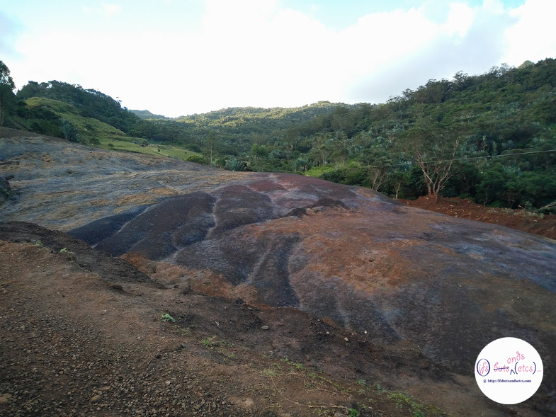](http://ifsbutsandsetcs.com/wp-content/uploads/2016/10/M11.jpg) Seven-Colored Earths at Chamarel\[/caption\]

\[caption id="attachment\_1370" align="alignnone" width="3120"\] Quad-biking at the La Vallée Des Merveilles Adventure Park\[/caption\]

On the day before our trip ended we took off on the Blue Safari. It entailed embarking on a submarine and journeying the deep seas 35 feet underwater. It was an experience of a lifetime! We got to see an ancient shipwreck, a lot of coral reefs and of course a huge variety of marine life. If you notice, the color of the sea here, it is the deepest of blue. I have no words to describe the intensity of the color and how it changed hues shade after shade as we approached the shore.

\[caption id="attachment\_1354" align="alignnone" width="785"\][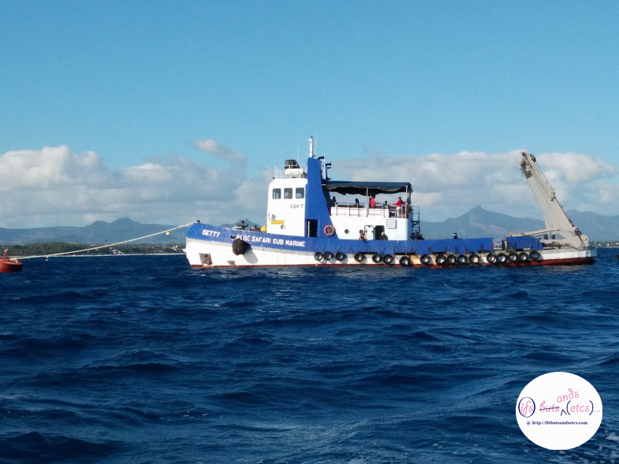](http://ifsbutsandsetcs.com/wp-content/uploads/2016/10/M4.jpg) The Blue Safari - That's where we were lowered into the submarine from.\[/caption\]

\[caption id="attachment\_1356" align="aligncenter" width="785"\][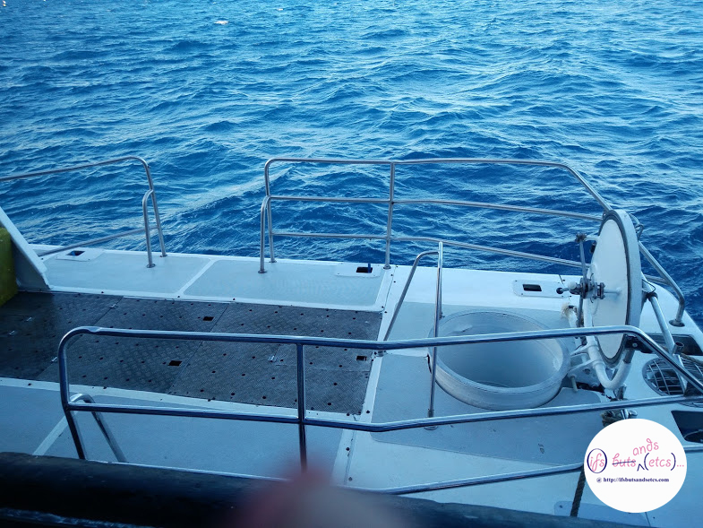](http://ifsbutsandsetcs.com/wp-content/uploads/2016/10/M3.jpg) The hole that led to the submarine\[/caption\]

\[caption id="attachment\_1355" align="aligncenter" width="442"\][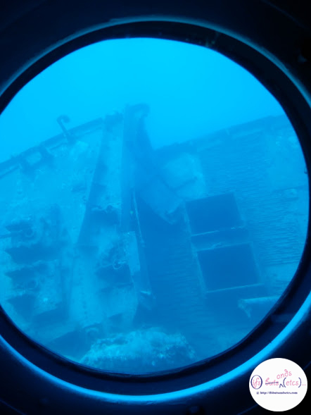](http://ifsbutsandsetcs.com/wp-content/uploads/2016/10/M2.jpg) The ship-wreck seen from the submarine window\[/caption\]

A foodie that I am, one of the top things on my to-do list when I travel is to sample the local delicacies. The initial few days of excitement of sampling Indian food adapted in the Mauritian kitchens was wearing out. We would have daal which tasted like a bland version of our daals back home with a sprinkling of fresh rosemary, accompanied by _Faranthas_ (local name for _Paranthas_). Some amusing discoveries I made at our resort's buffet counters went like this. I saw a placard that said _Rasgullas_ propped against a service bowl that contained _Gulab Jamuns_. I thought there was a mistake and when I pointed it out to the staff I was gently informed that _Gulab Jammun_ in Mauritius was known as _Rasgullas_. How confusing is that?! The next day at the same place I saw an orange coloured dry mixture with a placard that said it was a Gajjar ka Halwa (Carrot Halwa). Now, the only kind of Gajjar ka Halwa we have in India is one that is moist and dripping of fatty goodness of desi ghee. On sampling the mixture I discovered that it was a sweetened version of grated carrot and dry coconut. The texture reminded me of a dry version of coconut barfi prepared back home in India. My heart went out for the poor Mauritians who would never know the joys of tasting a melt-in-the-mouth ghee laden Gajjar halwa. I however kept my reservations aside assuming that in all probability it was the touristy resort that we were put up in that was coming up with such fanciful concoctions with mixed up names. But, the next day when I met up with a friend from college who had settled in Mauritius, she confirmed that it was actually true. These tweaks and adaptations by the Indo-Mauritians were actually amusing. But well, I was done with the adaptations. I wanted to taste the authentic specialties of the place. I gorged on a lot of local seafood specialties skipping some of the street food that I had read about, like the Dholl Puri, which sound quite Indian to me to feel the need to sample it. My friend had strongly recommended that I have the local sugarcane juice and a spicy stewed dish called the Boulette.

\[caption id="attachment\_1357" align="aligncenter" width="785"\][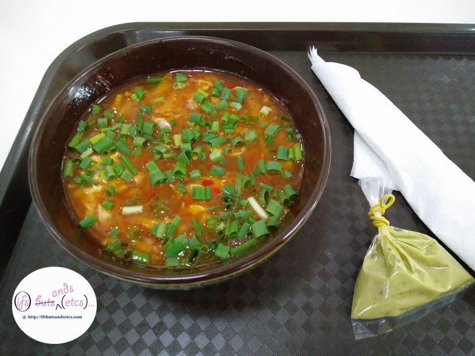](http://ifsbutsandsetcs.com/wp-content/uploads/2016/10/M5.jpg) The Boulette - Served on the side is a chilli-garlic sauce. Hot as can be!\[/caption\]

Boulette are a kind of steamed dumpling made with fish, pork, prawn, or beef, a bit like Dim Sum but served in a flavorsome broth (bouillon) usually made with proper chicken or fish stock and a flourish of accompaniments usually including spring onions, a sweet, spicy finishing sauce. I did get to sample a bowl of Boulette with chicken in it. And, wow! It satiated my spice deprived taste buds with a profusion of flavors! Must add though that this isn't a dish for people who cannot handle heat on their tongues.

\[caption id="attachment\_1358" align="aligncenter" width="442"\][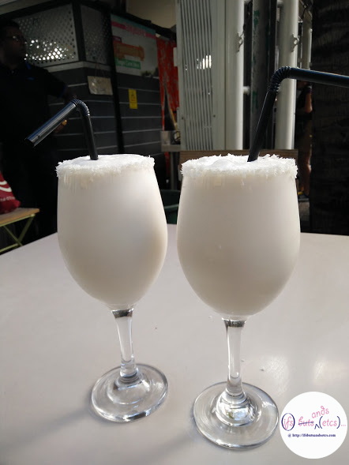](http://ifsbutsandsetcs.com/wp-content/uploads/2016/10/M6.jpg) The must-have Sugarcane-Coconut juice. Served, rimmed with coconut shavings.\[/caption\]

Le Caudan Waterfront is the commercial hub, a must hop-by for shopping. Le Caudan Waterfront is also a business centre, a melting pot for local artists and the favorite meeting place for gastronomes, tourists and locals looking for leisure and entertainment. This is where I tried the much recommended sugarcane juice. I tried the variety with coconut juice blended in. It was heavenly! Quite different and exotic as compared to the local Indian version of _Ganne Ka Ras_. Surprisingly, I couldn't spot a single fly hovering around the area where the sugarcane was juiced which is a common sight at the sugarcane juice stalls in India. It is a given that these stalls normally attract swarms of flies. Wonder how the Mauritians manage to keep it fly-free.

\[caption id="attachment\_1359" align="alignnone" width="851"\][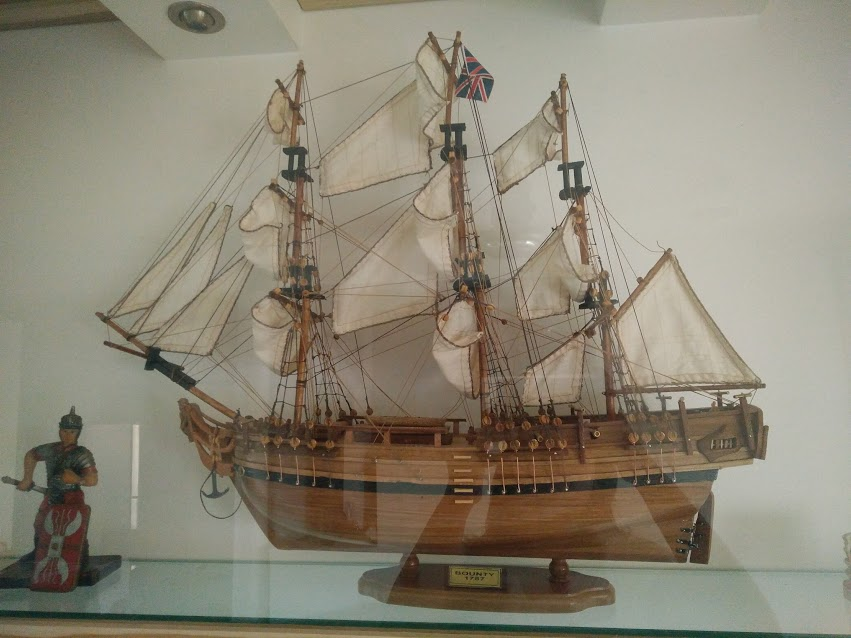](http://ifsbutsandsetcs.com/wp-content/uploads/2016/10/bounty.jpg) The Bounty -1787\[/caption\]

As for the shopping, I picked up a few souvenirs. Mauritius is known for producing the finest handcrafted ship models. We visited one of the factories to witness the precision of the entire execution of the craft and ended up carrying a fine piece for our living room, a model by the name of ["Bounty," dated 1787.](https://en.wikipedia.org/wiki/HMS_Bounty)  I also ended up picking some bright wicker knick-knacks, beautiful sachets and bottles of demerara sugar which were a definitely on my shopping list.

On the last night in Mauritius we were treated to the amazing rhythm of the local Sega dance at the resort. The grace and energy levels of the performers was infectious.

[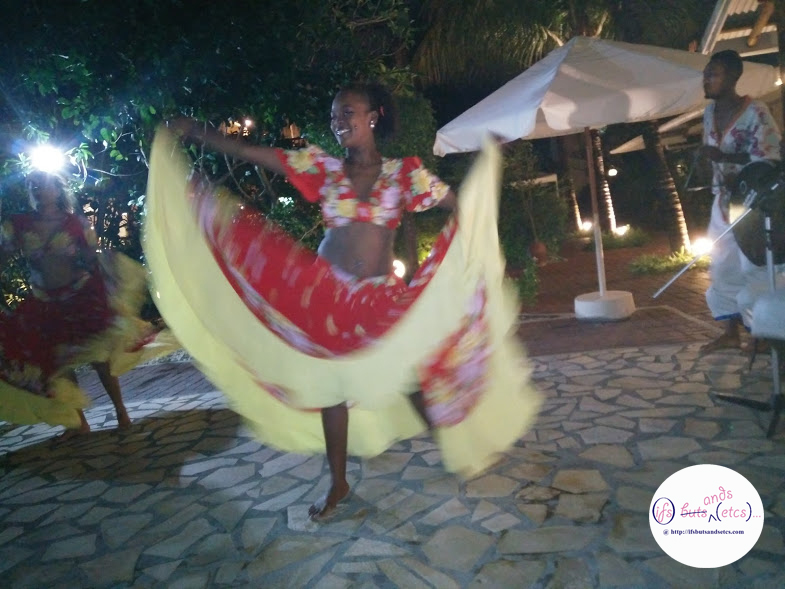](http://ifsbutsandsetcs.com/wp-content/uploads/2016/10/M16.jpg)

All in all, it was a culturally enriching experience. While some fellow travelers remarked that it almost felt like Goa, I begged to differ. That hint of Europe, French and Africa blending in so seamlessly with Indian culture was both interesting and endearing. It almost felt like that bowl of Boulette bursting with flavors. Here, take an eye-full of blue before you go!

[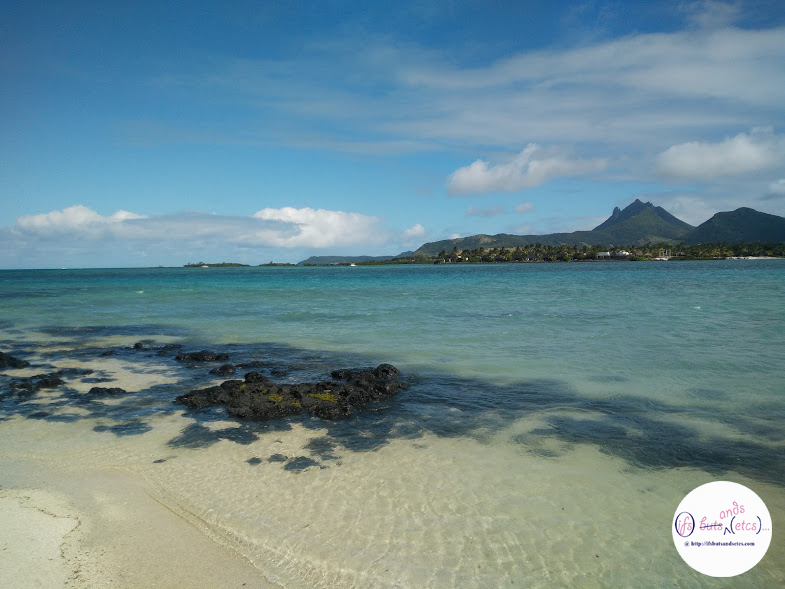](http://ifsbutsandsetcs.com/wp-content/uploads/2016/10/M17.jpg) [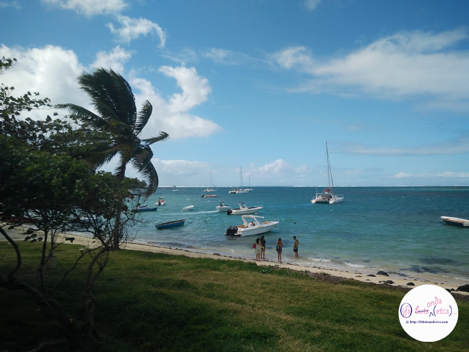](http://ifsbutsandsetcs.com/wp-content/uploads/2016/10/M18.jpg) [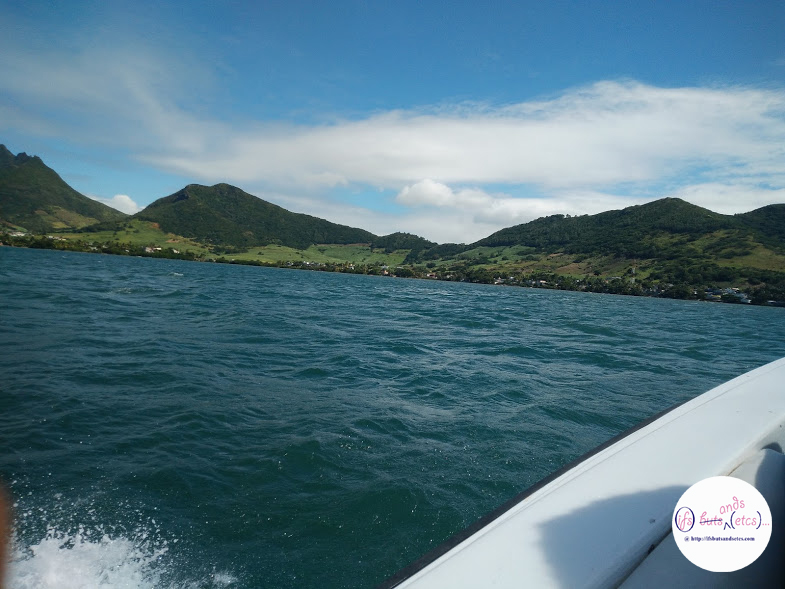](http://ifsbutsandsetcs.com/wp-content/uploads/2016/10/M19.jpg) [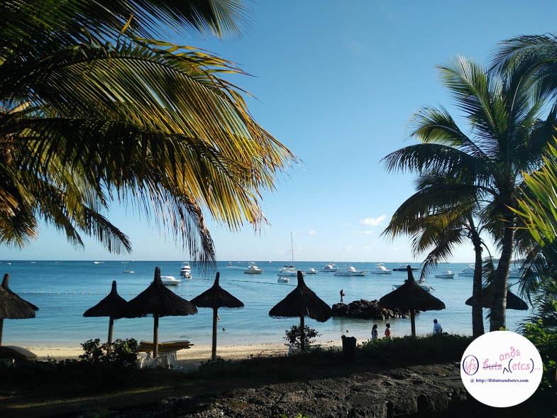](http://ifsbutsandsetcs.com/wp-content/uploads/2016/10/M22.jpg) [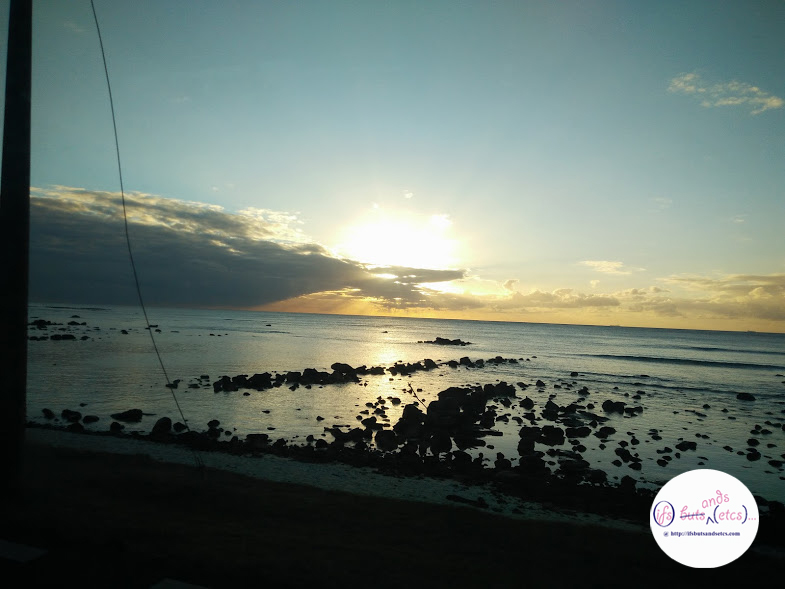](http://ifsbutsandsetcs.com/wp-content/uploads/2016/10/M23.jpg)
