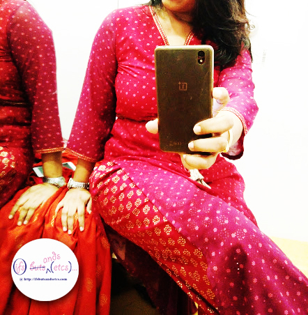

Starting today on my blog is a new series which will be brought to you directly from the trial room. Before you get things wrong, let me elaborate on what I mean. Do you recollect the moments you spend in the trial rooms when you go shopping? Yes, I'm talking about those moments of uncertainty, doubt, confusion, indecisiveness, fickle-mindedness, frustration at not being lucky with the style, color or size, and also those eureka moments of having landed with the perfect piece of clothing, of self-admiration, some healthy vanity, intense reflections and a smug satisfaction. You check yourself in the mirror from various angles reassuring yourself that what makes you feel so good should also look good on you. And, you savor that moment. That's exactly what I did. And while doing so, I also captured those few savored moments in selfies, some of which I'm sharing here with the risk of being labeled as a narcissist. It will take me some time to master the art of clicking presentable selfies at the right angles in the constricted spaces of a trial room while also trying to give ample justice to the garments. Hope the colors and silhouettes seen here help you in deciding in what you would want to don this Diwali.

Have you finished your shopping for Diwali? I finished mine yesterday. What I love about Diwali is the sudden burst of colors around. Like every year I set out on my mission to pick up the best attires to bring in the festive season with. This is one time of the year when I go berserk shopping. Otherwise, I am a perpetual window shopper who weighs the pros and cons of impulse buying all the time. Working in retail keeps me closely connected to fashion. On most days I study consumer behavior and work out ways to best present the brand I am working for, but on days like these I enjoy being on the other side of the fence, letting myself loose, going back to being a pampered consumer and making sure that I love every bit of it.

As I skimmed through the hangers of various brands, especially Indian and fusion wear, I realized that the current fashion forecast seemed to be quite forgiving and rather flattering for women of all body shapes. The silhouettes had gradually evolved into soft flowy lines that work well for both, the lanky, and the fuller forms. I chanced upon a lot of maxi dresses, long _Kurtis_ and Palazzo trousers that could be played around with to come up with interesting combinations. The kind that touched the floor and swept the carpet in splendor. After a long time of browsing through stores, I ended up taking fancy to _Anita Dongre's_ boho-chic collection at [_Global Desi_.](http://globaldesi.anitadongre.com/) The free spirited experimental attitude that reflects in the fusion wear garments of this brand is infectious. The silhouettes and layering were as per the season's mandate. Long hemlines that fall gracefully, thanks to the light and sheer fabrics. But, what made it stand apart was the jewel tones that were used in the color combinations. The flaming oranges, deep rusts, hot pinks, rich wine dipped marsala had me enthralled with just the right amount of shimmer and shine. After all, some occasions just can't be black, white and grey.

Here, have a look at what I tried and admired.

This vibrant printed maxi dress is sleeveless with long side slits. The solid pink colored inner garment acts as a canvas to the flamboyant print. Perfect for a day out with friends.

Seen here is a fluid maxi dress which is a smart fusion of a _Kurti_ and an evening gown. The gold print on the flaming orange paired with the slinky solid pink inner garb has just the right amount of festive bling required for a formal evening soiree.

The color Marsala has been hot for quite sometime now. But, this comfortable empire line drawstring _Kurti_ paired with a pair of Palazzo pants has an air of regalia about it that gives the color its due. The sprinkling of delicate _butta_ print in gold provides just the right accents for celebrations. How about wearing this to the Diwali dinner?

None of these looks had been accessorized nor had I touched on any makeup. Well, that's all you get when you're clicking impromptu selfies in a stuffy trial room! Wonder what level the entire look could go to with some interesting accessories and a hint of makeup. I eventually did not buy the exact same pieces but ended up getting inspired by the look and picked up something similar along the same lines. Looks like I'm going to have a super colorful Diwali. How about you?
