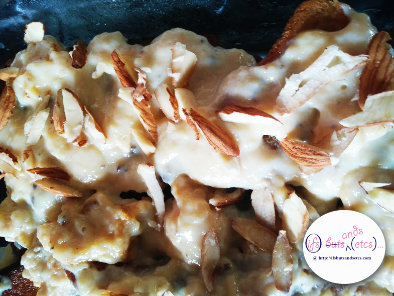
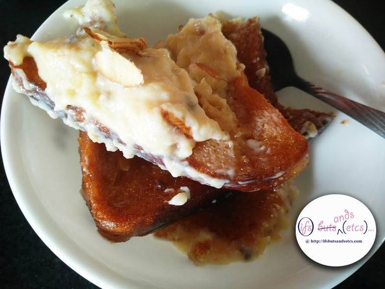
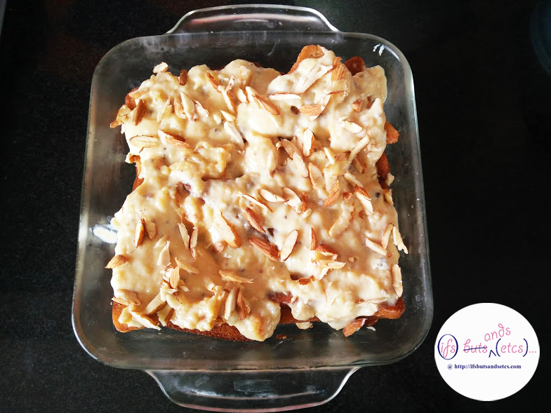
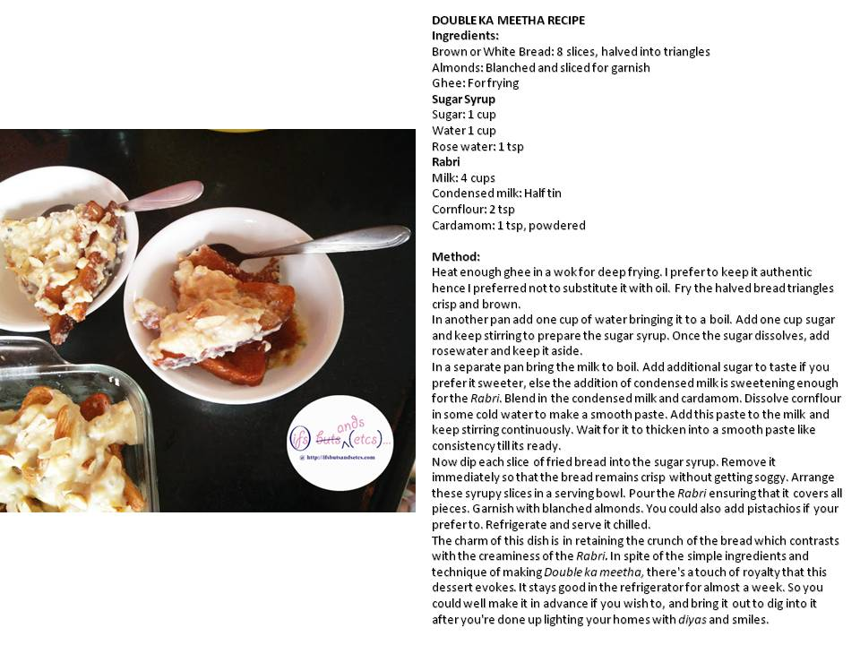

Diwali is here. The air is fragrant with the faint whiff of festivities. While I don't go all out with the celebrations in a big way, I do enjoy bringing in the festival with little things that add cheer to life in my own sweet way. That brings me to my favorite topic - sweets! My sweet tooth works overtime this time of the year. I allow myself to binge guilt-free. Not that I don't do that for the rest of the year but this one time one can get away with the excuse of the mandatory celebrations.

I hardly make Indian sweets, except for the occasional _Kheer_ that is offered as _prasad_ during _puja_ in the temple at home on festivals and birthdays, or _Gajjar Ka Halwa_ in winters when the crop of red carrots start flooding into the markets. I enjoy sweets bought off the counter. A few weeks ago, since there was still time to buy them and the spirit of the festive season was almost setting in, I was in the mood to try something at home over the weekend. I didn't have many ingredients for whipping up the rich sweet I had in mind. On scanning the refrigerator I chanced upon half a tin of condensed milk and a few slices left from a loaf of brown bread. So well, the _Hyderabadi_ genes got it sorted and had their sleeves rolled up to rustle up a sinuous dish of _Double Ka Meetha_ as it is popularly known in Hyderabad.

_Double Ka Meeta_ is an authentic _Hyderabadi_ dessert served at weddings and parties. Bread is called _double ka roti_ in Hindi as the dough raises double in size and _meetha_ means sweet. Hence the name D_ouble ka Meetha_ (bread sweet). Another popular Indian Sweet, S_hahi Tukda,_ is similar to _Double Ka Meeta_ with slight difference in serving style.

  

This recipe mainly calls for deep frying pieces of bread really crisp and brown (you could toast or shallow fry if you wish to cut the calories), dip it in sugar syrup and douse them with flavored thickened milk or _Rabri._ I don't enjoy sweating out for long hours in the kitchen hence I resorted to the cheat code to cut short my method of preparing the _Rabri_ by adding in condensed milk and my dish was ready in less than 20 minutes. Here's the detailed recipe:

\[caption id="attachment\_1394" align="alignnone" width="960"\] Makes 8 servings\[/caption\]

**Ingredients:**

Brown or White Bread: 8 slices, halved into triangles

Almonds: Blanched and sliced for garnish

Ghee: For frying

**Sugar Syrup**

Sugar: 1 cup

Water 1 cup

Rose water: 1 tsp

**Rabri**

Milk: 4 cups

Condensed milk: Half tin

Cornflour: 2 tsp

Cardamom: 1 tsp, powdered

 

**Method:**

Heat enough ghee in a wok for deep frying. I prefer to keep it authentic hence I decided not to substitute it with oil. Fry the halved bread triangles crisp and brown.

In another pan add one cup of water for making the sugar syrup and bring it to a boil. Add one cup sugar and keep stirring to prepare the sugar syrup. Once the sugar dissolves, add rosewater and keep it aside.

In a separate pan bring the milk to boil. Add additional sugar to taste if you prefer it sweeter, else the addition of condensed milk is sweetening enough for the _Rabri_. Blend in the condensed milk and cardamom. Dissolve cornflour in some cold water to make a smooth paste. Add this paste to the milk and keep stirring continuously. Wait for it to thicken into a smooth paste like consistency till its ready.

Now, dip each slice of fried bread into the sugar syrup. Remove it immediately so that the bread remains crisp without getting soggy. Arrange these syrupy slices in a serving bowl. Pour the _Rabri_ on top of the slices ensuring that it covers all pieces. Garnish with blanched almonds. You could also add pistachios to the garnish if your prefer to. To take the presentation further ahead you could also use silver _vark_ (edible sil_ver_ leaf)_._ Refrigerate and serve it chilled.

The charm of this dish is in retaining the crunch of the bread which contrasts with the creaminess of the _Rabri._ In spite of the simple ingredients and technique of making _Double Ka Meetha,_ there's a touch of royalty that this dessert evokes. It stays good in the refrigerator for almost a week, although it might lose some of its crunch after a few days but it still tastes amazing. So, you could well make it in advance if you wish to, and bring it out to dig into it with your family and friends after you're done up lighting your homes with _diyas_ and smiles. Happy Diwali!
