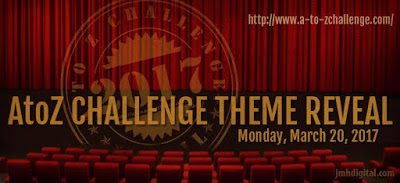

This is the third time that I am participating in the ['Blogging from A-Z Challenge.'](http://www.a-to-zchallenge.com/p/what-is-blogging-from-to-z.html) My first time was in 2014 followed by the one in 2015. It opened doors to a world of new possibilities and connections from the blogosphere that I cherish to this day. However last year, in 2016, I had to skip it since I was neck-deep into work and personal commitments. So here I am this year, taking up the challenge yet again, of blogging for an entire month and going through the heady rush of writing, reading and connecting with other fellow bloggers. When I first started thinking of a theme for this year's challenge, my natural inclination towards writing fiction was what I had in mind. However as I started writing, I realised that my thoughts were forever occupied with something else. That something else or rather someone else, the focus of my attention, turns out to be my soon-to-be adult son who is preparing to appear for his final year board exams at high school.

My son turns 18 on the 30th of this April. While he stands on the threshold of adulthood ready to spread his wings and explore the world, all I can think about is how he will be coping with this whole new exposure to fresh experiences and life in general when he is on his own. All these years he had a firm finger wrapped around his little finger guiding his steps to lead him to become the thoughtful human that he has grown into. Now is the time to let the finger loosen the grip a bit so that he finds his feet, empowered by the values instilled in him. The thought of it brings me a good amount of pride and confidence with the self-assurance that he will do well, no matter where he goes. I am reminded of the times when I myself stepped out of the environs of the cocoon of protected upbringing. After all, growing years come with its own set of exploring uncharted territories coupled with a furore of emotions that come pounding on your young impressionable mind in the most unexpected ways. I reminisced on my own experiences and learnings thereon till now. Just while I was in the middle of these thoughts is when I spontaneously decided to change the theme that I had first decided upon for the challenge. I felt it would make sense to write on the thoughts that are close to my heart at this point.

\[embed\]https://www.instagram.com/p/BR2Y8EzB1AS/?taken-by=vinodiniiyer\[/embed\]

So friends, this year my theme for 'Blogging from A-Z Challenge,' would be a set of open 'Letters to my Son' from me. Each of these twenty-six letters will be nuggets of my own experiences, thoughts, learnings, recommendations, coping mechanisms to various emotions and situations that I have learnt and accumulated along the way, combined with strong values that my own parents have ingrained in me. Although, me and my son often have healthy discussions and debates on most of these topics, freezing them in writing would perhaps give a new perspective, clarity and reinforce the crux of each topic dealt with. These bits of thoughts have kept me grounded and helped me tide over the toughest of the situations with my head held high. I wish that he learns from my mistakes and leverages from my experiences so far. I hope they work for him too. Someday, when he gets stuck in a certain situation I hope he is able to go back and refer to my post on the topic relevant to the particular issue. I sincerely wish that these letters resonate and strike a chord with you, my readers. After all, each of us have been through these times and handled them to the best of our capabilities. I look forward to knowing your individual experiences during your growing years in the comments section of these letters.

Hope to see you around during the challenge. I plan to explore as many blogs as I can this time. Till then, here's wishing the best to all the participants and supporters of this challenge. Wish you an eventful and enriching April 2017!
