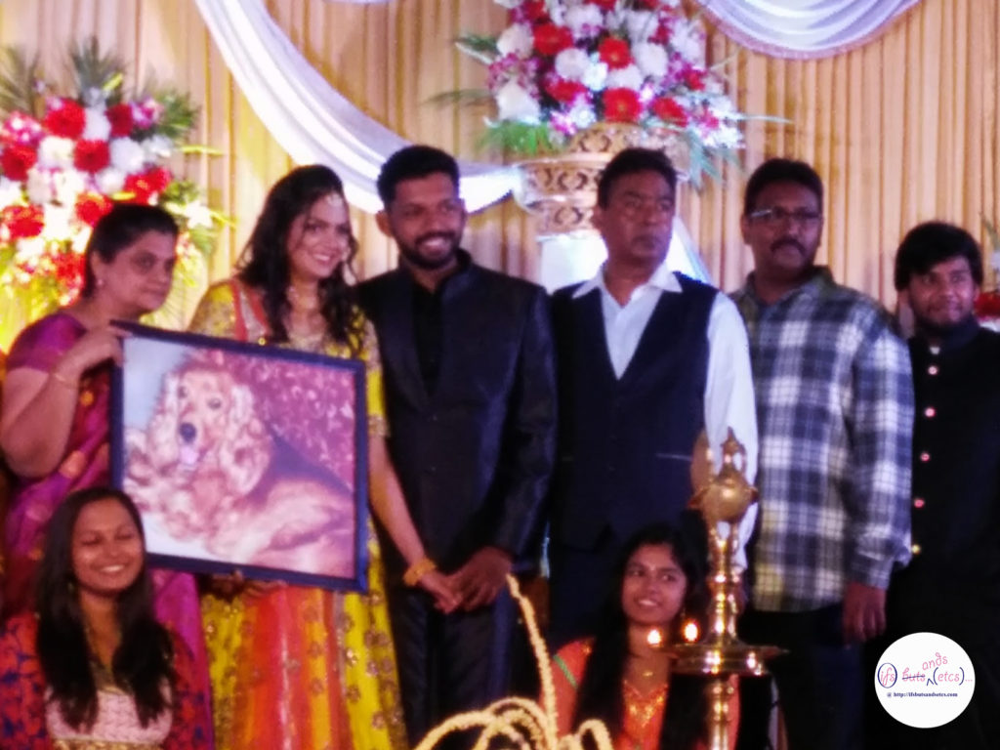
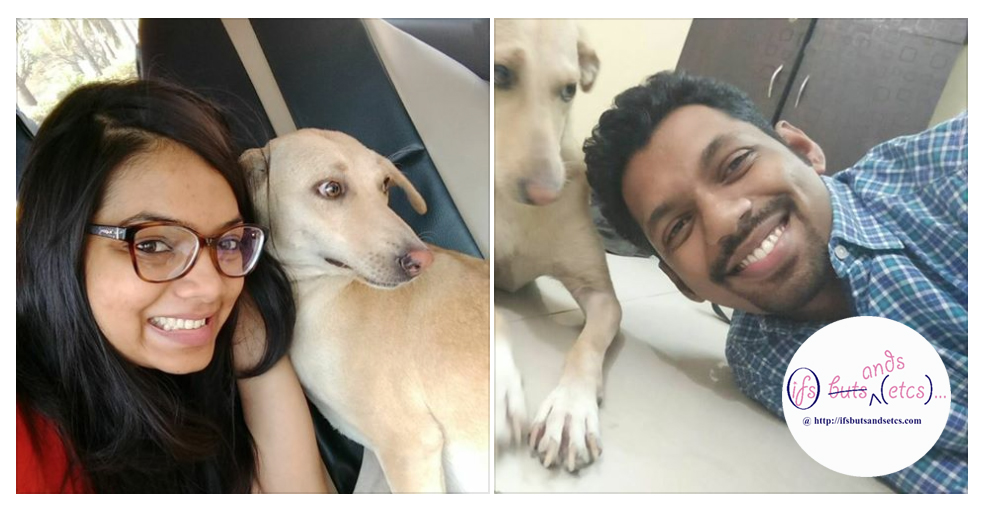

I had once written about a family who diligently fed a large pack of stray dogs in their vicinity every single day. You can read the post [here](http://ifsbutsandsetcs.com/2014/12/the-gift-of-giving/). Today I wish to write about a member from the same family who does little acts of kindness towards animals.

As a child the daughter of this family was extra sensitive towards animals. She was the animal rescue person in the building they lived in. She would never let any one kill rats and cockroaches that appeared in their house. On one of her birthdays she asked for a rather unusual gift from her mother. She asked her mother to give up eating non-vegetarian food. Andhraites, are known for their love for non-vegetarian food but the family gave in to her request and turned into pure vegetarians thereafter.

It was the little girl's idea to feed the stray dogs in their locality regularly. The family would go to feed the stray dogs in their locality even in heavy rains. They would carry huge cans of rice, eggs and lentils to serve about 27-30 odd dogs. The dogs waited all day long for them to arrive and would line up obediently for their turn to be served. When the family moved out of the city but they ensured that the dogs continue to be fed by someone in their neighbourhood who shares their passion for animals.

Recently, the daughter got married to her childhood sweetheart. Unfortunately, two days before her wedding she lost her pet dog to an illness. So heartbroken was she with this loss that she wanted to postpone the wedding. However, with a heavy heart she agreed to proceed with the wedding since the arrangements were already made. I'm sure not many people would not have understood her reasons for mourning for a dog on her special day.

When I attended her wedding reception I was pleasantly surprised to see her standing on the stage, carrying a huge picture of her late pet dog, Brunie. I could hear the guests whispering amongst themselves. The ones who did not understand the loss of losing a pet would have found the entire idea rather silly or melodramatic. I was deeply touched by her gesture. The kind of homage she paid to her dear Brunie was one of its kinds. Not many people would have the sensitivity or courage to do this.

\[caption id="attachment\_1931" align="aligncenter" width="680"\] At her wedding reception. Don't miss the picture of 'Bruny' that she's carrying.\[/caption\]

Recently, she informed me that she and her husband had adopted a dog. Their first child, Ella, a rescue was not finding a home due to her shy nature. She was bullied and infested with parasites. She found a home after almost five months. It was worth the wait, for she now has a set of extremely loving parents.

\[caption id="attachment\_1932" align="aligncenter" width="982"\] With their new baby.\[/caption\]

It is rare to see this kind of compassion at such a young age which calls for acknowledgement and respect no matter how small her efforts have been.

**_About ['We are the World Blogfest'](http://www.damyantiwrites.com/we-are-the-world-blogfest/)_**

_The 'We are the World Blogfest' (#WATWB) is an initiative taken by like-minded bloggers who felt that there was too much negativity happening on social media off-late. In a bid to bring in a change, on the last Friday of every month, members of the community will share stories about people and organisations who made a change in the society by means of kindness and compassion. The co-hosts this time are **[Belinda Witzenhausen](http://www.belindawitzenhausen.com/), [Lynn Hallbrooks](http://cswcllc.weebly.com/blog),  [Simon Falk](http://simonfalk28.wordpress.com/), [Sylvia McGrath,](http://www.professorowlsbookcorner.com/)** and **[Damyanti Biswas](http://www.damyantiwrites.com/).**  Do check out the other posts written for this initiative [here.](http://www.damyantiwrites.com/we-are-the-world-blogfest/)_ 

