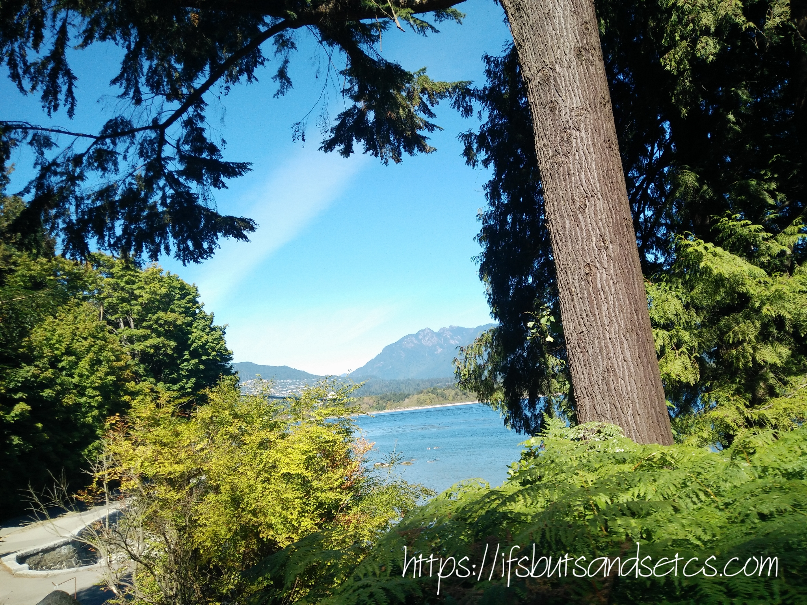

Hola, folks! How have you been? I had been away from this space for a long long time. My personal priorities took a forefront. I was off to Canada to drop my son to the university that he was joining. People who are regulars here have read the open letters that I wrote to him through the month of April before he left for his higher education. My trip was a bitter-sweet experience. Bitter for the thought of leaving my young man behind in a foreign land, and sweet since I love traveling no matter what the reason for travel was.

I was in Canada for a little over a month. Although I couldn't find the time to write my experiences while I was there, I clicked tons of pictures on my cell phone to post them later. I hope to write about them in detail in my coming posts. But yes, first let me tell you briefly about the place. Our trip started with a week spent in Toronto followed by a stay at our final destination, Vancouver. My son is fortunate to have grabbed a seat in the prestigious University of British Columbia (UBC) in Vancouver. I must admit that he did work hard for it and I am proud of his achievement. Coming back to where I started, we had the chance to visit our friends in Toronto and explore a bit of the city. Although we were told by many people about how different Toronto and Vancouver were as cities when we landed in Vancouver the stark difference in the topography, geography, culture, and climate amazed us. While Toronto has the upbeat energy of a metropolis, Vancouver comes across as fairly laid back and sleepy, typical of a touristy place. Vancouver is a west coast seaport in the beautiful province of British Columbia. It is one of Canada's most ethnically diverse cities.

I've been asked by many people about my preference between a beach destination and a hill station, to which I have always maintained greedily that I'd love to enjoy a bit of both at the same place. The idea of a vast sweeping ocean curling mysteriously around the feet of lush towering mountains fascinates me to no end. This is one place where you could ski in the morning and sunbathe on the beach in the afternoon. Vancouver was exactly what I wished for. I must admit that the sheer scenic beauty had me awestruck from the time I stepped onto it. Fringed by majestic mountains and laced by the bluest of seas, Vancouver is a photographer's delight! The maples and pines shoot their orange-emerald hued magic right through the fluffy tufts floating through the blue sky. The place is known for pouring inconsistently throughout the year, but I was lucky enough to enjoy clear days during most of the days of my stay there. However, it was sad to note that the recent wildfires seemed to have affected the ecology adversely.

Every day was a different experience and I had small yet significant instances stowed away in my memory bank that struck me as interesting. Vancouver is said to be one of the top five worldwide cities for livability and quality of life. I had the first-hand experience of the famous Canadian friendliness in my day-to-day interactions with the locals there. The best part is the ease of public transport that had solo female travelers like me moving around conveniently. The city has a little of everything for everyone who visits it, right from offering the most versatile global cuisine to arts, entertainment, adventure, shopping, sprawling parks and a generous dose of fresh air with natural beauty to entice your senses with. More on it in my coming posts. Stay tuned.

Before I leave let me share a bird's-eye view of what Vancouver looks like. Yes, that's just a tiny glimpse of the whole picture, the entirety of which my humble lens could probably never give justice to.

