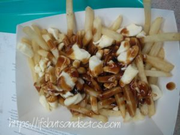
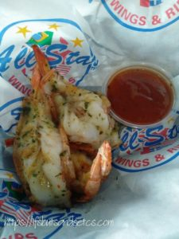
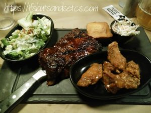
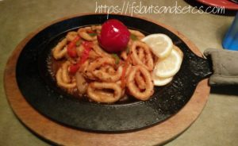
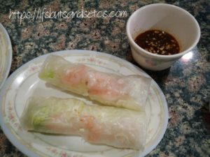
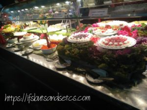
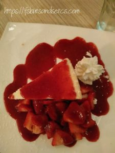
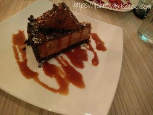
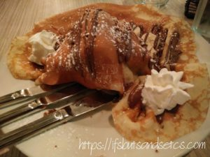

Our first stop in Canada was at Toronto where we spent a week catching up with friends before heading to Vancouver. The spirit of Toronto is quite different from Vancouver. While Vancouver has this laid back, touristy feel to it, Toronto seems to have the high energy of an urban place. It seemed to be a larger melting pot of diverse cultures with far more options to choose from. This seemed true to us especially in terms of the food we enjoyed there. The pictures below will testify the same.

Seen below is, Poutine, a Canadian dish originating from the province of Quebec. A bed of crisp French fries is topped with a creamy layer of cheese curds and doused in brown gravy. I freaked at the amount of grease and fat that went into making this dish. This can ideally be comfort food on a cold evening considering how rich and heavy it is. 

We had the best chicken wings at Allstar Wings and Ribs. The wings that we enjoyed there became a parameter for us to judge the quality of wings wherever we had them through the remainder of our trip. None of the wings we had elsewhere really matched up even close to those. Allstar has more than 200+ variety of wings. Before you place your orders you get to decide on the level of hotness you would want your wings to be spiked with. If you decide to go beyond a certain level of hotness, you need to sign a disclaimer that ensures that the consequences of eating that particular level of hotness is solely your responsibility. Yes, some of their sauces are fiery bombs! With fancy names like 'God of Lightening' and 'Wicked Buddha', the menu can be quite confusing. I don't remember the names of the ones we had. But all of them were finger-licking amazing! 

At the risk of sounding repetitive let me tell you, we also had the best ribs in Toronto. The ribs we savored at Montana's BBQ and Bar was served with a choice of BBQ Sauce, coleslaw, and their in-house baked cornbread. The ribs were deliciously juicy and the portions were big.

We happened to have a lunch at East Side Marios with a friend who recommended their calamari dish. It was lightly seasoned with garlic, onions, red, green and hot cherry bomb peppers served in a tomato broth on a sizzling skillet. The calamari was crisp and nice but it was the pepper on the garnish that I relished the most.

One rainy evening we got to slurp on some amazing Pho (Vietnamese noodle soup) at Pho Hung. I loved the hot and tangy Seafood Pho that I had ordered but it was the Shrimp Cold Spring Roll that took the cake. It was delicately flavored and served with a delicious sauce which had soy in it.

I had the chance to catch up with one of my childhood classmates who now lives in Toronto. We met after almost twenty-five years. When he asked me to pick the cuisine I'd have liked to have for lunch my only criteria was that I was okay with anything but Indian. I'd rather explore other cuisines during my travel than eating the regular Indian food that we normally eat back home. At least not when I was overseas and had a plethora of options to explore. My friend obliged and decided that we try the Chinese-Canadian cuisine at Mandarin. I was taken by surprise at the lavish spread of buffet. The fare was an absolute treat to the eyes. Tastefully displayed was a salad and sushi bar, a selection of hot soups, freshly baked bread, hot entrees, grilled meats, and veggies, noodles, dumplings, pizza, an array of sinful desserts, fresh fruits, frozen yogurt and ice cream. It took us quite a while to absorb the sight of the beautifully laid food. We ended up clicking a lot more pictures than actually eating all of that sumptuousness. Their frozen yogurt is a die-for.

One evening my friend suggested that we visit a street in the neighborhood that is known to host some attractions on Tuesdays. Unionville in Markham goes vibrant every Tuesday with local music, events, shows, food stalls, and a few souvenirs shops to browse through. We strolled around a bit through what looked like a mini carnival. A local musician strummed merrily on his guitar entertaining a crowd gathered around him under a tree. We stopped by a chocolatier's and feasted our eyes on some exquisitely crafted chocolates. The penguins and gift boxes made out of chocolate that you see below were just a few of some really marvelous looking pieces of chocolates. We sampled different flavors which simply tasted out of this world. I particularly took fancy to the green tea flavor.

 

The next sweet tooth pampering session was when a late night spin ended up at Caffe Demetre which is known for their finest sweet indulgences. Right from decadent cheesecakes to fluffy crepes stuffed with whipped cream dripping with the richest of sauces, we soulfully indulged ourselves with the sinful desserts till the last lick. Seen below are strawberry cheesecake, chocolate-toffee cheesecake and crepe stuffed with whipped cream served with ice cream.

 

As I started to collate the pictures to write this post I realized how much food we had consumed in Toronto in a span of just one week! The pictures that you see here are not even a fraction of what we ate. But well, I believe it was also due to the fact that we had lots of dear friends in Toronto who commonly shared our love for good food. Goes without saying that meals taste yummier when you share them with people you love!

I know, I know...I have been tormenting a lot of you with the food pictures that I previously posted in my blog post on [Vancouver food](https://ifsbutsandsetcs.com/2017/10/vancouver-on-a-platter/) and now this. But I guess I will be spared this time around coz' I'm guessing that a lot of you would have already had your share of binge sessions during the festival. Hope you had a delicious Diwali. Before I go, let me remind you that life is short. Go right ahead and eat that cake!

_I am taking part in [The Write Tribe Problogger October 2017 Blogging Challenge](http://writetribe.com/write-tribe-problogger-october-2017-challenge/) at [Write Tribe.](http://writetribe.com/)_
