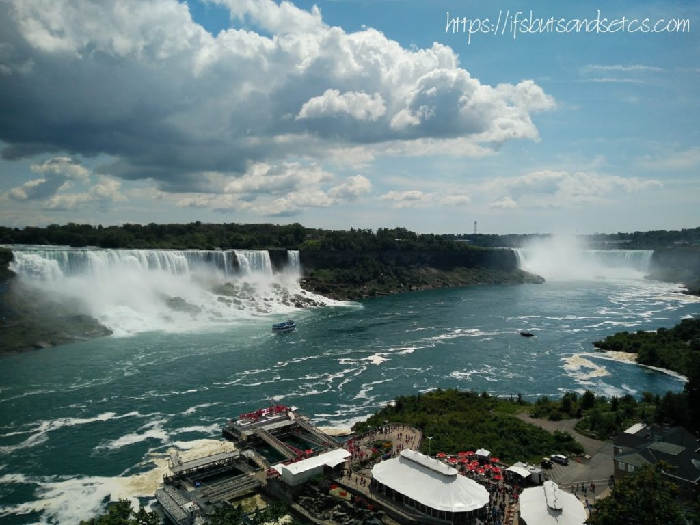
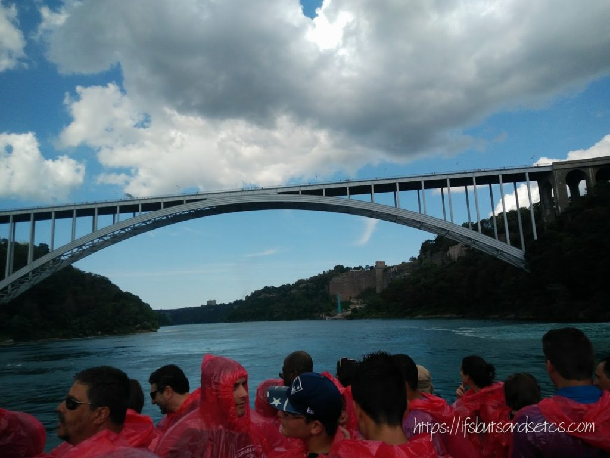
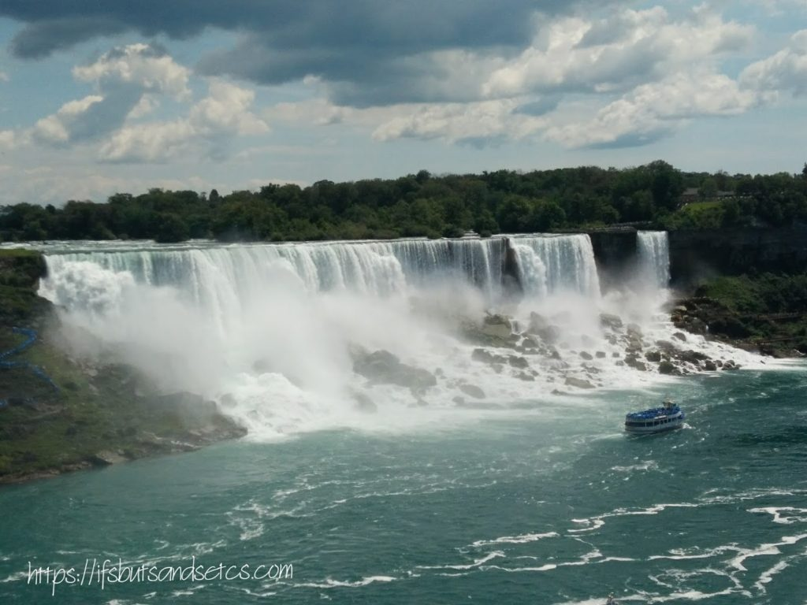
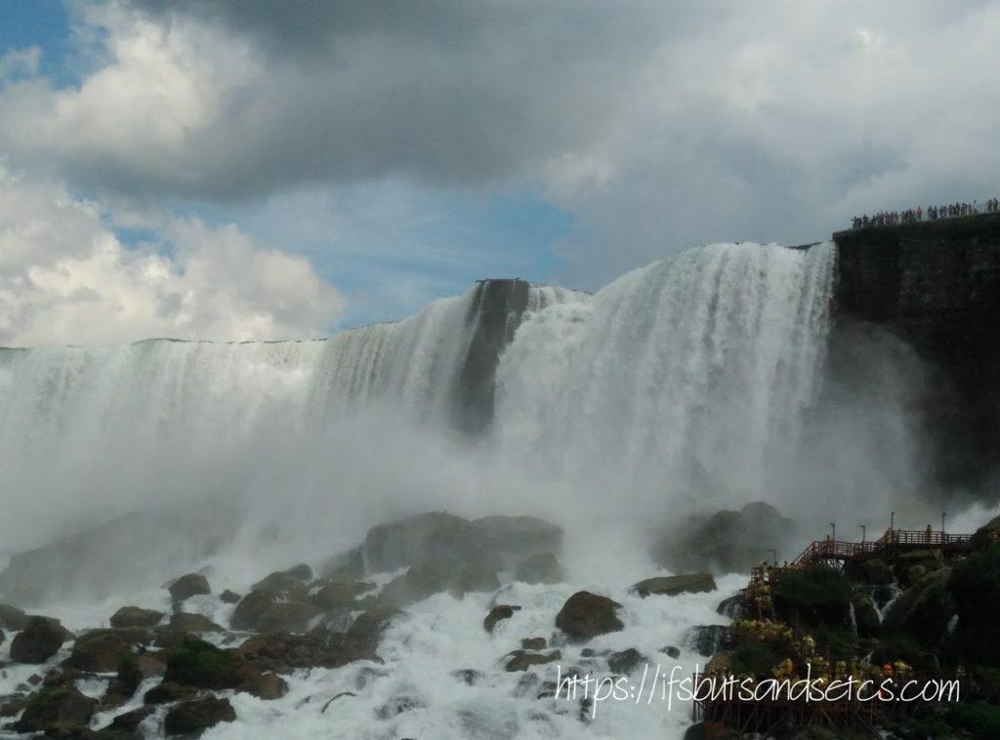
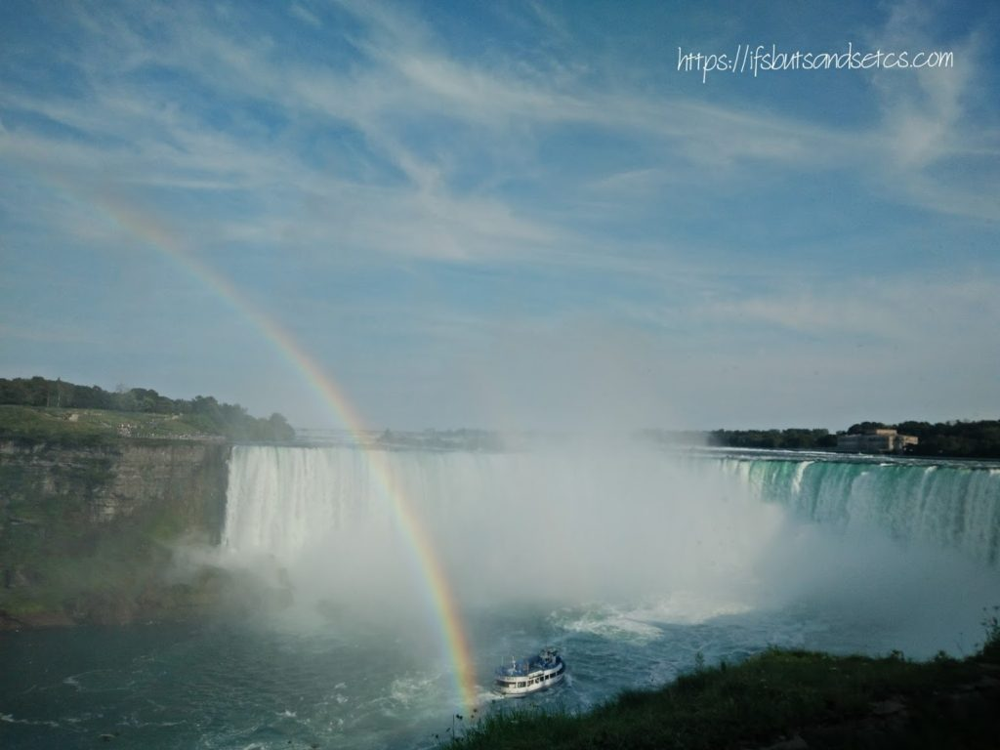
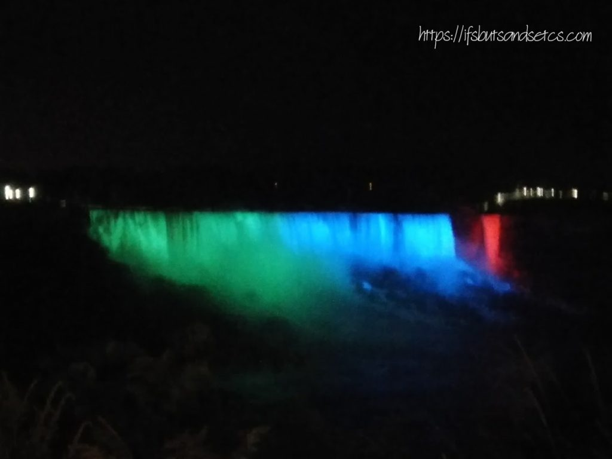

We had not expected to do much of sightseeing during our stay in Toronto since it was a social visit that we were paying to our friends living there. However, we did manage to strike off watching one of the eighth wonders of the world, the Niagara Falls, from our bucket list thanks to our friends who planned to take us to Niagara over the weekend. Just so that you know, if you're like me who believed that Niagara Falls was one of the seventh wonders of the world, let me inform you that it is not. It is actually considered to be the eighth wonder of the world. It’s easily the most powerful waterfall in the world. With over 168,000 cubic meters flowing through the falls every minute – and that’s not even counting what gets diverted for the hydroelectric plants – no other waterfall in the world has the same intensity.

_Niagara Falls is the collective name for three waterfalls that straddle the international border between Canada and the United States; more specifically, between the province of Ontario and New York state. They form the southern end of the Niagara Gorge. From largest to smallest, the three waterfalls are the Horseshoe Falls, the American Falls, and the Bridal Veil Falls. The Horseshoe Falls lies on the border of the United States and Canada with the American Falls entirely on the United States' side, separated by Goat Island. The smaller Bridal Veil Falls are also on the United States' side, separated from the other waterfalls by Luna Island. It is located on the Niagara River, which drains Lake Erie into Lake Ontario. [Source](https://en.wikipedia.org/wiki/Niagara_Falls)_

You only realize the magnitude of what the hype is all about is when you stand up front facing the force of the cascading water crashing down hitting the rocks in vehemence only to rise again in a hazy mist. Within seconds I felt as though I was a part of the mist, my thoughts almost dissolving into it.

We took a cruise that took us closer to the falls. The foam sprayed wildly on our faces as we approached towards the furiously descending falls. The Niagara Falls International Rainbow Bridge, commonly known as the Rainbow Bridge, is an arch bridge across the Niagara River gorge and is a world-famous tourist site. It connects the cities of Niagara Falls, New York, United States (to the east), and Niagara Falls, Ontario, Canada (west).

 

 

 

This was the first time that I saw multiple rainbows at one location, not in the sky but in the mist formed from the water hanging in the air in front of the falls. For a second I thought I was imagining it. It almost seemed magical!

During the night the falls look even more dramatic with colored lights that are projected on to them from a distance. The lights keep changing colors. It is worth waiting until it is dark to see this spectacular sight.

No matter how many pictures I post it wouldn't describe the intensity of the tumbling ferocity of these falls. It needs to be experienced in person. Watch the videos below to get a feel of what I mean.

\[video width="720" height="720" mp4="http://ifsbutsandsetcs.com/wp-content/uploads/2017/10/VID\_544950826\_190750\_719.mp4"\]\[/video\]

 

The Horseshoe falls that happen to be on the Canadian side is also the largest of the three falls. The name seems to have been inspired from the bend of the natural curve that the water slides from. I could have gazed on in awe at this natural wonder for hours. For obvious reasons this also happens to be a place where one needs to be cautious, especially during the rains. I was told that recently a young girl had got swept away by heavy rains and had fallen down the precipice into the gushing water. She happened be taking selfies perched on the barricade before she lost her balance and got swept off. She obviously did not survive the fall and her body was retrieved within minutes from the depth of the waters much far away than where she fell from. I shudder as I imagine the force of the torrents that must have flung her so far off within that short duration. It is unfortunate and ironical that she lost her life at a place as beautiful and magnificent as this due to her carelessness.

\[video width="1280" height="720" mp4="http://ifsbutsandsetcs.com/wp-content/uploads/2017/10/VID\_20170813\_182529.mp4"\]\[/video\]

 

Niagara also has a host of other attractions like the zip line and aerial adventures. It can be quite exhilarating to do these activities in the close proximity of the falls. The kids thoroughly enjoyed some of them. We took a quick bite at the eateries around. In the middle of it all, a fake Elvis Presley who looked dressed and almost sang like him entertained the crowds. Despite all this happening around me, my eyes kept traveling to the mist that emerged from the frothy roar, as the glassy shards of water sliced down from the steep gorges. No matter how many unnatural things we build around us, nature always seems to have the last say. The thunderous echo of the falls, for example, stays with me to this day.

_I am taking part in [The Write Tribe Problogger October 2017 Blogging Challenge](http://writetribe.com/write-tribe-problogger-october-2017-challenge/) at [Write Tribe.](http://writetribe.com/)_
