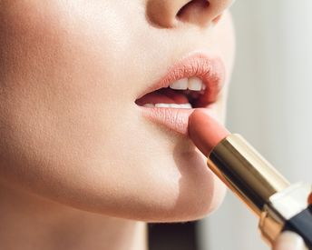

Fashion is all about being the person who you are and feeling comfortable in your skin. The very basic thing you need to keep in mind while you shop for something is that not everything looks good on everyone. Hence, idealizing a celebrity and copying their sense of lifestyle is not going to work out for everyone around. Henceforth, it is very important to get a right guide at a right point in time.

Nykaa is here to do exactly the same thing. To guide you through your times of crisis and when you don’t know what do you need to look your best. Nykaa, a premium online skin care, and wellness destination are slowly and steadily making its grip tighter on the wardrobe of today’s fashionistas. This website is exclusively designed for the people who are in the habit of slaying the ordinary. Nykaa has a superb collection of beauty and wellness products, they are jaw-dropping as well as fairly reasonable. Don’t forget to use Nykaa Coupons while you make your purchases on the website. It will get you an extra cut on your expenses. You can use these [Nykaa Coupons](https://www.gopaisa.com/nykaa-discount-coupons-offers-promo-codes) while you grab some awesome deals under the bag of Nykaa Offers. These offers include 15% Off on professional makeup kit, Flat 30% Off on Maybelline products, Up to 30% Off on Lakme products, Up to 25% Off on Bio-Oil products, Up to 25% Off on The Face Shop and many more. These offers are a great help for your shopaholic-self so that you can shop guilt-free!

Nykaa also curates special editions for all the newcomers and guide them towards a healthy and glowing skin. You can also refer to the expert beauty Vloggers and get tutored on basic as well as advanced level makeup. There is another amazing option to try on if you are looking for something fashionable and under your budget.

Flipkart is one of those websites where you can get almost everything from beauty products to your daily and party wear. Flipkart is a similar online website as Nykaa, although it has been serving the audience for quite a long time. In addition to this with the help of [Flipkart Coupons](https://www.gopaisa.com/flipkart), you can get all that has been displayed on the websites, providing the current offers, at reasonable discounts and save some money from your shopping budget.

 

_\*This is a sponsored post. This blog has no direct affiliation with the offers on the links provided here._
