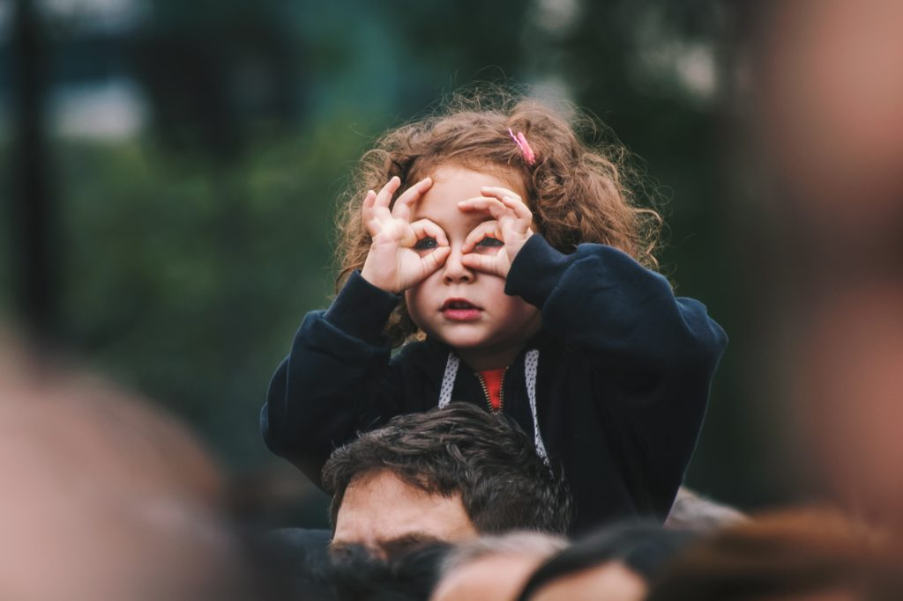

She realized that she'd been staring at the string of words for a long time without actually registering what they meant. Her glazed eyes blurred the contents of the book into oblivion. Only one word stared back at her from the haze. TRUST. What was it about Trust that had defied her intelligence of so many years? It is Trust that has the capacity to throw a person off his mental equilibrium. Both the lack of it and excess of it have known to destroy lives. That's how powerful Trust is.

As a little girl, she trusted her parents to do the best for her future. Like most parents, they did whatever best they could for her as per their understanding of the world. When she met him in her adolescence, their mutual admiration was a strong foundation to Trust him enough to decide to spend her entire life with him. When she became a mother her world seemed complete. Every time she would fondly look into her child's eyes all she could see was an unmistakable glint of Trust in his eyes. Trust that comes from knowing how secure he was in her presence. As the happiness in her life doubled, so did the number of people around her. Its a known fact that people like happy people. And again its happy people who gain the maximum Trust.  She trusted them right back. After all, they were her real friends.

Life was good till the time REALITY started knocking softly on her window. She tried to make sense of what it was trying to tell her. But that would mean that she would have to let go of her good friend Trust and listen to what was otherwise. So she decided to ignore it. A few days later Reality knocked on her backdoor. She had half a niggling doubt to go check on what it was all about. But again she did not want to forego her Trust. One fine day Reality stood outside her front door and pressed the doorbell so hard that she almost fell off her seat in panic. No, she was not going to answer that and let go of her dear Trust. And then she heard Reality banging hard on the door. Oh my god! Was this for real? She shut her ears to block it all out. She was going to be faithful to her Trust, come what may. But the unimaginable happened in the next instance. The front door fell open with all that force and Reality barged into her living room, perched itself haughtily on the seat staring right into her face as she watched in dismay from the place she had fallen to. It sat there drumming on the side rest mocking at her. By the time Reality sunk in, she realized that her good friend Trust had vanished.

She fumbled for a bit then jumped up to her feet and ran around like a woman possessed, trying to find Trust in all the places she had found it earlier. First, she went to him, her life partner, who had a large chunk of her Trust. But hell he was the very reason why Trust had disappeared from her life! So she ran to her dear friends. But apparently, these fair weather friends only had Trust around happy people. And right now she was far from happy. They whispered snidely behind her back as they walked away unperturbed. Disappointed she turned to her parents. There they were with her little one. With guess who? Her lost friend Trust! It was right there smiling back from their eyes. She hugged them tightly. Good lord! She had almost thought she was dead. But the Trust within her loved ones had pumped life back into her listless soul. Her little one's innocent twinkling eyes with their familiar emotion caught hers. Full of Trust. And, that was it. It was enough to last for a lifetime. Trust me.

\[caption id="attachment\_2779" align="aligncenter" width="680"\] Source: [unsplash.com](https://unsplash.com/photos/1bhp9zBPHVE)\[/caption\]
