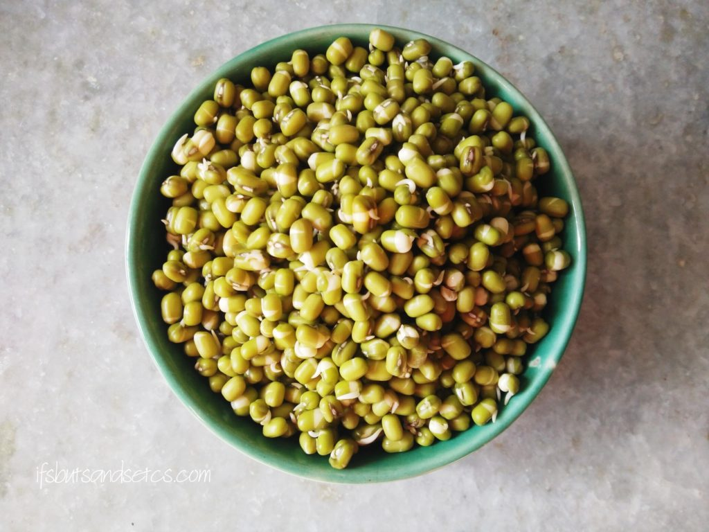
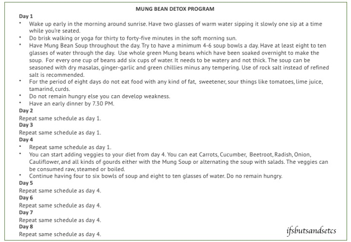

It's been a couple of months since I have been living an unhealthy lifestyle. Zero exercise coupled with binging on lots of comfort food has played havoc with my weight. Along with it came lethargy and a certain low that I cannot really describe in words. It didn't feel right. I had to do something about it. I am not a big fan of drastic diet changes but sometimes I experiment to see how they work for me especially if they promise not to starve me. The last time I followed a rigorous diet was when I read Rujuta Diwekar's book _'Don't lose your mind, lose your weight.'_ I followed it to the T and lost eight kilos in the duration of one year. Read about it [here](https://ifsbutsandsetcs.com/2014/04/how-i-lost-my-weight-and-not-my-mind/). Encouraged with that weight loss I made a lot of lifestyle changes after that. That was seven years ago and somewhere along the line, I went lax on the discipline cultivated back then. I normally eat moderately balanced meals and try to keep myself active. But that did not help in keeping the unhealthy pounds away since I did cheat a lot off late. A couple of days ago I learned about this detox program from my brother. He had followed it for a week and lost close to four kilos in one week. Curious about how it worked I did a bit of research online and ended up trying it myself.

_**The Mung Bean Detox Program**_

_The Mung Bean Detox Program involves eating Mung Beans for eight days._

_The day starts with two glasses of warm water. You're supposed to sit down and drink the water slowly. It is important to sit and have it one sip at a time since it helps flush out the toxins well, makes your knees strong and the body remains hydrated throughout the day. At least eight to ten glasses of water (more if its summers) are to be had all through the day for the toxins to be flushed out._ 

_After that, thirty to forty-five minutes of brisk walk or yoga is recommended around sunrise when the sun rays are still soft. The early morning sun is supposed to be beneficial in preventing you from various diseases like Diabetes, Cancer and also great for stronger bones. You are advised to wake up early and sleep at a decent time on these days._

_The diet for the first three days is strictly only Mung Beans which are to be had in the form of a soup. Five to six bowls of the size of a standard soup bowl are recommended for a day. Anything lesser could result in weakness. The Mung soup is made with Mung beans that were soaked overnight. The Mung Beans need to be the whole green Mung Beans and not the split or yellow ones. The correct proportion for the soup should be six cups of water to be added for every one cup of beans. The soup needs to be really watery. I pressure cooked and seasoned it with salt, red chili powder, garam masala, a pinch of turmeric with a dollop of ginger-garlic paste and a few slivers of green chilies and mashed the cooked beans a bit. There's no tempering to be done. Replacing refined salt with rock salt is recommended._

_For the period of eight days, there is a restriction of adding any kind of fat, sweetener, lime juice, tomatoes, curds, tamarind or any other sour item to your food. However, you can season your food with dry spices, ginger, garlic, and salt. I was a little liberal with the spices. I had a bowl each for breakfast, lunch, after tea in the evening and dinner._

_Mung beans are high in nutrients and antioxidants, which may provide health benefits. They are high in fiber and protein, which can help curb hunger by lowering levels of hunger hormones, such as ghrelin, and raising fullness hormones, such as peptide YY, GLP-1, and cholecystokinin. In fact, they may protect against heat stroke, aid digestive health, promote weight loss and lower “bad” LDL cholesterol, blood pressure and blood sugar levels._

_You're allowed to have two cups of tea with milk per day with less sugar or alternatively, you could have green tea. However, the tea is not to be had on an empty stomach._

_The fourth day onwards you could add veggies like carrots, beetroot, cucumber, onion, cabbage, cauliflower, all kinds of gourds to your meals along with the Mung beans soup, raw, boiled or steamed._ _You could also alternate your meals between salads and soup every two hours. Ensure that you do not remain hungry._

_This program is not meant for pregnant ladies, lactating mothers, people with diabetes or any other serious health issues. It is always advisable to consult your doctor before trying the program._

**The benefits of this program are that it helps you flush out toxins, lose weight, brings down any swelling that you have in your body and works on aches related to the same. It helps balance your hormones, control the symptoms of menopause, helps control bad cholesterol, increases your stamina and gives you glowing skin.**

\[caption id="attachment\_2907" align="aligncenter" width="720"\] Printable and Downloadable Schedule Chart\[/caption\]

Here are my observations during my detox program day wise.

**Day 1:** I got up early in the morning to get my dose of exercise in the morning sun. I prefer brisk walking with my favorite music plugged into my ears. Gives a different high altogether! The Mung soup did not taste bad at all. It was rather filling. In fact, halfway through the day, I felt heavy after consuming it. I observed that my mouth felt dry after the first two bowls of soup. By evening I was craving for some other taste but a little bit of distraction helped me get over the craving. The afternoon tea was a welcome change. I ditched my regular mug of morning coffee. I had my tea without sugar. Even on regular days, I do not take sugar in my beverages so that I get to indulge my sweet tooth with my favorite desserts.

**Day 2:** I checked my weight on empty stomach first thing in the morning and I had lost a good 700 gms already! That was motivating enough, otherwise, the Mung soup wasn't something I was looking forward to having. I continued having it for all four meals although I went easy on the portions now. My appetite seemed to have gone down. The mouth still feels dry and I seem to be drinking much more water than I usually do.

**Day 3:** Unlike the first two days, the third day was quite challenging. I did not notice any change in my weight loss since the time I checked last. I had trouble getting up early in the morning for my walk but I barely made it in time to catch the early morning rays. It was particularly a trying day coz my tastebuds were missing other flavors and more importantly different textures of food. The Mung Soup was getting too monotonous. Surprisingly I did not crave for my daily dose of something sweet but I longed for tangy and sour things. It could probably be because we normally prepare Andhra food at home which has a lot of tanginess and heat. I also sensed some random mood swings owing to my cravings but well I was determined that I'd get through it.

**Day 4:** My weighing scale says I lost one kilo already! Today I am allowed to have a few veggies along with the Mung Soup. After all that liquid, I longed for something crunchy and this was a welcome change. I munched on carrots and cucumber throughout the day. However, the soup was to continue as per schedule. I realized why I was feeling heavy all these days. The soup I was having was much thicker than prescribed. The ratio was six cups of water for every cup of Mung Beans. And each serving was supposed to be the size of a standard soup bowl. I started having a thinner version of the soup and this was much lighter on the stomach.

**Day 5:** I was slightly skeptical on how I'd get through today coz its a Friday and I fast on Fridays. That would mean having salt and grains only once in the day. In that case, I could have the Mung Bean Soup only once in the day. I worked around it by having veggies for my other meals and having a little more of Bean Soup for lunch. I managed well despite the restrictions.

**Day 6:** I expected a major shift in my weight after yesterday's fasting but that didn't happen. There was some amount of weight loss but it wasn't a significant number much to my disappointment. Actually, it's pretty difficult to gauge your exact weight during this program because it keeps fluctuating throughout the day due to the large number of fluids that you're consuming and the frequent number of times you're eating. I was assured by my brother that the positive results of this program show towards the end of the program. Well, that's enough assurance to keep me going!

**Day 7:** I did not notice any major change in my weight today. I continued having different kinds of veggies, namely carrots, beetroot, and cucumber. Just another day to go before this program ends and I am wondering how much of a difference has this diet really made to me. I'll wait for another day before I come to a conclusion.

**Day 8:** I was elated when I checked my weight this morning. I was a little less than five kilos lighter! Today was an exceptionally stressful and eventful day on personal front but I managed to pull through the diet, nevertheless. Since the last two-three days, I've started having the Mung Beans soup with chopped onions on the side seasoned with rock salt and red chili powder. It helped me balance the monotony (after eight days of eating the same thing over and over again!) of the bland and boring taste of the soup. I now look forward to having my regular meals from tomorrow!

In conclusion, let me share the results of my program. Today I notice that I have in total lost five kilos and had about two to three inches of inch loss over a period of eight days. I haven't achieved my goal weight as yet but I do intend to get there by maintaining this weight and trying to reduce further with balanced meals and daily exercising. Before I started this program my face had a few zits which magically disappeared during the course of the program. I notice a clearer skin with a healthy glow. My energy levels have soared. I sleep better. I feel lighter and rejuvenated at the end of these eight days.

\[caption id="attachment\_2895" align="aligncenter" width="680"\] Before and After\[/caption\]

If you are someone who is fit enough to undertake this program, the other requirements to do this program is that you're okay with eating the same kind of food for eight days for breakfast, lunch, and dinner, which is quite challenging but can be tackled with a bit of creativity. And of course, you need to have a willpower of steel to tide you through the eight days minus the temptations! The sense of accomplishment that follows is overwhelming. So, what do you think? Do you have it in you? Let me know your thoughts in the comments section below.
