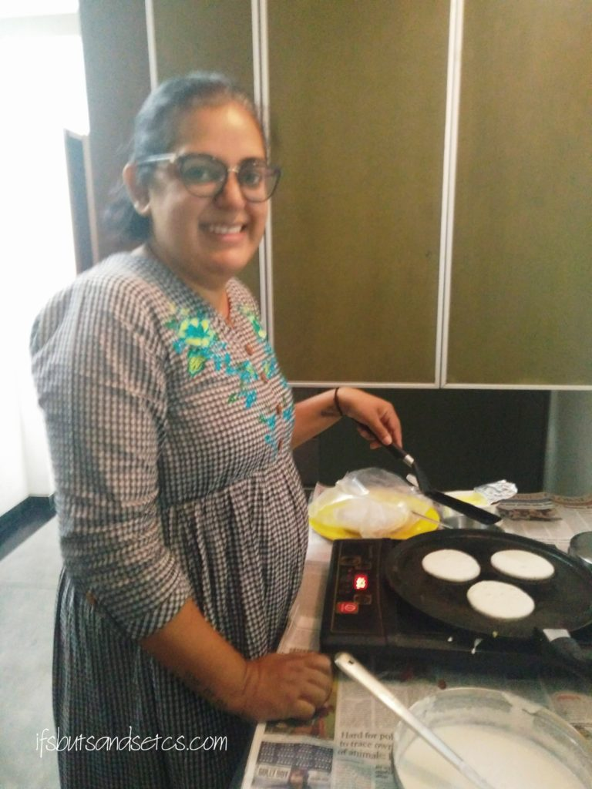
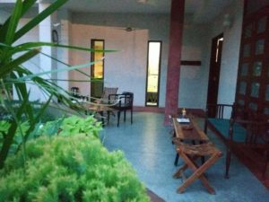
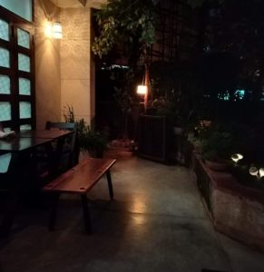
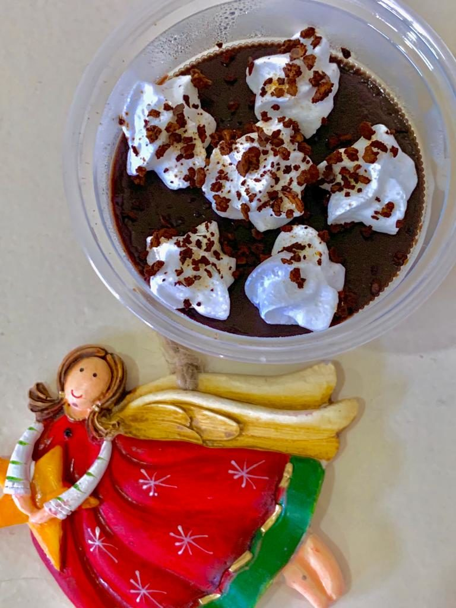
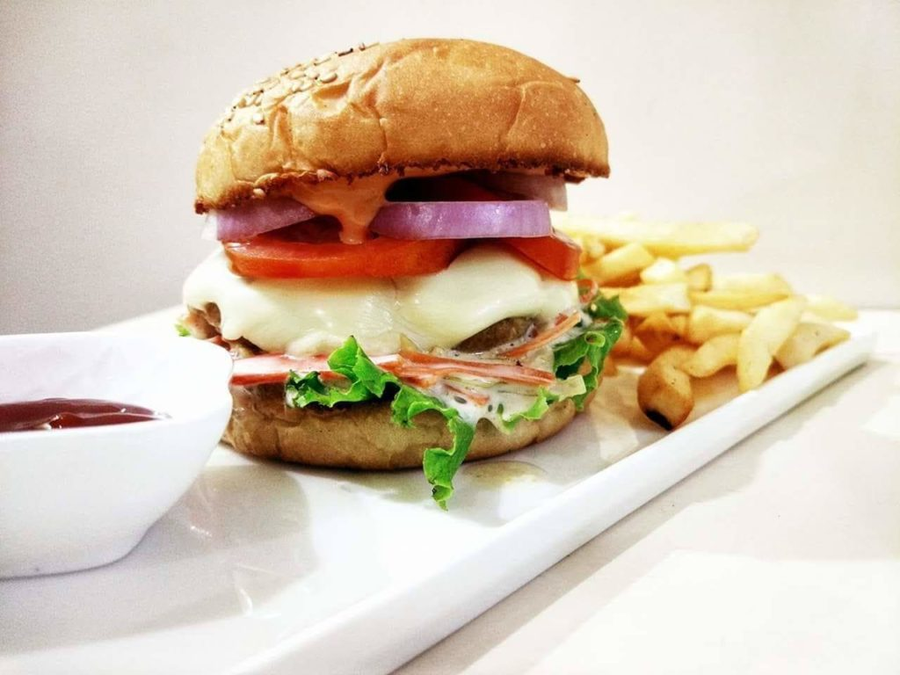

It's a lazy weekend. You've lounged around the entire day. You plan to get out of the house to get some fresh air and do something interesting in the evening with your friends/family. Like most weekends you end up at yet another swanky restaurant hoping to indulge your tastebuds with something interesting. After careful screening of the menu, you order a few dishes which sound exotic and promise to be different from the regular stuff you order, only to end up groaning at the sight of the same old orange gravy or sauce presented in a different manner or in the guise of an exotic name but tastes almost repetitive. To add to it sometimes the thought of the noise and crowds that throng these joints is another thing one would want to get away from.

Wouldn't it have been great to just relax somewhere quiet and informal? Some place that serves delicious world cuisine with a touch of home-style cooking. A friend started a weekend cafe precisely three years ago. What started as a common family interest of indulging in good food soon developed into a passion that she was happy to explore professionally. The face behind Ms Muffet, this quaint weekend cafe, is Pooja Sheth, an enterprising young woman who with the loving support and assistance of her mother Parinda Sheth and a few close friends ventured into catering to the much-needed requirement of bringing authentic recipes from across the globe with a personal touch for the people of Baroda, who are known to be forever on a gastronomic trail. Pooja works as a school teacher during the week but as the weekend draws closer she dons her chef's hat and apron with full gusto. She started her journey with baking cookies which she still does on order. She also sells freshly bottled homemade Pizza sauce.

\[caption id="attachment\_3027" align="aligncenter" width="480"\] Ms. Muffet aka Pooja Sheth in action!\[/caption\]

I've always known Pooja's family as connoisseurs of great food and excellent hosting, especially her late father, Girish Sheth, lovingly known as 'Jaada Kaka' (fat uncle in Gujarati) whom we remember with great fondness. Their family recipes are authentic and lip-smacking. I have memories of enjoying some amazingly scrumptious homemade meals on their dining table over great conversations years ago. Fast forward to now when Pooja actually started showing interest in this business I am not at all surprised by how far Ms Muffet has come! It is a part of the Sheth legacy.

Every weekend after much research, they come up with a new innovative menu of select items, both vegetarian, non-vegetarian and a dessert or drink to go with it. The menu is different every week. The attack on your senses begins right at the point when you see the menu card for that week. Designed by an extremely creative 18-year-old, Aruvi Dave, these menu cards are visual treats in themselves. Each weekend a newly designed menu card diligently pops up tempting you with the imagery and the inviting cuisine it talks about. Aruvi's mother Zaida Jacob, who happens to be my dear friend from college and also a close friend to the Sheths, is one of the major think-tanks for Ms Muffet. Pooja and Zaida often brainstorm over the detailing, right from planning the menu to the calmingly rustic ambience of the cafe.

You have to watch this video to see young Aruvi's exceptional imagination translated into menu cards for Ms Muffet week after week. She uses a mix of handwork and digital media to create them. I bet you will love them!

https://youtu.be/Ys\_Jm5h2gKc

I must admit that some of the dishes I read on the menu were new to me and I had to actually google to know where they were from. _Huli Huli_ Chicken (a Hawaiian delicacy), Pannacotta with _Jamun_ sauce, Gosht _Beliram_ (named after the recipe of a famous cook called Beliram, from Lahore during Maharaja Ranjit Singh's reign), Chicken _Cacciatore_ (an Italian dish) were some of the names that caught my fancy. While some of the dishes are fancy and have a history to them which are often elaborated by Ms. Muffet, some of the items on the menu are simple soul food like good old Mango rice with cucumber _pachadi_ or a humble roast tomato and cheese toast. There's something for everyone. That's the ingenuity of Ms Muffet!

I never had the chance to visit the cafe since its inception a few years ago despite getting lured on many weekends, blame it to the procrastinator in me. There came a point when I got to hear some rave reviews from local friends who had discovered the cafe by word of mouth. _"Hey, you should check out this place called Ms Muffet, they serve some amazing stuff! "_ said a friend to me one day and I was like, _"I know,"_ I had no doubts about it and it made me feel proud of Pooja! So I decided to finally visit them this weekend when the cafe turned all of three years old. Pooja's brother Nandan was visiting from Ireland and he was the guest chef this weekend. It was a temptation I could not refuse. The prospect of having to enjoy both, Nandan and Pooja's joint efforts in dishing out the best of their culinary skills were not to be foregone.

Nestled in a quiet corner of a building, Gulmohar, [the venue of Ms Muffet](https://wego.here.com/directions/mix//Ms-Muffet,-Anand-Kiran,-390002-Vadodara:e-eyJuYW1lIjoiTXMgTXVmZmV0IiwiYWRkcmVzcyI6IkFuYW5kIEtpcmFuLCBWYWRvZGFyYSwgR3VqYXJhdCwgSW5kaWEiLCJsYXRpdHVkZSI6MjIuMjk2MzY1NzY3ODYzLCJsb25naXR1ZGUiOjczLjE2NDQwOTgzMTI5NywicHJvdmlkZXJOYW1lIjoiZmFjZWJvb2siLCJwcm92aWRlcklkIjoxNTM1MTQ5MTk2NzMxNzQ5fQ==?map=22.29637,73.16441,15,normal&fb_locale=en_US) is actually an architect's office during the week. This architect friend gladly offered them to use the premises on the weekends. It is actually a compact office with a tiny pantry and a small patio that converts into a cafe on weekends with clean and simple seating arrangements for the diners. A few wooden benches, chairs and stools at the tables give a casual and relaxed feel to the place. The lighting is dim and soothing. Although, it is preferable to go in small groups to be comfortably accommodated or else order for a takeaway if you're a larger group. There are small water bodies around the patio with tiny fish in them, fringed by some greenery. If you're an animal lover there's a cat who loves entertaining those interested with its antics.

I discovered that a lot of people pre-booked their orders because most of the dishes got sold off within one hour of the opening hours. Pooja greets her customer with a sweet smile while she and her mother get busy serving them personally as they indulge in friendly banter with the eager diners. The best part is that they personally plan, research, source all the fresh ingredients, chop, cook, serve and clean all by themselves without any additional help. That's the reason people prefer the homely touch they offer to their service.

\[caption id="attachment\_3021" align="aligncenter" width="680"\] Menu card design by Aruvi Dave\[/caption\]

This weekend the menu at the cafe was Chicken Pepper Roast, Paneer Pepper Fry, Dhabewala Rajma Chawal, Ghar ka Mutton Curry with Paranthas by Nandan and Mocha Extravaganza by our own Ms Muffet for dessert. I decided to go for good old Ghar ka Mutton Curry since I have a soft corner for home-cooked meat and also because the Chicken Pepper Roast was already sold off within the first hour of the opening of the cafe. The lamb was tender and juicy and the curry was perfectly spiced with a hint of star anise. It was served with steaming hot Paranthas. The quantity was good and quite filling at the cost it was offered for. I also got a chance to taste some of the Paneer Pepper Fry which was served on a bed of spongy mini Uthappams. It was heavenly and for some strange reason, the spices in the paneer reminded us of a dry prawn masala preparation. If you're a non-vegetarian you'd know that it is a compliment to a vegetarian dish to be compared with a non-vegetarian preparation! Years of working as a visual display artist naturally make me look for the finer details of the presentation. In this case, the presentation was basic and fuss-free with a sprinkling of freshly chopped cilantro garnish, except for the dessert which was quite an eye candy. After all, the USP of Ms Muffet is the authenticity of her recipes and the pure joy of relishing the delectable fare. She doesn't need many frills to her plating! I ended my meal with the decadent Mocha Extravaganza which was an overload of creamy rich dark chocolate topped with swirls of whipped cream. I couldn't have gone back home without enjoying a signature Ms Muffet creation. I am glad I did coz the taste lingered on my tastebuds for a long time. Damn...I'm still craving for some more!

\[caption id="attachment\_3022" align="aligncenter" width="480"\] The super-rich Mocha Extravaganza\[/caption\]

\[caption id="attachment\_3043" align="aligncenter" width="580"\] By the way, I'm told that Ms Muffet's juicy burgers are to die for. Have a look!\[/caption\]

My overall feedback is that this would be a place I and many like me who prefer quality and quietude would want to go back to, for the versatility of the menu, the authentic tastes offered and for the easy, casual comfort that eludes most restaurants and cafes. Kudos, to Ms Muffet for making this happen! I am looking forward to breaking bread with her more often as I wait in anticipation with the next thing she's going to surprise us with. If you're in Baroda on a weekend, I heavily recommend that you check her menu for the week on her [Facebook Page](https://www.facebook.com/MsMuffet/), don't forget to like the page and drop by at the cafe to experience the magic of Ms Muffet!

Before you go, here's a glimpse of what you can expect at Ms Muffet's. Watch the video below.

https://youtu.be/dETL0G3OgFU

_Ms Muffet is open on Saturday and Sunday from 7 pm to 10 pm at Gulmohar, Anand Kiran Apartments, Manisha Chokdi, Baroda. Call 9825099948 to make your bookings._
