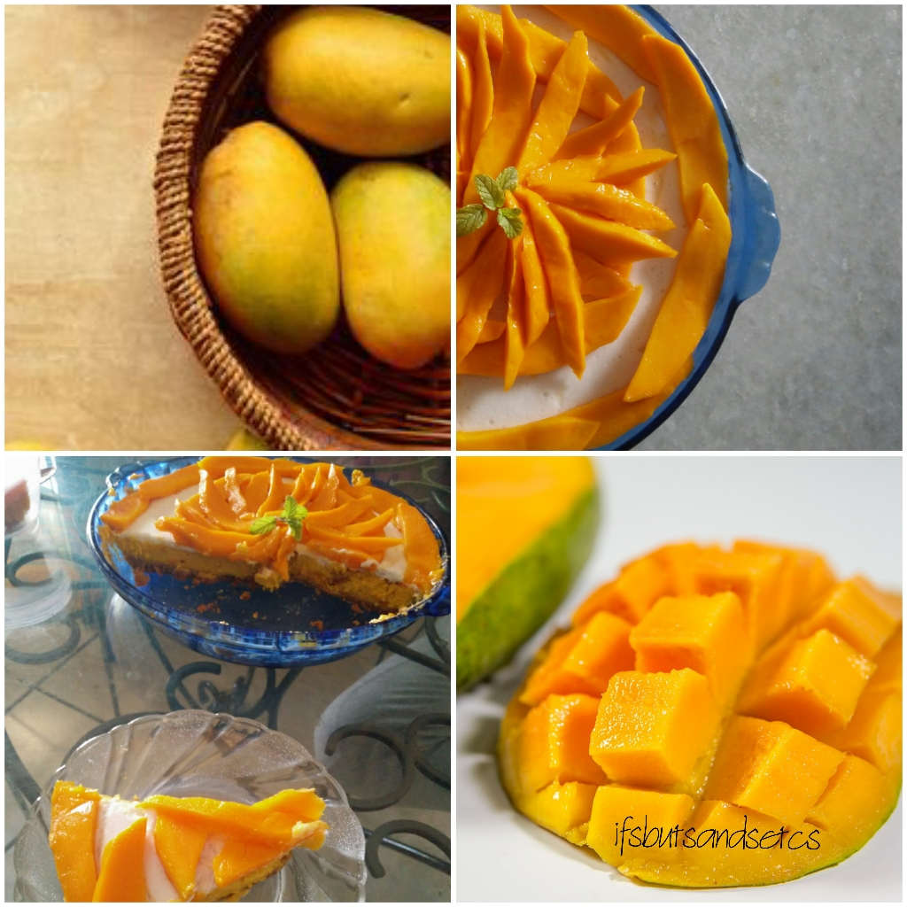
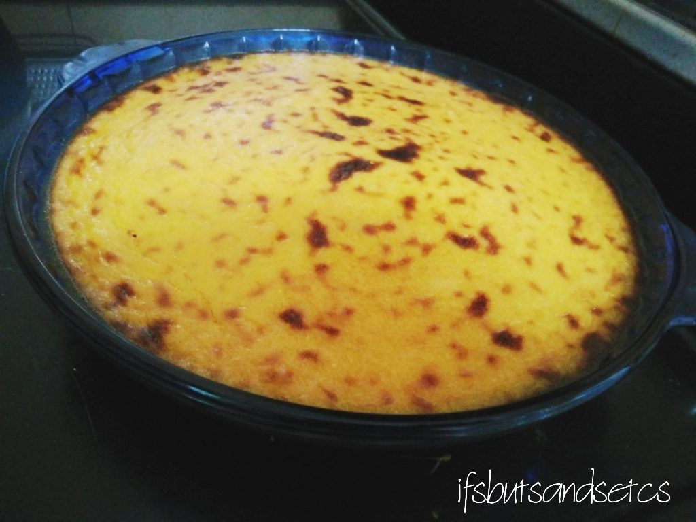
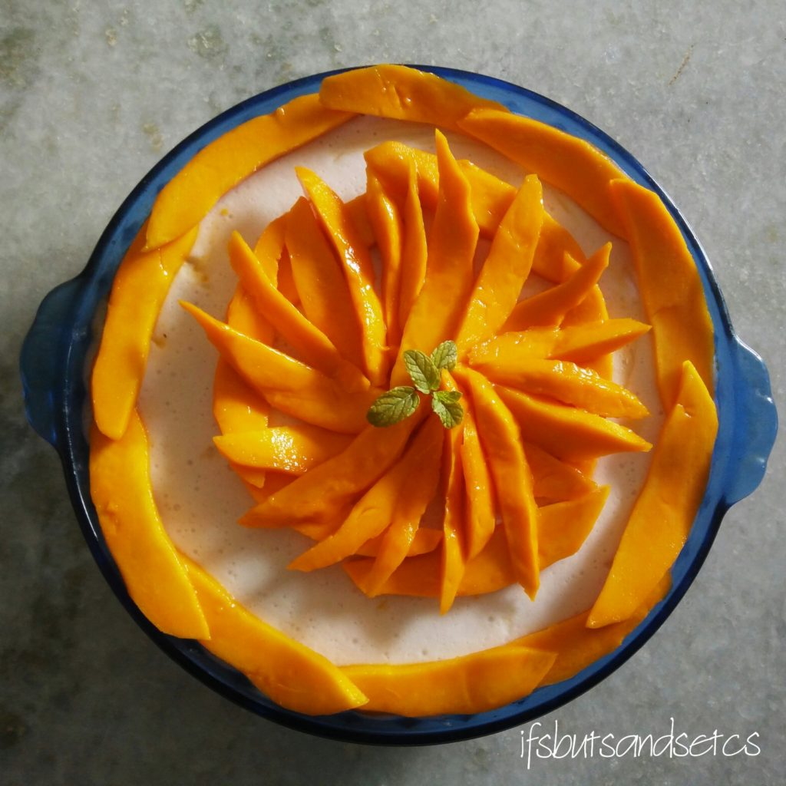
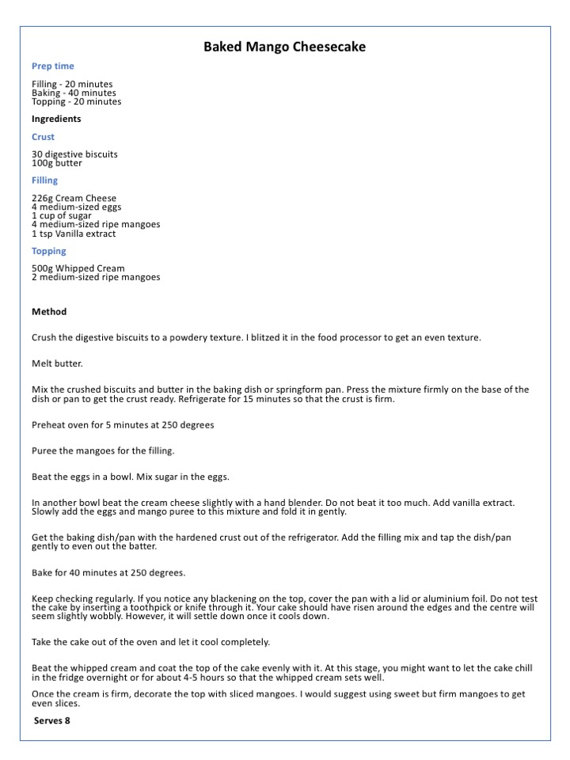
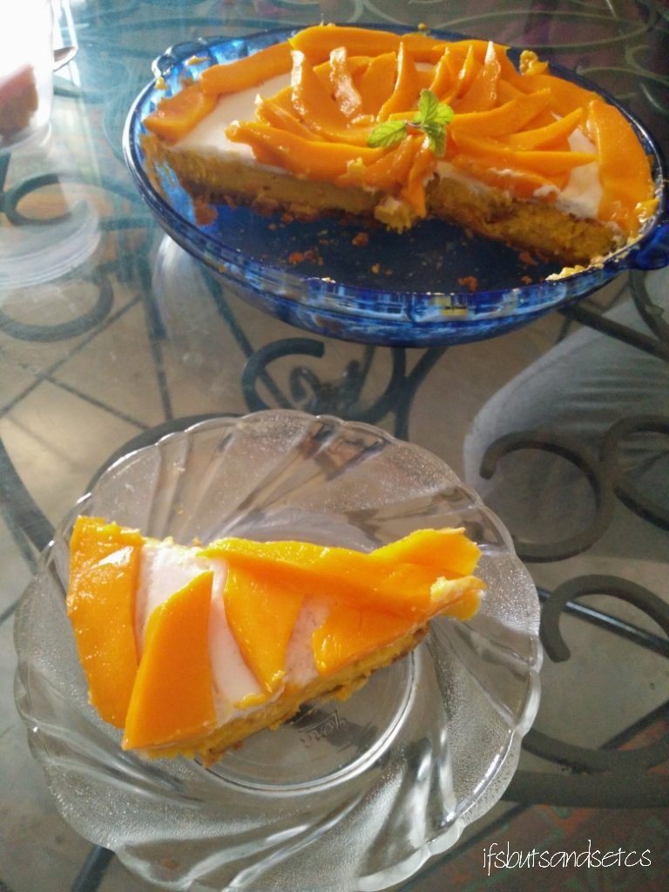

A neglected block of cream cheese was lying in the corner of my refrigerator for some days. I planned to use it to make a dessert but did not bring myself to do so purely out of laziness. But what got me going was the pile of ripening mangoes in my fruit basket that begged to be consumed. I had just the right ingredients for a decadent mango cheesecake.

I am particularly fond of cheesecakes. Who's not, actually? I haven't yet met anyone who does not like cheesecake! Having tried my hand at making a no-bake variety of cheesecake in the past I decided to make the baked variety of cheesecake. There's a subtle difference in the texture when you bake it. While the no-bake version has a creamy souffle kind of feel to it, this one is airy and light.

A springform makes it convenient to hold the cheesecake, but if you don't have one you can use a fancy baking dish like the one I used and serve it directly from it.

I used Philadelphia cream cheese. Although Alphonso mangoes would have been ideal, I used _Kesar_ mangoes which added an amazing flavor to the dish. The recipe is basic but if you're finicky about presenting it well you may want to put in some creativity there. I promise it would definitely be worth the effort! I used whipped cream and freshly sliced mangoes to top it with. The result was a treat to the eyes and the taste-buds! A lot of you asked me to share the recipe. So here it is:

**Baked Mango Cheesecake**

**Prep time** Filling - 20 minutes Baking - 40 minutes Topping - 20 minutes

**Ingredients**

**Crust** 30 digestive biscuits 100g butter

**Filling** 226g Cream Cheese 4 medium-sized eggs 1 cup of sugar 4 medium-sized ripe mangoes 1 tsp Vanilla extract

**Topping** 500g Whipped Cream 2 medium-sized ripe mangoes

**Serves 8**

**Method**

Crush the digestive biscuits to a powdery texture. I blitzed it in the food processor to get an even texture.

Melt butter.

Mix the crushed biscuits and butter in the baking dish or springform pan.

Press the mixture firmly on the base of the dish or pan to get the crust ready. Refrigerate for 15 minutes so that the crust is firm.

Preheat oven for 5 minutes at 250 degrees.

Puree the mangoes for the filling.

Beat the eggs in a bowl. Mix sugar in the eggs.

In another bowl beat the cream cheese slightly with a hand blender. Do not beat it too much. Add vanilla extract. Slowly add the eggs and mango puree to this mixture and fold it in gently.

Get the baking dish/pan with the hardened crust out of the refrigerator. Add the filling mix and tap the dish/pan gently to even out the batter.

Bake for 40 minutes at 250 degrees.

Keep checking regularly. If you notice any blackening on the top, cover the pan with a lid or aluminum foil.

Do not test the cake by inserting a toothpick or knife through it. Your cake should have risen around the edges and the center will seem slightly wobbly. However, it will settle down once it cools down.

Take the cake out of the oven and let it cool completely.

Beat the whipped cream and coat the top of the cake evenly with it. At this stage, you might want to let the cake chill in the fridge overnight or for about 4-5 hours so that the whipped cream sets well.

Once the cream is firm, decorate the top with sliced mangoes. I would suggest using sweet but firm mangoes to get even slices.

Gently loosen the edges of the cheesecake with the help of a knife. If you've used a springform pan, open the sides and if it's a baking dish, slice and serve from the dish itself.

Let me tell you, it would be gone in a jiffy as soon as you start serving it. So don't forget to save yourself some. Enjoy!

 

If you're in the mood to try some savory mango dish you might like my [Mango Salsa recipe](https://ifsbutsandsetcs.com/2014/04/mad-about-mangoes/).
